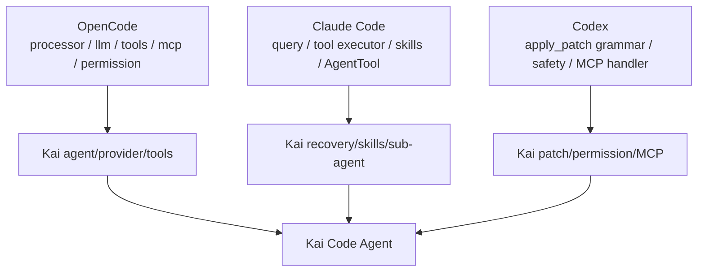

# 01 References Map

本文档把三份参考代码映射到 Kai Code Agent 的模块。引用只用于定位设计参考，不复制实现。

## OpenCode 参考地图

| 参考文件 | 行号 | 学习点 | 映射模块 |
| --- | --- | --- | --- |
| `$OPENCODE_REPO/packages/opencode/src/session/processor.ts` | L37-L53 | processor handler 边界 | `src/agent/loop.ts` |
| `$OPENCODE_REPO/packages/opencode/src/session/processor.ts` | L118-L144 | turn context 初始化 | `src/agent/turn.ts` |
| `$OPENCODE_REPO/packages/opencode/src/session/processor.ts` | L286-L445 | tool part 生命周期 | `src/agent/stream.ts` |
| `$OPENCODE_REPO/packages/opencode/src/session/processor.ts` | L499-L558 | usage、snapshot、compaction flag | `src/session/store.ts`, `src/coding/context/manager.ts` |
| `$OPENCODE_REPO/packages/opencode/src/session/processor.ts` | L638-L794 | cleanup、halt、retry、overflow | `src/agent/recovery.ts` |
| `$OPENCODE_REPO/packages/opencode/src/session/llm.ts` | L76-L129 | provider/config/auth/prompt 合成 | `src/community/openai-compatible`, `src/coding/context/model-input-builder.ts` |
| `$OPENCODE_REPO/packages/opencode/src/session/llm.ts` | L195-L228 | tool resolve 与兼容工具 | `src/tools/registry.ts` |
| `$OPENCODE_REPO/packages/opencode/src/tool/tool.ts` | L16-L45 | Tool.Context 与 ExecuteResult | `src/tools/types.ts` |
| `$OPENCODE_REPO/packages/opencode/src/tool/tool.ts` | L79-L127 | tool wrapper、schema validate、truncate | `src/tools/runner.ts` |
| `$OPENCODE_REPO/packages/opencode/src/tool/registry.ts` | L114-L132 | builtin 初始化 | `src/tools/builtins.ts` |
| `$OPENCODE_REPO/packages/opencode/src/tool/registry.ts` | L189-L202 | custom tool 加载 | Stage 14+ 可选扩展 |
| `$OPENCODE_REPO/packages/opencode/src/tool/read.ts` | L29-L87 | read 参数、not found、directory | `src/tools/read.ts` |
| `$OPENCODE_REPO/packages/opencode/src/tool/write.ts` | L38-L90 | write、format、diagnostics | `src/tools/write.ts` |
| `$OPENCODE_REPO/packages/opencode/src/tool/edit.ts` | L47-L190 | exact edit、diff、diagnostics | `src/tools/edit.ts` |
| `$OPENCODE_REPO/packages/opencode/src/tool/shell.ts` | L261-L307 | 命令 parse、approval、process | `src/tools/bash.ts` |
| `$OPENCODE_REPO/packages/opencode/src/tool/grep.ts` | L56-L115 | rg search、mtime sort、limit | `src/tools/grep.ts` |
| `$OPENCODE_REPO/packages/opencode/src/tool/glob.ts` | L31-L78 | file discovery、limit | `src/tools/glob.ts` |
| `$OPENCODE_REPO/packages/opencode/src/tool/apply_patch.ts` | L30-L104 | patch parse 与计划变更 | `src/tools/applyPatch.ts` |
| `$OPENCODE_REPO/packages/opencode/src/patch/index.ts` | L189-L245 | Begin/End patch parser | `src/patch/parser.ts` |
| `$OPENCODE_REPO/packages/opencode/src/session/compaction.ts` | L122-L203 | summary prompt、turn splitting | `src/coding/context/compaction.ts` |
| `$OPENCODE_REPO/packages/opencode/src/session/overflow.ts` | L6-L26 | usable context 计算 | `src/coding/context/budget.ts` |
| `$OPENCODE_REPO/packages/opencode/src/session/session.sql.ts` | L16-L137 | session/message/part schema | `src/session/schema.ts` |
| `$OPENCODE_REPO/packages/opencode/src/session/retry.ts` | L24-L197 | retry delay 与 retryable error | `src/agent/retry.ts` |
| `$OPENCODE_REPO/packages/opencode/src/session/instruction.ts` | L13-L163 | AGENTS/CLAUDE/CONTEXT loader | `src/coding/prompt/instructions.ts` |
| `$OPENCODE_REPO/packages/opencode/src/mcp/index.ts` | L132-L173 | listTools、tool conversion | `src/mcp/adapter.ts` |
| `$OPENCODE_REPO/packages/opencode/src/mcp/index.ts` | L301-L417 | remote/local connection | `src/mcp/client.ts` |
| `$OPENCODE_REPO/packages/opencode/src/permission/index.ts` | L128-L185 | permission evaluate/ask | `src/permissions/engine.ts` |
| `$OPENCODE_REPO/packages/opencode/src/skill/index.ts` | L165-L247 | skill scan 与 customize | `src/skills/loader.ts` |

## Claude Code 参考地图

| 参考文件 | 行号 | 学习点 | 映射模块 |
| --- | --- | --- | --- |
| `$CLAUDE_CODE_REPO/src/query.ts` | L620-L708 | 模型调用循环与阻塞限制 | `src/agent/loop.ts` |
| `$CLAUDE_CODE_REPO/src/query.ts` | L709-L740 | fallback 清理 tool executor | `src/agent/recovery.ts` |
| `$CLAUDE_CODE_REPO/src/query.ts` | L826-L862 | tool_use 累积与结果产出 | `src/agent/stream.ts` |
| `$CLAUDE_CODE_REPO/src/query.ts` | L893-L930 | missing tool result backfill | `src/agent/recovery.ts` |
| `$CLAUDE_CODE_REPO/src/query.ts` | L1011-L1051 | abort 时补齐 tool result | `src/agent/recovery.ts` |
| `$CLAUDE_CODE_REPO/src/services/tools/toolOrchestration.ts` | L19-L82 | tool 批处理 | `src/tools/scheduler.ts` |
| `$CLAUDE_CODE_REPO/src/services/tools/toolOrchestration.ts` | L86-L176 | read-only 并发、安全工具串行 | `src/tools/scheduler.ts` |
| `$CLAUDE_CODE_REPO/src/services/tools/StreamingToolExecutor.ts` | L73-L151 | streaming tool queue | `src/tools/scheduler.ts` |
| `$CLAUDE_CODE_REPO/src/services/tools/toolExecution.ts` | L916-L1042 | permission denied result | `src/permissions/engine.ts` |
| `$CLAUDE_CODE_REPO/src/tools/FileEditTool/FileEditTool.ts` | L275-L310 | 编辑前读文件与 stale check | `src/tools/edit.ts` |
| `$CLAUDE_CODE_REPO/src/tools/FileReadTool/FileReadTool.ts` | L496-L608 | read state 与 skill discovery | `src/tools/read.ts`, `src/skills/router.ts` |
| `$CLAUDE_CODE_REPO/src/tools/BashTool/BashTool.tsx` | L227-L294 | BashTool 输入/输出 schema | `src/tools/bash.ts` |
| `$CLAUDE_CODE_REPO/src/tools/BashTool/BashTool.tsx` | L852-L1142 | bash progress/background 目标形态 | `src/tools/bash.ts` |
| `$CLAUDE_CODE_REPO/src/tools/GrepTool/GrepTool.ts` | L310-L575 | rg 参数组合与结果模式 | `src/tools/grep.ts` |
| `$CLAUDE_CODE_REPO/src/constants/prompts.ts` | L444-L577 | prompt 动态段合成 | `src/coding/context/model-input-builder.ts` |
| `$CLAUDE_CODE_REPO/src/context.ts` | L36-L149 | git/system context | `src/coding/prompt/runtime-context.ts` |
| `$CLAUDE_CODE_REPO/src/skills/loadSkillsDir.ts` | L185-L265 | frontmatter 字段 | `src/skills/frontmatter.ts` |
| `$CLAUDE_CODE_REPO/src/tools/SkillTool/SkillTool.ts` | L118-L236 | forked skill 执行 | `src/skills/runner.ts` |
| `$CLAUDE_CODE_REPO/src/tools/AgentTool/runAgent.ts` | L368-L575 | 子 Agent 上下文、工具、权限 | `src/agents/runner.ts` |
| `$CLAUDE_CODE_REPO/src/tools/AgentTool/loadAgentsDir.ts` | L73-L133 | agent 定义 schema | `src/agents/definitions.ts` |

## Codex 参考地图

| 参考文件 | 行号 | 学习点 | 映射模块 |
| --- | --- | --- | --- |
| `$CODEX_REPO/codex-rs/core/src/tools/handlers/apply_patch.lark` | L1-L19 | apply_patch grammar | `src/patch/grammar.ts` |
| `$CODEX_REPO/codex-rs/apply-patch/src/parser.rs` | L35-L45 | patch markers | `src/patch/parser.ts` |
| `$CODEX_REPO/codex-rs/apply-patch/src/parser.rs` | L176-L260 | strict/lenient boundary parse | `src/patch/parser.ts` |
| `$CODEX_REPO/codex-rs/apply-patch/src/seek_sequence.rs` | L12-L109 | exact/trim/normalized seek | `src/patch/apply.ts` |
| `$CODEX_REPO/codex-rs/core/src/safety.rs` | L21-L115 | patch safety decision | `src/permissions/patchSafety.ts` |
| `$CODEX_REPO/codex-rs/core/src/safety.rs` | L138-L193 | writable path constraint | `src/permissions/pathPolicy.ts` |
| `$CODEX_REPO/codex-rs/core/src/tools/handlers/mcp.rs` | L31-L139 | MCP handler lifecycle | `src/mcp/toolHandler.ts` |
| `$CODEX_REPO/codex-rs/core/src/mcp_tool_call.rs` | L110-L240 | MCP args parse、approval、start event | `src/mcp/invocation.ts` |
| `$CODEX_REPO/codex-rs/core/src/session/mcp.rs` | L68-L159 | MCP elicitation request/response | Stage 14+ 可选高级能力 |
| `$CODEX_REPO/codex-rs/core/src/session/mcp.rs` | L200-L260 | MCP resource/tool delegation | `src/mcp/client.ts` |

## Kai 模块映射总表

| Kai 模块 | 主参考 | 次参考 | 设计选择 |
| --- | --- | --- | --- |
| `agent/loop` | OpenCode processor | Claude query | 一个 turn 内显式处理 stream、tool、retry、stop |
| `provider` | OpenCode LLM.run | Claude query | 统一 `stream(messages, tools)` 接口 |
| `tools/types` | OpenCode tool.ts | Codex handler trait 思想 | zod schema + async execute |
| `tools/scheduler` | Claude StreamingToolExecutor | OpenCode processor toolcalls | 读工具可并发，写/bash 串行 |
| `tools/read/write/edit` | OpenCode tools | Claude file tools | 先读后改、diff 摘要、诊断预留 |
| `tools/bash` | Claude BashTool | OpenCode shell | 名称和目标形态向 Claude Bash 靠拢；Stage 02 执行骨架保持轻量 |
| `patch` | Codex grammar | OpenCode patch | TS parser，安全检查在执行前 |
| `session` | OpenCode session.sql | Claude sidechain transcript | SQLite 存 messages/parts/permissions |
| `prompt` | OpenCode instruction | Claude prompt composer | 静态原则 + 项目指令 + 动态上下文，全部产出 ContextItem |
| `context` | OpenCode compaction | Claude query abort cleanup | ContextItem + ModelInputBuilder + token budget + summary + tail preserve |
| `mcp` | OpenCode mcp | Codex mcp handler | server/tool 适配到统一 ToolDef |
| `skills` | Claude skills | OpenCode skill scan | frontmatter 驱动路由 |
| `agents` | Claude AgentTool | OpenCode task tool | 子 Agent 是隔离 session + side transcript |
| `permissions` | OpenCode permission | Codex safety | action -> auto/ask/reject |
| `ui` | OpenCode TUI 思想 | Claude progress hints | CLI renderer 先简洁后增强 |

## 读取顺序建议

1. 先读 OpenCode 的 `processor.ts`、`llm.ts`、`tool.ts`、`registry.ts`。
2. 再读 OpenCode 的 read/write/edit/shell/grep/glob/apply_patch；其中 OpenCode shell 只作为 Kai `bash` 的轻量执行骨架参考。
3. Stage 06 前读 OpenCode instruction/compaction/overflow、Claude prompt/context，并先设计 ContextItem / ModelInputBuilder。
4. Stage 08 前读 Claude `query.ts` 的 fallback 与 missing result 区域。
5. Stage 09 前读 OpenCode/Codex MCP 适配。
6. Stage 10-11 前读 Claude skills 与 AgentTool，重点看它们如何把 skill/sub-agent 内容变成可控上下文。
7. Stage 12 前读 OpenCode permission 与 Codex safety。
8. Stage 15 前复盘真实 Kai session trace，并回读 OpenCode usage/snapshot、Claude prompt cache/context cleanup、Codex context snapshot/debug 思路。
