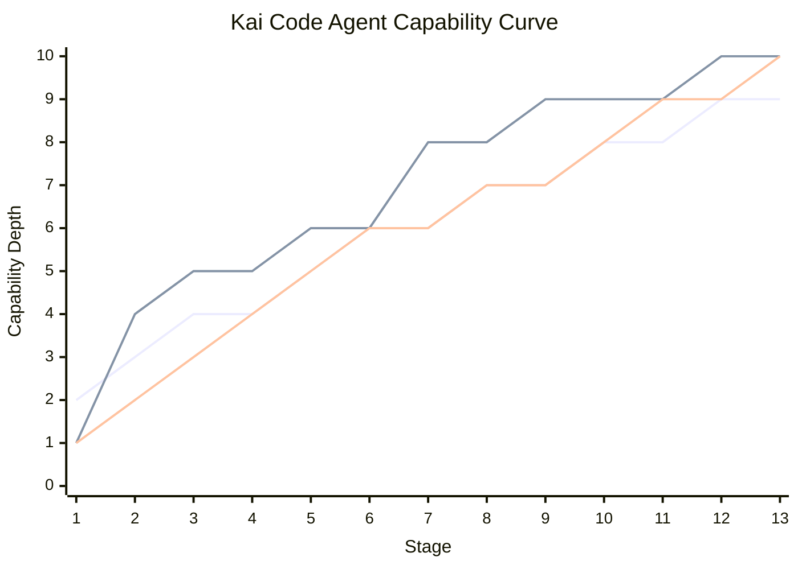
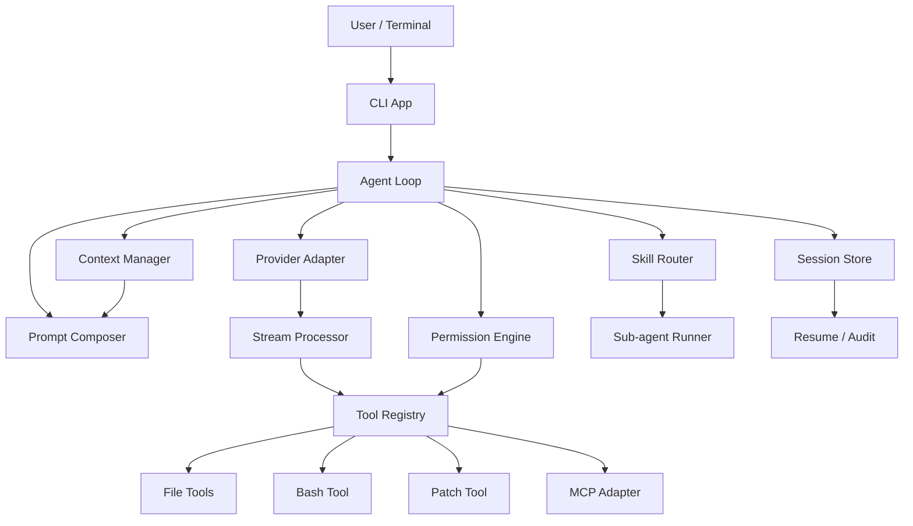

# Kai Code Agent Roadmap

Kai Code Agent 是一个个人 TypeScript CLI code agent。目标不是一次性复刻大而全产品，而是用 13 个可运行阶段，把一个最小对话循环逐步演化为具备工具调用、文件编辑、上下文压缩、权限控制、MCP、技能、子 Agent 和可观测性的本地编码助手。

## 项目愿景

| 目标 | 说明 |
| --- | --- |
| 个人可控 | 单人可维护，核心代码目标约 6.9K 行，不引入复杂服务端 |
| 可闭环 | 每阶段都能用真实 provider 或 fixture provider 跑出可观察 demo |
| 可学习 | 每个模块都能映射到 OpenCode、Claude Code、Codex 的设计参考 |
| 可替换 | LLM provider、工具、权限策略、MCP server 都通过接口隔离 |
| 可恢复 | 会话、工具结果、失败信息、压缩摘要都能落盘或重建 |

## 13 阶段能力曲线

```mermaid
flowchart LR
  S01["01 real LLM loop\ncan chat with API"] --> S02["02 core tools\ncan read/write/edit/bash"]
  S02 --> S03["03 streaming CLI\ncan stream text/tools"]
  S03 --> S04["04 persistence\ncan resume session"]
  S04 --> S05["05 system prompt\ncan load instructions"]
  S05 --> S06["06 context mgmt\ncan compact overflow"]
  S06 --> S07["07 search/patch\ncan grep/glob/apply patch"]
  S07 --> S08["08 failures\ncan retry/recover"]
  S08 --> S09["09 MCP\ncan call external tools"]
  S09 --> S10["10 skills/memory\ncan route skills"]
  S10 --> S11["11 sub-agent\ncan delegate work"]
  S11 --> S12["12 permissions\ncan gate risky ops"]
  S12 --> S13["13 polish\ncan ship daily CLI"]

  classDef done fill:#eef2ff,stroke:#4f46e5,color:#111827;
  class S01,S02,S03,S04,S05,S06,S07,S08,S09,S10,S11,S12,S13 done;
```





## 阶段一览

| 阶段 | 名称 | can do | 核心增量 |
| --- | --- | --- | --- |
| 01 | minimal real LLM loop | 首次配置模型，调用真实 LLM API 收到回答 | CLI、first-run config、OpenAI-compatible provider、fixture provider、message model |
| 02 | core tools | 模型可以读文件、写文件、编辑文件、跑 Bash 命令 | Tool registry、read、write、edit、bash |
| 03 | streaming CLI | 文本和工具调用实时显示 | stream processor、tool lifecycle UI |
| 04 | persistence | 会话可恢复、消息可追踪 | SQLite/JSONL store、session id、part model |
| 05 | system prompt | 能加载项目说明和运行时上下文 | instruction loader、prompt composer |
| 06 | context management | 上下文超限前自动压缩 | token budget、summary、tail preserve |
| 07 | grep/glob/patch | 能搜索文件并做结构化补丁 | ripgrep wrapper、patch parser/applier |
| 08 | failure handling | 网络、工具、模型失败可恢复 | retry policy、missing result backfill |
| 09 | MCP client | 能连接 MCP server 并调用工具 | MCP config、tool adapter、approval hook |
| 10 | skill memory | 能发现技能、选择技能、保存偏好 | skill frontmatter、memory store |
| 11 | sub-agent | 能把局部任务交给子 Agent | agent definitions、side transcript |
| 12 | permissions | 危险操作需要确认或被拒绝 | policy engine、sandbox profile |
| 13 | polish | 日常 CLI 可用、可调试、可发布 | config、telemetry、docs、packaging |

## 全局架构



## 推荐仓库形态

```text
kai-code-agent/
  package.json
  src/
    cli/
    agent/
    provider/
    tools/
    session/
    prompt/
    context/
    mcp/
    skills/
    permissions/
    ui/
  tests/
  docs/
  code-agent-roadmap/
```

## 代码预算

| 阶段 | 累计核心行数 | 新增核心行数 | 主要模块 |
| --- | ---: | ---: | --- |
| 01 | 850 | 850 | CLI、first-run config、message、OpenAI-compatible provider、fixture provider、loop |
| 02 | 1650 | 800 | registry、read、write、edit、bash |
| 03 | 2150 | 500 | stream processor、terminal renderer |
| 04 | 2450 | 300 | session store、resume |
| 05 | 2750 | 300 | instruction loader、prompt composer |
| 06 | 3350 | 600 | token budget、compaction |
| 07 | 3850 | 500 | grep、glob、apply patch |
| 08 | 4250 | 400 | retry、recovery、backfill |
| 09 | 4650 | 400 | MCP client adapter |
| 10 | 5150 | 500 | skill loader、memory |
| 11 | 5550 | 400 | sub-agent runner |
| 12 | 5850 | 300 | permission engine |
| 13 | 6850 | 1000 | config、telemetry、bash task store、bash_status、release polish |

测试、fixtures、示例脚本预算另计约 2.3K 行。核心实现目标约 6.9K，允许在 6.5K 到 8.5K 行窗口内按质量需要浮动。

## 学习路线

| 天数 | 学习重点 | 输出 |
| --- | --- | --- |
| Day 1-2 | Agent loop、message schema、provider adapter | 跑通 stage 01 |
| Day 3-5 | 工具协议、文件 IO、最小 Bash 执行 | 跑通 stage 02 |
| Day 6-7 | streaming event、terminal render | 跑通 stage 03 |
| Day 8-9 | 会话存储、恢复、part model | 跑通 stage 04 |
| Day 10-12 | system prompt、项目指令、上下文注入 | 跑通 stage 05 |
| Day 13-16 | token budget、摘要、溢出处理 | 跑通 stage 06 |
| Day 17-20 | grep/glob/apply_patch | 跑通 stage 07 |
| Day 21-23 | retry、工具失败、missing result | 跑通 stage 08 |
| Day 24-27 | MCP client、外部工具 | 跑通 stage 09 |
| Day 28-31 | skills、memory、routing | 跑通 stage 10 |
| Day 32-35 | sub-agent、side transcript | 跑通 stage 11 |
| Day 36-38 | permission、sandbox、approval | 跑通 stage 12 |
| Day 39-42 | CLI polish、诊断、文档 | 跑通 stage 13 |

## 参考边界

OpenCode 是 TypeScript 主参考，优先学习模块拆分、工具注册和流式处理。Claude Code 是 BashTool 目标形态、工具编排、缺失工具结果补齐、技能/子 Agent 的主要参考。Codex 主要用于 apply_patch grammar、补丁安全和 MCP 生命周期设计。所有参考都只作为设计输入，不复制实现。
