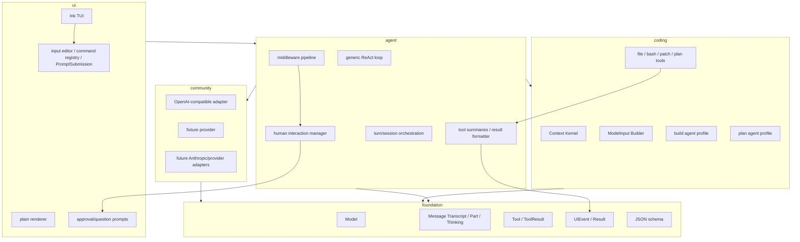

# Kai Code Agent Roadmap

这份 roadmap 将 Kai Code Agent 规划为一个 Bun-first、transcript-first、Ink-first、middleware-first、plan-aware 的个人 TypeScript CLI code agent。整体参考优先级为：OpenCode 的 Bun workspace、plan agent/profile 和 permission model；Claude Code 的 EnterPlanMode / ExitPlanMode / plan approval 体验；Codex 的 patch safety 与协议化工具边界。

目标调整为 15 个阶段，每个阶段都要形成可运行、可验证、可回滚的闭环。实现节奏保持渐进，但底层分层从一开始就避免把 provider、agent loop、工具、TUI、session、memory、context 和权限粘在一起。

## 1. 架构分层



分层边界：

| 层 | 职责 |
| --- | --- |
| `foundation` | 只定义通用 Model、Message、Tool、UiEvent、Result、JSON schema，不知道 coding agent 的存在 |
| `agent` | 通用 ReAct loop、middleware pipeline、turn/session orchestration，不关心具体工具是不是代码工具 |
| `coding` | Context Kernel、ModelInput builder、coding prompt、文件工具、bash、patch、plan mode、build/plan agent profiles |
| `community` | OpenAI-compatible、fixture provider，后续接 Anthropic 和其它 provider adapters |
| `ui` | Ink TUI、plain renderer、input editor、command registry、approval prompt、ask_user_question prompt、slash command picker |

Transcript-first 约束：

| 对象 | 定位 |
| --- | --- |
| Message transcript | session store 中的 `messages` / `parts` 是权威事实，驱动 resume、token budget、tool history、summary 和历史展示 |
| UiEvent | 当前 turn 的实时过程事件，负责流式文本、工具进度、审批/问题展示，不作为长期状态唯一来源 |
| TUI / plain renderer | transcript 和 event stream 的投影；重启后必须能从 session messages/parts 重新渲染基本历史摘要 |
| Executable ToolUse | provider stream 的 tool argument delta 必须先进入 accumulator；只有完整 JSON parse 成功后才可进入 middleware、approval、runner、UI 参数展示和 executable transcript |
| Model-visible ToolResult | raw tool result 必须经过 formatter 后才回传模型，避免大输出、私有 metadata、非结构化错误污染上下文 |
| Thinking part | provider reasoning/thinking_content 或 `<think>` 包裹内容必须拆成独立 part；renderer 默认不作为正文展示 |
| HITL manager | approval、ask_user_question、plan approval、MCP elicitation 等交互先进入 manager queue，UI 只是订阅者 |
| ToolUse summary | 工具展示由 `summarizeToolUse` 生成 `{ title, detail? }`，plain/Ink 共用同一摘要 |
| Renderer batching | Ink state commit 对 stream event 做 30-80ms 批量 flush，避免终端闪烁和输入卡顿 |
| Layered Settings | `settings.json` 按 user/project/project-local 合并；allow/deny 类字段 union，普通字段后层覆盖 |
| PromptSubmission | slash command 可以提交 metadata 改变下一轮 agent context，而不只是执行本地命令 |

## 2. 阶段总览

| Stage | 名称 | 核心能力 | 主要参考 |
| ---: | --- | --- | --- |
| 01 | Bun-first foundation + real LLM loop | Bun workspace、真实 OpenAI-compatible API、fixture provider、Ink first-run setup、thinking/text 拆分 | OpenCode provider/config；Ink CLI 体验 |
| 02 | Tool protocol + generic ReAct loop + core coding tools v0 | ToolDef/ToolResult、read/write/edit/bash 前台执行、build profile 初版 | OpenCode tool abstraction；Claude Bash 目标形态 |
| 03 | Middleware pipeline + HITL tools + current-turn Ink renderer | middleware hooks、HumanInteractionManager、approval、ask_user_question、tool summary、render batching | OpenCode hooks/permissions；Codex elicitation 边界 |
| 04 | Session persistence + session-backed Ink chat shell | bun:sqlite transcript store、message/part 持久化、chat/resume、input editor、PromptSubmission、bash metadata、history replay | OpenCode session store；Claude transcript 思路 |
| 05 | Plan mode | `/plan`、`plan_enter`、`plan_exit`、plan file、plan approval、build-agent handoff | OpenCode plan agent；Claude plan approval |
| 06 | Context kernel + prompt composer + budgeted ModelInput | Stage 06A: ContextItem/ModelInput builder；Stage 06B: compaction、prompt debug、budget tuning | OpenCode instruction/compaction；Claude prompts/context；Codex prompt debug 思路 |
| 07 | Grep/glob/apply_patch | ripgrep 搜索、Codex-style apply_patch grammar、安全写入 | Claude grep/edit；Codex patch safety |
| 08 | Bash hardening + failure handling + retry/recovery | timeout、abort、exit code、retry、missing ToolResult backfill | Claude Bash failure semantics；OpenCode retry |
| 09 | MCP client | stdio MCP、tools/list、tools/call、ToolDef adapter | OpenCode MCP；Codex MCP handler |
| 10 | Skills + memory v0 + slash activation | 多目录 discovery、SKILL.md progressive loading、slash context activation、manual memory add/list/search；通过 ContextItem 注入 | Claude skills；OpenCode skill index |
| 11 | Sub-agent runner | 子 agent profile、side transcript、summary result；父子上下文通过 ContextItem 摘要交接 | Claude AgentTool；OpenCode agent profiles |
| 12 | Full permission engine | file/bash/patch/MCP policies、layered settings、scoped remembered approvals、plan restrictions 迁移 | OpenCode permissions；Codex safety |
| 13 | Memory system | typed/scoped memory、retrieval ranking、post-turn extraction、citations、lifecycle、secret guard；memory retrieval 输出 ContextItem | Claude memory extraction；Codex memory citations；OpenCode context/compaction |
| 14 | Polish + diagnostics + Bun binary release | doctor、settings diagnostics、debug JSONL、examples、Bun compile、bash background status | OpenCode diagnostics；Claude Bash background |
| 15 | Context quality optimization after real usage | dogfooding trace、context eval/replay、prompt debug diff、retrieval/ranking tuning、真实 tokenizer 校准、prompt cache stability | Codex context snapshots/prompt debug；Claude prompt cache 诊断；OpenCode compaction/prune |

## 3. 能力曲线

| 阶段 | 能力曲线 |
| --- | --- |
| 01-02 | 先让真实模型和 fixture provider 都能走通；工具协议从第一版就保持 provider-agnostic |
| 03-04 | 把人机交互和 transcript 立住：审批、结构化提问、TUI 投影、持久化、resume、history replay |
| 05-06 | 加入 plan-aware 工作流，并建立 Context Kernel，让长任务有稳定 ModelInput、预算、摘要和可解释裁剪 |
| 07-09 | 进入真实 coding 能力：搜索、patch、bash failure、MCP 外部工具 |
| 10-12 | 扩展能力系统：skills、memory v0、sub-agent、统一 permission engine；新增能力只通过 ContextItem 注入模型上下文 |
| 13 | 完善长期记忆系统：分层 scope、typed records、检索、自动提取、引用和生命周期，并纳入 ContextItem 预算 |
| 14 | 打磨成日常可用的 Bun binary：诊断、文档、debug、发布链路 |
| 15 | 基于真实使用 trace 优化 context 质量：补 eval、调 ranking/budget、降低噪音、稳定 prompt cache |

## 4. 关键公共接口

Middleware 是 Stage 03 后的默认扩展机制：

```ts
export interface Middleware {
  beforeAgentRun?(ctx: AgentRunContext): Promise<void>;
  afterAgentRun?(ctx: AgentRunContext): Promise<void>;
  beforeModel?(ctx: ModelContext): Promise<ModelInput | void>;
  afterModel?(ctx: ModelContext): Promise<void>;
  beforeToolUse?(ctx: ToolUseContext): Promise<ToolResult | void>;
  afterToolUse?(ctx: ToolUseContext): Promise<void>;
}
```

`beforeToolUse` 可以拦截工具并直接返回 `ToolResult`，因此 approval、plan guard、audit、memory 和 skills 不需要写死在 agent loop 里。

Stage 06 后，进入模型的上下文以 ContextItem 为统一单位：

```ts
export type ContextItemKind =
  | "base"
  | "profile"
  | "environment"
  | "instruction"
  | "history"
  | "summary"
  | "tool_result"
  | "plan"
  | "skill"
  | "memory"
  | "permission"
  | "subagent";

export interface ContextItem {
  id: string;
  kind: ContextItemKind;
  source: string;
  content: string;
  priority: number;
  estimatedTokens?: number;
  maxTokens?: number;
  sticky?: boolean;
  cacheStable?: boolean;
  metadata?: Record<string, unknown>;
}

export interface ContextDebugItem {
  id: string;
  kind: ContextItemKind;
  source: string;
  estimatedTokens: number;
  included: boolean;
  cutReason?: string;
}

export interface ModelInputBuildResult {
  system: string[];
  messages: Message[];
  tools: ProviderToolSchema[];
  generation: { maxOutputTokens: number; temperature?: number };
  debug: { items: ContextDebugItem[]; estimatedInputTokens: number };
}
```

后续 skills、memory、permission 和 sub-agent 只能追加或调整 ContextItem，由 ModelInputBuilder 统一预算、裁剪和输出 provider input。

Provider stream 必须先拆分用户正文和 thinking/reasoning：

```ts
export type ProviderEvent =
  | { type: "text_delta"; text: string }
  | { type: "thinking_delta"; text: string; hidden: true }
  | { type: "tool_call_delta"; id: string; name?: string; argumentsDelta: string }
  | { type: "done" };
```

renderer 默认只展示 `text_delta` 和工具摘要。`thinking_delta` 可以进入 debug/session policy，但不能裸打印成正文。

ToolUse assembly 是 provider stream 到工具系统之间的硬边界：

```ts
export interface ExecutableToolUse {
  id: string;
  name: string;
  input: JsonObject;
}
```

provider 流式返回的 argument delta 只能进入 accumulator。只有 JSON parse 成功后，才允许创建 `ExecutableToolUse` 并进入 `beforeToolUse`、approval、runner、UI 参数展示和 executable transcript。最终帧仍无法 parse 时，生成非执行 parse error result，不调用工具。

ToolResult formatting 是工具系统到模型 continuation 的硬边界：

```ts
export function formatToolResultForModel(toolName: string, rawResult: ToolResult): string;
```

工具执行返回内部 `ToolResult`，formatter 负责 normalize success/error、推断 error kind、按 tool policy 截断大结果、决定只给 summary 还是保留正文。失败结果必须结构化，不能把任意错误字符串直接塞回模型。

ToolUse display 是工具系统到 UI 的展示边界：

```ts
export interface ToolUseSummary {
  title: string;
  detail?: string;
}

export function summarizeToolUse(toolUse: ExecutableToolUse): ToolUseSummary;
```

bash、read_file、grep_search、move_path、apply_patch、todo_write、ask_user_question 等工具要有 tool-specific summary。plain renderer 和 Ink renderer 共享这个结果，各自决定样式。

Human-in-the-loop 通过 manager queue 解耦工具层和 UI：

```ts
export interface HumanInteractionManager<TRequest, TResult> {
  enqueue(request: TRequest): Promise<TResult>;
  subscribe(listener: (pending: PendingHumanInteraction<TRequest>) => void): () => void;
  resolve(id: string, result: TResult): void;
  reject(id: string, error: Error): void;
}

export interface PendingHumanInteraction<TRequest> {
  id: string;
  kind: "approval" | "question" | "plan_approval" | "mcp_elicitation" | "login";
  request: TRequest;
}
```

工具和 middleware 只等待结构化结果，不直接 import Ink prompt。ApprovalPrompt、AskUserQuestionPrompt、plan approval、MCP elicitation 和未来 OAuth/login prompt 都可以挂在同一个模式上。

Layered settings 是运行配置和长期信任决策的合并边界：

```ts
export interface SettingsLayers {
  user?: KaiSettings;          // ~/.kai-code-agent/settings.json
  project?: KaiSettings;       // <project>/.kai/settings.json
  projectLocal?: KaiSettings;  // <project>/.kai/settings.local.json
}

export function mergeSettings(layers: SettingsLayers): EffectiveSettings;
```

合并规则：`allow` 类字段 union，`deny` / `reject` 类字段 union 且 deny 优先；普通标量和对象后层覆盖；未标注 union 的数组后层覆盖。`settings.local.json` 默认 gitignored。Remembered approvals 支持 `session`、`projectLocal`、`user` scope，不能只存在 session 内。

Slash command 可以生成下一轮 agent run context：

```ts
export interface PromptSubmission {
  text: string;
  metadata?: {
    requestedSkillName?: string;
    requestedProfile?: "build" | "plan" | string;
    requestedModel?: string;
    requestedMode?: string;
    resumeSessionId?: string;
    slashCommand?: string;
  };
}

export type CommandResult =
  | { type: "submit_prompt"; submission: PromptSubmission }
  | { type: "local_action"; action: string; input?: JsonValue }
  | { type: "input_transform"; text: string };
```

`/skill` 应提交 `requestedSkillName`，由 skills middleware 注入 explicit skill invocation；`/plan` 应提交 profile/mode metadata，由 plan/profile orchestration 切换上下文；`/model`、`/profile`、`/mode`、`/resume` 也走同一协议。

`ask_user_question` 是澄清需求工具，不等同于权限审批：

```ts
{
  questions: Array<{
    id: string;
    question: string;
    mode: "single" | "multi";
    options: Array<{ label: string; description: string; preview?: string }>;
  }>;
}
```

Plan tools：

```ts
plan_enter: {}
plan_exit: {}
```

Agent profiles：

```ts
build: normal coding agent
plan: read-only planning agent, only plan file is writable
```

## 5. 目录规划

```text
src/
  foundation/
    model.ts
    message.ts
    part.ts
    tool.ts
    tool-summary.ts
    ui-event.ts
    result.ts
    schema.ts
  agent/
    loop.ts
    middleware.ts
    human-interaction-manager.ts
    tool-accumulator.ts
    tool-result-formatter.ts
    turn.ts
    session-orchestrator.ts
    recovery.ts
  coding/
    profiles/
    prompt/
    tools/
    plan/
    patch/
    context/
      quality/
  community/
    openai-compatible/
    fixture/
  ui/
    ink/
    plain/
    prompts/
    input-editor.ts
    use-command-input.ts
    command-registry.ts
    render-batcher.ts
    slash/
  session/
  config/
    settings.ts
    settings-merge.ts
  mcp/
  skills/
  memory/
    types.ts
    store.ts
    retrieval.ts
    extractor.ts
    lifecycle.ts
    citations.ts
    secret-guard.ts
  permissions/
```

## 6. 代码预算

核心代码目标从 6.9K 调整为约 11.1K 行，允许在 10.0K 到 13.0K 行内浮动。Bun-first、Ink-first、middleware、plan mode、HITL manager、可测试输入层、Context Kernel、layered settings、slash context selection、完整 memory lifecycle、更完整的 Bash 目标形态和真实使用后的 context 质量优化都进入 v0.1 范围；预算是约束复杂度的仪表盘，不是牺牲架构完整性的铁令。

| Stage | 新增核心行数 | 累计核心行数 | 说明 |
| ---: | ---: | ---: | --- |
| 01 | 990 | 990 | Bun workspace、foundation types、real API、fixture、first-run Ink、thinking/text split |
| 02 | 750 | 1740 | Tool protocol、generic loop、core coding tools v0 |
| 03 | 860 | 2600 | middleware、HITL manager、approval/question、tool summaries、Ink current-turn renderer |
| 04 | 680 | 3280 | bun:sqlite persistence、session-backed chat shell、input editor、PromptSubmission |
| 05 | 500 | 3780 | plan profile、plan tools、plan file、approval handoff |
| 06 | 900 | 4680 | Context Kernel、ModelInput builder、prompt composer、context budget/compaction/debug |
| 07 | 500 | 5180 | grep/glob/apply_patch |
| 08 | 600 | 5780 | bash hardening、failure handling、retry/recovery |
| 09 | 400 | 6180 | MCP stdio tools |
| 10 | 720 | 6900 | skills、memory v0、slash context activation、progressive loading、ContextItem injection |
| 11 | 400 | 7300 | sub-agent runner、child context summary |
| 12 | 820 | 8120 | full permission engine、layered settings、audit、scoped remembered approvals |
| 13 | 1100 | 9220 | typed/scoped memory、retrieval、post-turn extraction、citations、lifecycle |
| 14 | 1190 | 10410 | diagnostics、settings inspect、debug、background bash status、Bun binary |
| 15 | 650 | 11060 | context trace/eval/replay、ranking/budget tuning、prompt debug diff、tokenizer calibration |

## 7. 学习路线

| 周期 | 重点 |
| --- | --- |
| Day 1-3 | Bun workspace、foundation 类型、OpenAI-compatible stream、thinking/text split、fixture replay、first-run config |
| Day 4-7 | generic ReAct loop、ToolDef/ToolResult、file/bash v0 |
| Day 8-12 | middleware、HITL manager、approval、ask_user_question、tool summary、Ink renderer、input editor、PromptSubmission、session store |
| Day 13-16 | plan mode：plan agent/profile、plan file、approval handoff |
| Day 17-23 | Context Kernel、ModelInput builder、prompt composer、context budget、compaction、prompt debug |
| Day 24-30 | grep/glob/apply_patch、bash failure/retry、MCP |
| Day 31-38 | skills、memory v0、slash context activation、sub-agent |
| Day 39-44 | permission engine、layered settings、memory system |
| Day 45-50 | doctor/debug/examples、Bun compile release |
| Day 51-55 | 真实使用后的 context trace/eval/replay、ranking/budget tuning、tokenizer 校准 |

## 8. 验证命令

Roadmap/OpenSpec 文档层检查：

```bash
rg -n 'Node\.js LTS|p''npm|v''itest|V''itest' code-agent-roadmap openspec/config.yaml
openspec validate --all --strict --no-interactive
```

代码迁移完成后的项目验证：

```bash
bun install
bun test
bun run check
bun build --compile
```

## 9. 参考边界

| 来源 | 采纳方式 |
| --- | --- |
| OpenCode | Bun workspace、agent profiles、permission model、MCP/tool/session 组织方式 |
| Claude Code | Bash 目标形态、plan approval 体验、skills 行为、sub-agent 交互、memory extraction |
| Codex | apply_patch grammar、安全边界、工具协议清晰度、patch failure 处理、memory citation/compaction、context snapshot/debug 思路 |

不复制源码，不复制私有提示词；只抽象架构模式、交互协议和安全边界。
