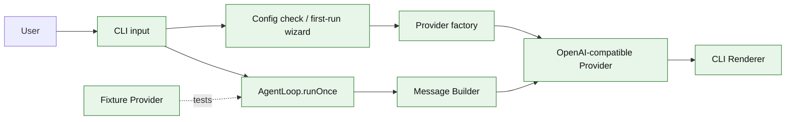

# Stage 01 Diagram

```mermaid
flowchart LR
  U["User"] --> C["CLI input"]
  C --> CFG["Config check / first-run wizard"]
  CFG --> F["Provider factory"]
  C --> L["AgentLoop.runOnce"]
  L --> M["Message Builder"]
  M --> P["OpenAI-compatible Provider"]
  F --> P
  P --> R["CLI Renderer"]
  FX["Fixture Provider"] -. tests .-> L

  classDef new fill:#e8f5e9,stroke:#2e7d32,color:#111;
  classDef future fill:#f3f4f6,stroke:#9ca3af,color:#374151;
  class C,CFG,F,L,M,P,R,FX new;
```
