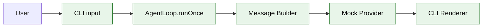

# Stage 01 Diagram

```mermaid
flowchart LR
  U["User"] --> C["CLI input"]
  C --> L["AgentLoop.runOnce"]
  L --> M["Message Builder"]
  M --> P["Mock Provider"]
  P --> R["CLI Renderer"]

  classDef new fill:#e8f5e9,stroke:#2e7d32,color:#111;
  classDef future fill:#f3f4f6,stroke:#9ca3af,color:#374151;
  class C,L,M,P,R new;
```
