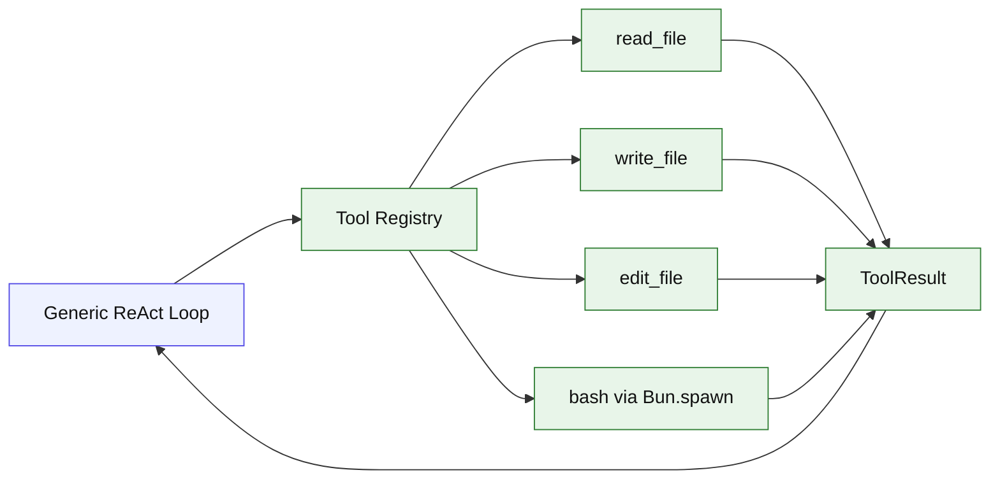

# Stage 02 Diagram

```mermaid
flowchart LR
  L["Generic ReAct Loop"] --> T["Tool Registry"]
  T --> Read["read_file"]
  T --> Write["write_file"]
  T --> Edit["edit_file"]
  T --> Bash["bash via Bun.spawn"]
  Read --> TR["ToolResult"]
  Write --> TR
  Edit --> TR
  Bash --> TR
  TR --> L

  classDef existing fill:#eef2ff,stroke:#4f46e5,color:#111;
  classDef new fill:#e8f5e9,stroke:#2e7d32,color:#111;
  class L existing;
  class T,Read,Write,Edit,Bash,TR new;
```
