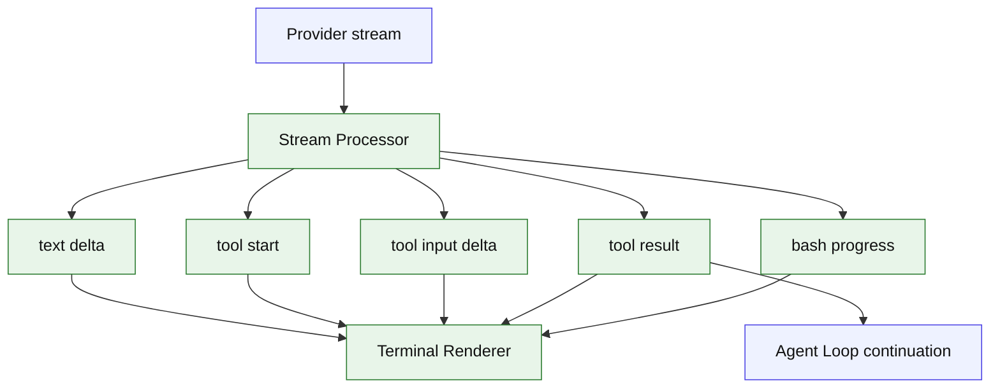

# Stage 03 Diagram

```mermaid
flowchart TB
  P["Provider stream"] --> SP["Stream Processor"]
  SP --> Text["text delta"]
  SP --> ToolStart["tool start"]
  SP --> ToolDelta["tool input delta"]
  SP --> ToolDone["tool result"]
  SP --> BashProgress["bash progress"]
  Text --> UI["Terminal Renderer"]
  ToolStart --> UI
  ToolDelta --> UI
  ToolDone --> UI
  BashProgress --> UI
  ToolDone --> L["Agent Loop continuation"]

  classDef existing fill:#eef2ff,stroke:#4f46e5,color:#111;
  classDef new fill:#e8f5e9,stroke:#2e7d32,color:#111;
  class P,L existing;
  class SP,Text,ToolStart,ToolDelta,ToolDone,BashProgress,UI new;
```
