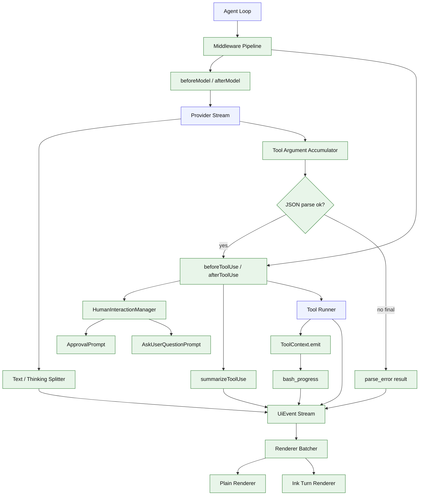

# Stage 03 Diagram

```mermaid
flowchart TB
  Loop["Agent Loop"] --> MW["Middleware Pipeline"]
  MW --> ModelHooks["beforeModel / afterModel"]
  MW --> ToolHooks["beforeToolUse / afterToolUse"]
  ModelHooks --> Provider["Provider Stream"]
  Provider --> Split["Text / Thinking Splitter"]
  Provider --> Acc["Tool Argument Accumulator"]
  Acc --> Gate{"JSON parse ok?"}
  Gate -->|yes| ToolHooks
  Gate -->|no final| ParseErr["parse_error result"]
  ToolHooks --> Manager["HumanInteractionManager"]
  Manager --> Approval["ApprovalPrompt"]
  Manager --> Question["AskUserQuestionPrompt"]
  ToolHooks --> Summary["summarizeToolUse"]
  ToolHooks --> Tool["Tool Runner"]
  Tool --> Emit["ToolContext.emit"]
  Emit --> BashProgress["bash_progress"]
  Split --> Events["UiEvent Stream"]
  Summary --> Events
  ParseErr --> Events
  Tool --> Events
  BashProgress --> Events
  Events --> Batcher["Renderer Batcher"]
  Batcher --> Plain["Plain Renderer"]
  Batcher --> Ink["Ink Turn Renderer"]

  classDef existing fill:#eef2ff,stroke:#4f46e5,color:#111;
  classDef new fill:#e8f5e9,stroke:#2e7d32,color:#111;
  class Loop,Tool,Provider existing;
  class MW,ModelHooks,Split,Acc,Gate,ParseErr,ToolHooks,Manager,Approval,Question,Summary,Emit,BashProgress,Events,Batcher,Plain,Ink new;
```
