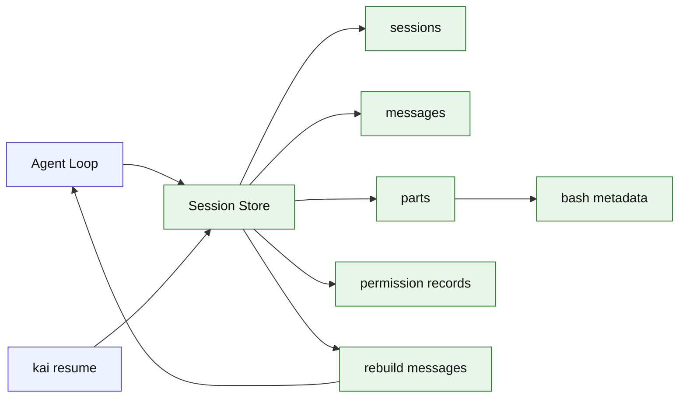

# Stage 04 Diagram

```mermaid
flowchart LR
  L["Agent Loop"] --> S["Session Store"]
  S --> Sess["sessions"]
  S --> Msg["messages"]
  S --> Part["parts"]
  Part --> BashMeta["bash metadata"]
  S --> Perm["permission records"]
  CLI["kai resume"] --> S
  S --> Rebuild["rebuild messages"]
  Rebuild --> L

  classDef existing fill:#eef2ff,stroke:#4f46e5,color:#111;
  classDef new fill:#e8f5e9,stroke:#2e7d32,color:#111;
  class L,CLI existing;
  class S,Sess,Msg,Part,BashMeta,Perm,Rebuild new;
```
