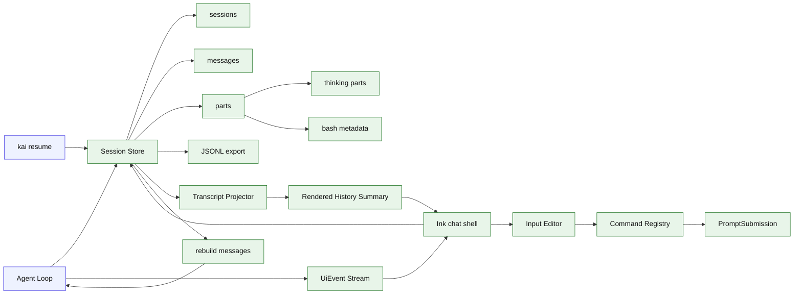

# Stage 04 Diagram

```mermaid
flowchart LR
  L["Agent Loop"] --> S["Session Store"]
  S --> Sess["sessions"]
  S --> Msg["messages"]
  S --> Part["parts"]
  Part --> Thinking["thinking parts"]
  Part --> BashMeta["bash metadata"]
  S --> Export["JSONL export"]
  S --> Projector["Transcript Projector"]
  CLI["kai resume"] --> S
  Chat["Ink chat shell"] --> S
  Chat --> Input["Input Editor"]
  Input --> Commands["Command Registry"]
  Commands --> Submission["PromptSubmission"]
  Projector --> History["Rendered History Summary"]
  History --> Chat
  S --> Rebuild["rebuild messages"]
  Rebuild --> L
  L --> Events["UiEvent Stream"]
  Events --> Chat

  classDef existing fill:#eef2ff,stroke:#4f46e5,color:#111;
  classDef new fill:#e8f5e9,stroke:#2e7d32,color:#111;
  class L,CLI existing;
  class S,Sess,Msg,Part,Thinking,BashMeta,Export,Projector,History,Chat,Input,Commands,Submission,Rebuild,Events new;
```
