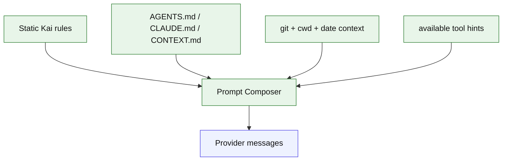

# Stage 05 Diagram

```mermaid
flowchart TB
  Static["Static Kai rules"] --> PC["Prompt Composer"]
  Project["AGENTS.md / CLAUDE.md / CONTEXT.md"] --> PC
  Git["git + cwd + date context"] --> PC
  SkillsHint["available tool hints"] --> PC
  PC --> ProviderInput["Provider messages"]

  classDef existing fill:#eef2ff,stroke:#4f46e5,color:#111;
  classDef new fill:#e8f5e9,stroke:#2e7d32,color:#111;
  class ProviderInput existing;
  class Static,Project,Git,SkillsHint,PC new;
```
