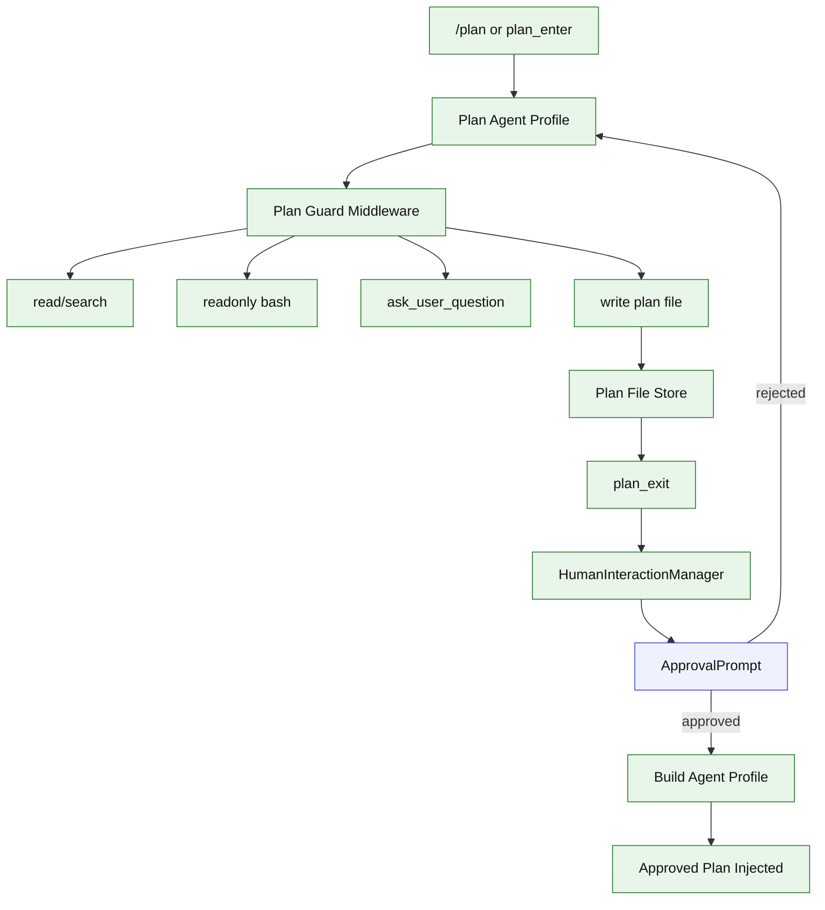

# Stage 05 Diagram

```mermaid
flowchart TB
  Enter["/plan or plan_enter"] --> Plan["Plan Agent Profile"]
  Plan --> Guard["Plan Guard Middleware"]
  Guard --> Read["read/search"]
  Guard --> Bash["readonly bash"]
  Guard --> Ask["ask_user_question"]
  Guard --> WritePlan["write plan file"]
  WritePlan --> Store["Plan File Store"]
  Store --> Exit["plan_exit"]
  Exit --> Manager["HumanInteractionManager"]
  Manager --> Approval["ApprovalPrompt"]
  Approval -->|approved| Build["Build Agent Profile"]
  Approval -->|rejected| Plan
  Build --> Context["Approved Plan Injected"]

  classDef existing fill:#eef2ff,stroke:#4f46e5,color:#111;
  classDef new fill:#e8f5e9,stroke:#2e7d32,color:#111;
  class Approval existing;
  class Enter,Plan,Guard,Read,Bash,Ask,WritePlan,Store,Exit,Manager,Build,Context new;
```
