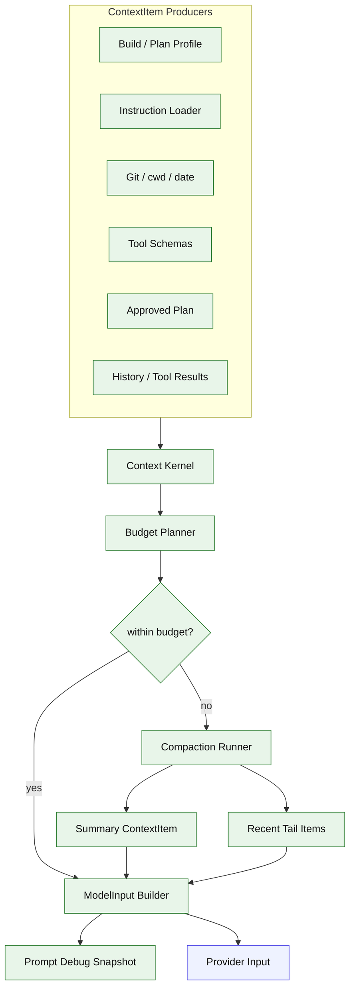

# Stage 06 Diagram

```mermaid
flowchart TB
  subgraph Producers["ContextItem Producers"]
    Profile["Build / Plan Profile"]
    Instructions["Instruction Loader"]
    Runtime["Git / cwd / date"]
    Tools["Tool Schemas"]
    Plan["Approved Plan"]
    History["History / Tool Results"]
  end

  Producers --> Kernel["Context Kernel"]
  Kernel --> Budget["Budget Planner"]
  Budget --> Decision{"within budget?"}
  Decision -->|yes| Builder["ModelInput Builder"]
  Decision -->|no| Compact["Compaction Runner"]
  Compact --> Summary["Summary ContextItem"]
  Compact --> Tail["Recent Tail Items"]
  Summary --> Builder
  Tail --> Builder
  Builder --> Debug["Prompt Debug Snapshot"]
  Builder --> Provider["Provider Input"]

  classDef existing fill:#eef2ff,stroke:#4f46e5,color:#111;
  classDef new fill:#e8f5e9,stroke:#2e7d32,color:#111;
  class Provider existing;
  class Profile,Instructions,Runtime,Tools,Plan,History,Kernel,Budget,Decision,Compact,Summary,Tail,Builder,Debug new;
```
