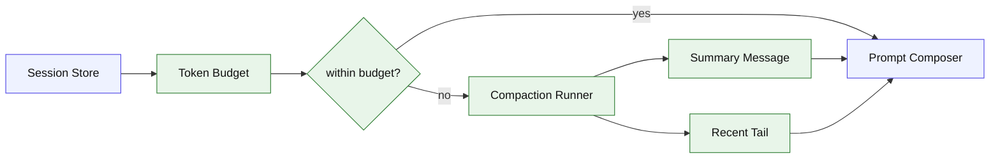

# Stage 06 Diagram

```mermaid
flowchart LR
  Store["Session Store"] --> Budget["Token Budget"]
  Budget --> Decision{"within budget?"}
  Decision -->|yes| Prompt["Prompt Composer"]
  Decision -->|no| Compact["Compaction Runner"]
  Compact --> Summary["Summary Message"]
  Compact --> Tail["Recent Tail"]
  Summary --> Prompt
  Tail --> Prompt

  classDef existing fill:#eef2ff,stroke:#4f46e5,color:#111;
  classDef new fill:#e8f5e9,stroke:#2e7d32,color:#111;
  class Store,Prompt existing;
  class Budget,Decision,Compact,Summary,Tail new;
```
