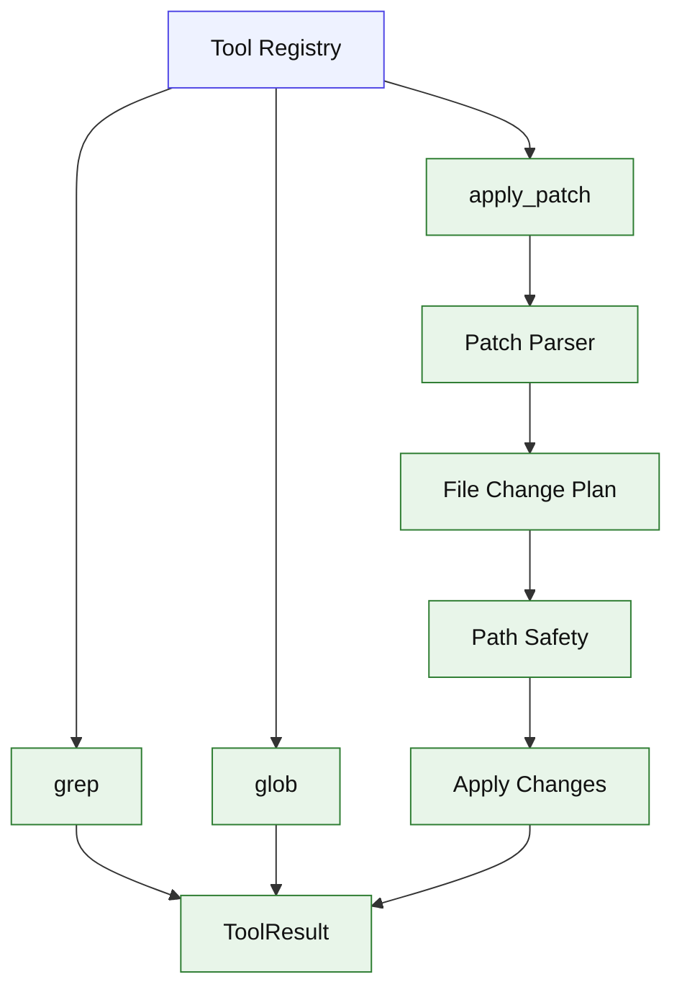

# Stage 07 Diagram

```mermaid
flowchart TB
  Registry["Tool Registry"] --> Grep["grep"]
  Registry --> Glob["glob"]
  Registry --> Patch["apply_patch"]
  Patch --> Parser["Patch Parser"]
  Parser --> Plan["File Change Plan"]
  Plan --> Safety["Path Safety"]
  Safety --> Apply["Apply Changes"]
  Grep --> Result["ToolResult"]
  Glob --> Result
  Apply --> Result

  classDef existing fill:#eef2ff,stroke:#4f46e5,color:#111;
  classDef new fill:#e8f5e9,stroke:#2e7d32,color:#111;
  class Registry existing;
  class Grep,Glob,Patch,Parser,Plan,Safety,Apply,Result new;
```
