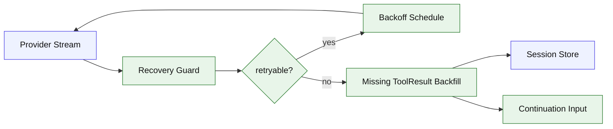

# Stage 08 Diagram

```mermaid
flowchart LR
  Stream["Provider Stream"] --> Guard["Recovery Guard"]
  Guard --> Retry{"retryable?"}
  Retry -->|yes| Backoff["Backoff Schedule"]
  Backoff --> Stream
  Retry -->|no| ToolFill["Missing ToolResult Backfill"]
  ToolFill --> Store["Session Store"]
  ToolFill --> Model["Continuation Input"]

  classDef existing fill:#eef2ff,stroke:#4f46e5,color:#111;
  classDef new fill:#e8f5e9,stroke:#2e7d32,color:#111;
  class Stream,Store existing;
  class Guard,Retry,Backoff,ToolFill,Model new;
```
