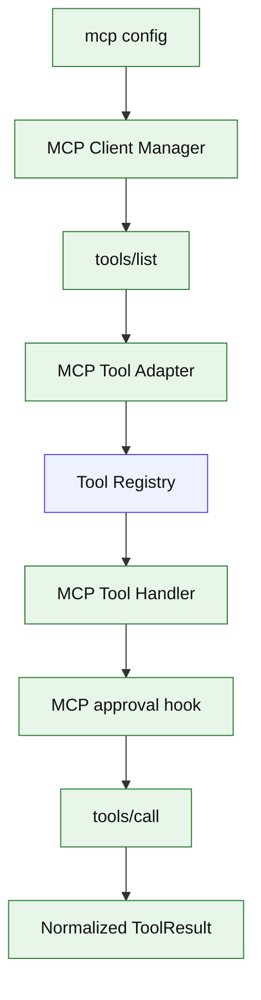

# Stage 09 Diagram

```mermaid
flowchart TB
  Config["mcp config"] --> Client["MCP Client Manager"]
  Client --> List["tools/list"]
  List --> Adapter["MCP Tool Adapter"]
  Adapter --> Registry["Tool Registry"]
  Registry --> Handler["MCP Tool Handler"]
  Handler --> Approval["MCP approval hook"]
  Approval --> Call["tools/call"]
  Call --> Result["Normalized ToolResult"]

  classDef existing fill:#eef2ff,stroke:#4f46e5,color:#111;
  classDef new fill:#e8f5e9,stroke:#2e7d32,color:#111;
  class Registry existing;
  class Config,Client,List,Adapter,Handler,Approval,Call,Result new;
```
