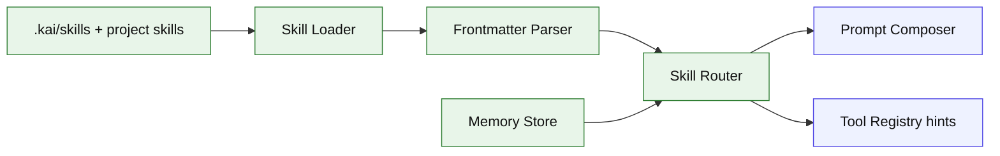

# Stage 10 Diagram

```mermaid
flowchart LR
  FS[".kai/skills + project skills"] --> Loader["Skill Loader"]
  Loader --> FM["Frontmatter Parser"]
  FM --> Router["Skill Router"]
  Memory["Memory Store"] --> Router
  Router --> Prompt["Prompt Composer"]
  Router --> Tools["Tool Registry hints"]

  classDef existing fill:#eef2ff,stroke:#4f46e5,color:#111;
  classDef new fill:#e8f5e9,stroke:#2e7d32,color:#111;
  class Prompt,Tools existing;
  class FS,Loader,FM,Router,Memory new;
```
