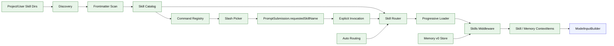

# Stage 10 Diagram

```mermaid
flowchart LR
  Dirs["Project/User Skill Dirs"] --> Discovery["Discovery"]
  Discovery --> FM["Frontmatter Scan"]
  FM --> Catalog["Skill Catalog"]
  Catalog --> Registry["Command Registry"]
  Registry --> Slash["Slash Picker"]
  Slash --> Submission["PromptSubmission.requestedSkillName"]
  Catalog --> Router["Skill Router"]
  Submission --> Explicit["Explicit Invocation"]
  Explicit --> Router
  Auto["Auto Routing"] --> Router
  Router --> Loader["Progressive Loader"]
  Loader --> Middleware["Skills Middleware"]
  Memory["Memory v0 Store"] --> Middleware
  Middleware --> Items["Skill / Memory ContextItems"]
  Items --> Builder["ModelInputBuilder"]

  classDef existing fill:#eef2ff,stroke:#4f46e5,color:#111;
  classDef new fill:#e8f5e9,stroke:#2e7d32,color:#111;
  class Builder existing;
  class Dirs,Discovery,FM,Catalog,Registry,Slash,Submission,Router,Explicit,Auto,Loader,Middleware,Memory,Items new;
```
