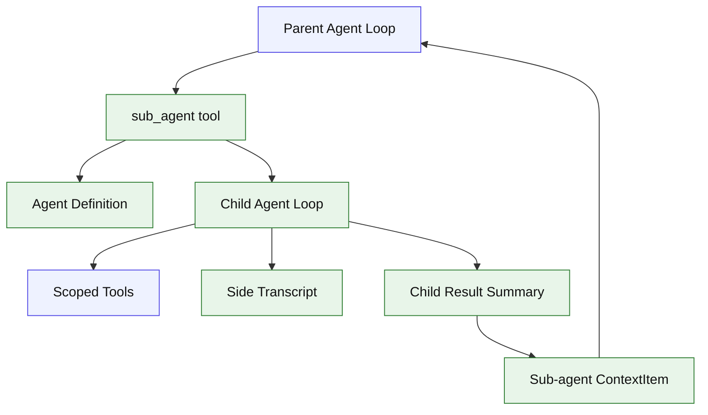

# Stage 11 Diagram

```mermaid
flowchart TB
  Parent["Parent Agent Loop"] --> AgentTool["sub_agent tool"]
  AgentTool --> Def["Agent Definition"]
  AgentTool --> Child["Child Agent Loop"]
  Child --> ChildTools["Scoped Tools"]
  Child --> Side["Side Transcript"]
  Child --> Summary["Child Result Summary"]
  Summary --> Item["Sub-agent ContextItem"]
  Item --> Parent

  classDef existing fill:#eef2ff,stroke:#4f46e5,color:#111;
  classDef new fill:#e8f5e9,stroke:#2e7d32,color:#111;
  class Parent,ChildTools existing;
  class AgentTool,Def,Child,Side,Summary,Item new;
```
