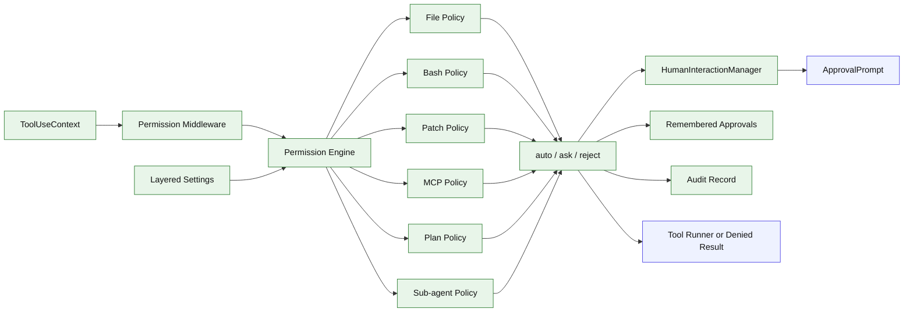

# Stage 12 Diagram

```mermaid
flowchart LR
  ToolUse["ToolUseContext"] --> MW["Permission Middleware"]
  MW --> Engine["Permission Engine"]
  Settings["Layered Settings"] --> Engine
  Engine --> File["File Policy"]
  Engine --> Bash["Bash Policy"]
  Engine --> Patch["Patch Policy"]
  Engine --> MCP["MCP Policy"]
  Engine --> Plan["Plan Policy"]
  Engine --> Sub["Sub-agent Policy"]
  File --> Decision["auto / ask / reject"]
  Bash --> Decision
  Patch --> Decision
  MCP --> Decision
  Plan --> Decision
  Sub --> Decision
  Decision --> Manager["HumanInteractionManager"]
  Manager --> Approval["ApprovalPrompt"]
  Decision --> Remember["Remembered Approvals"]
  Decision --> Audit["Audit Record"]
  Decision --> Tool["Tool Runner or Denied Result"]

  classDef existing fill:#eef2ff,stroke:#4f46e5,color:#111;
  classDef new fill:#e8f5e9,stroke:#2e7d32,color:#111;
  class Approval,Tool existing;
  class ToolUse,MW,Settings,Engine,File,Bash,Patch,MCP,Plan,Sub,Decision,Manager,Remember,Audit new;
```
