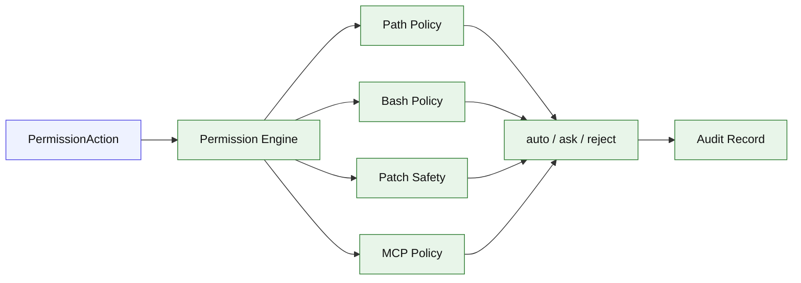

# Stage 12 Diagram

```mermaid
flowchart LR
  Action["PermissionAction"] --> Engine["Permission Engine"]
  Engine --> Path["Path Policy"]
  Engine --> Bash["Bash Policy"]
  Engine --> Patch["Patch Safety"]
  Engine --> MCP["MCP Policy"]
  Path --> Decision["auto / ask / reject"]
  Bash --> Decision
  Patch --> Decision
  MCP --> Decision
  Decision --> Audit["Audit Record"]

  classDef existing fill:#eef2ff,stroke:#4f46e5,color:#111;
  classDef new fill:#e8f5e9,stroke:#2e7d32,color:#111;
  class Action existing;
  class Engine,Path,Bash,Patch,MCP,Decision,Audit new;
```
