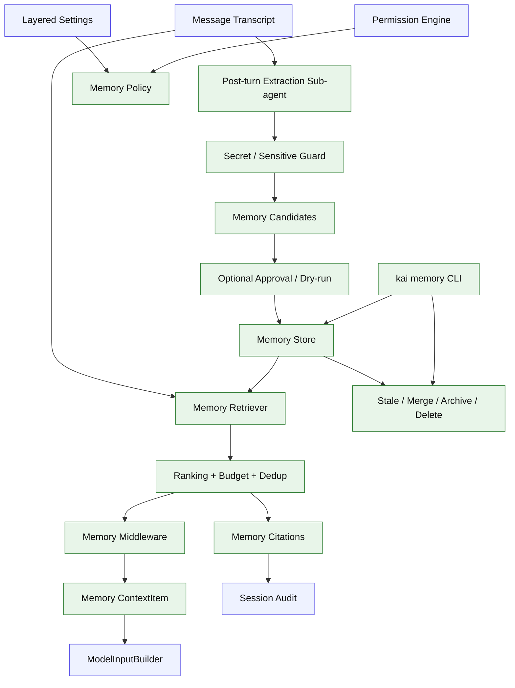

# Stage 13 Diagram

```mermaid
flowchart TB
  Transcript["Message Transcript"] --> Extractor["Post-turn Extraction Sub-agent"]
  Transcript --> Retriever["Memory Retriever"]
  Settings["Layered Settings"] --> Policy["Memory Policy"]
  Permission["Permission Engine"] --> Policy
  Extractor --> Guard["Secret / Sensitive Guard"]
  Guard --> Candidates["Memory Candidates"]
  Candidates --> Approval["Optional Approval / Dry-run"]
  Approval --> Store["Memory Store"]
  Store --> Retriever
  Retriever --> Ranking["Ranking + Budget + Dedup"]
  Ranking --> Citations["Memory Citations"]
  Ranking --> Middleware["Memory Middleware"]
  Middleware --> Item["Memory ContextItem"]
  Item --> Builder["ModelInputBuilder"]
  Store --> Lifecycle["Stale / Merge / Archive / Delete"]
  CLI["kai memory CLI"] --> Store
  CLI --> Lifecycle
  Citations --> Audit["Session Audit"]

  classDef existing fill:#eef2ff,stroke:#4f46e5,color:#111;
  classDef new fill:#e8f5e9,stroke:#2e7d32,color:#111;
  class Transcript,Settings,Permission,Builder,Audit existing;
  class Extractor,Policy,Guard,Candidates,Approval,Store,Retriever,Ranking,Citations,Middleware,Item,Lifecycle,CLI new;
```
