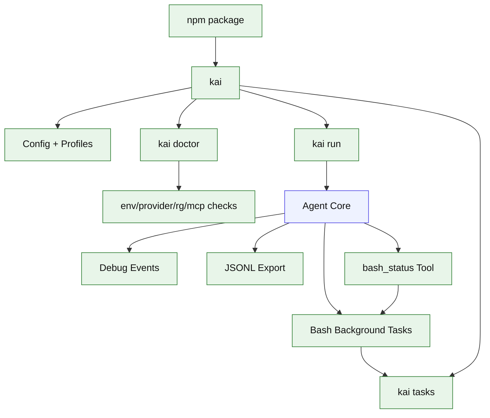

# Stage 13 Diagram

```mermaid
flowchart TB
  CLI["kai"] --> Config["Config + Profiles"]
  CLI --> Doctor["kai doctor"]
  CLI --> Run["kai run"]
  CLI --> Tasks["kai tasks"]
  Run --> Core["Agent Core"]
  Core --> Telemetry["Debug Events"]
  Core --> Logs["JSONL Export"]
  Core --> BashBg["Bash Background Tasks"]
  Core --> BashStatus["bash_status Tool"]
  BashBg --> Tasks
  BashStatus --> BashBg
  Doctor --> Checks["env/provider/rg/mcp checks"]
  Package["npm package"] --> CLI

  classDef existing fill:#eef2ff,stroke:#4f46e5,color:#111;
  classDef new fill:#e8f5e9,stroke:#2e7d32,color:#111;
  class Core existing;
  class CLI,Config,Doctor,Run,Tasks,Telemetry,Logs,BashBg,BashStatus,Checks,Package new;
```
