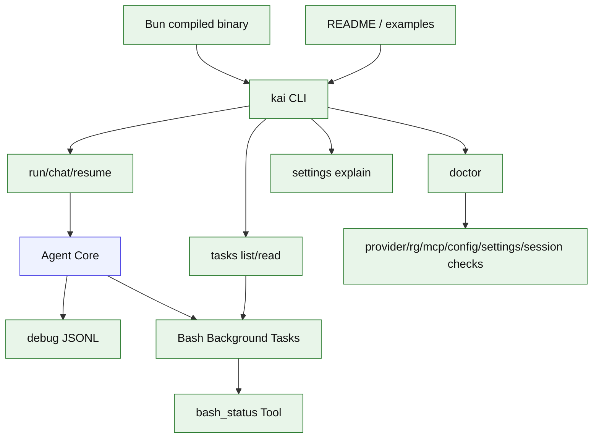

# Stage 14 Diagram

```mermaid
flowchart TB
  CLI["kai CLI"] --> Run["run/chat/resume"]
  CLI --> Doctor["doctor"]
  CLI --> Settings["settings explain"]
  CLI --> Tasks["tasks list/read"]
  Run --> Core["Agent Core"]
  Core --> Logs["debug JSONL"]
  Core --> BashBg["Bash Background Tasks"]
  BashBg --> BashStatus["bash_status Tool"]
  Tasks --> BashBg
  Doctor --> Checks["provider/rg/mcp/config/settings/session checks"]
  Binary["Bun compiled binary"] --> CLI
  Docs["README / examples"] --> CLI

  classDef existing fill:#eef2ff,stroke:#4f46e5,color:#111;
  classDef new fill:#e8f5e9,stroke:#2e7d32,color:#111;
  class Core existing;
  class CLI,Run,Doctor,Settings,Tasks,Logs,BashBg,BashStatus,Checks,Binary,Docs new;
```
