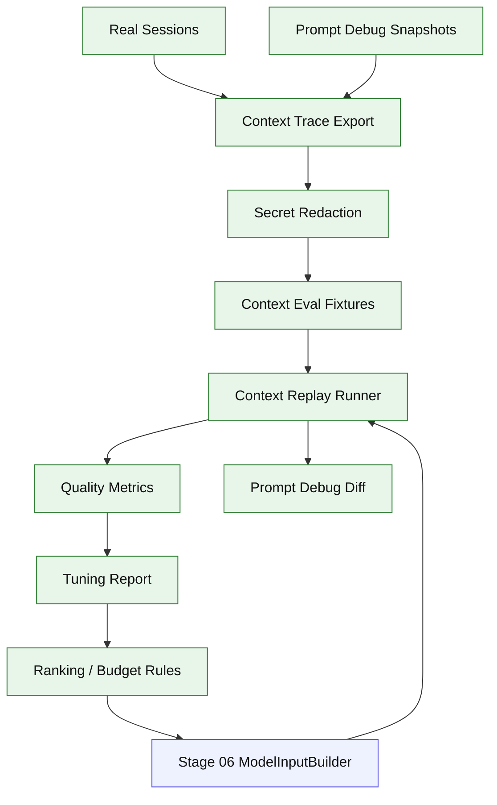

# Stage 15 Diagram

```mermaid
flowchart TB
  Sessions["Real Sessions"] --> Trace["Context Trace Export"]
  Debug["Prompt Debug Snapshots"] --> Trace
  Trace --> Redact["Secret Redaction"]
  Redact --> Fixtures["Context Eval Fixtures"]
  Fixtures --> Replay["Context Replay Runner"]
  Builder["Stage 06 ModelInputBuilder"] --> Replay
  Replay --> Metrics["Quality Metrics"]
  Metrics --> Report["Tuning Report"]
  Report --> Rules["Ranking / Budget Rules"]
  Rules --> Builder
  Replay --> Diff["Prompt Debug Diff"]

  classDef existing fill:#eef2ff,stroke:#4f46e5,color:#111;
  classDef new fill:#e8f5e9,stroke:#2e7d32,color:#111;
  class Builder existing;
  class Sessions,Trace,Debug,Redact,Fixtures,Replay,Metrics,Report,Rules,Diff new;
```
