# Final Architecture

Stage 15 完成后，Kai Code Agent 是一个 Bun-first TypeScript CLI binary。它的核心不是一个巨大 coding loop，而是五层协作：`foundation` 定义协议，`agent` 执行通用 ReAct + middleware，`coding` 注入 build/plan profiles、代码工具和 Context Kernel，`community` 连接 provider，`ui` 提供 Ink/plain/HITL 体验。所有长期状态遵循 transcript-first：message/part transcript 是权威事实，UiEvent 是实时过程事件，TUI 是 transcript/event 的投影。Memory 是分层、类型化、可引用、可删除的长期偏好/决策/事实层，不替代 transcript、context loader 或 skills。所有进入模型的内容遵循 ContextItem-first：skill、memory、sub-agent、permission 和 plan handoff 都通过 `ContextItem[] -> ModelInputBuilder` 统一预算、裁剪、debug 和质量评估。Thinking/reasoning、tool_use 展示和人机交互都有独立边界，不能混进普通正文、原始 JSON 或具体 Ink 组件。

## 架构图

```mermaid
flowchart TB
  subgraph UI["ui"]
    Entry["kai command"]
    Ink["Ink TUI"]
    Plain["Plain Renderer"]
    InputEditor["Input Editor"]
    CommandInput["Command Input Hook"]
    CommandRegistry["Command Registry"]
    PromptSubmission["PromptSubmission"]
    Batcher["Renderer Batcher"]
    Approval["ApprovalPrompt"]
    Question["AskUserQuestionPrompt"]
    Slash["Slash Command Picker"]
  end

  subgraph Foundation["foundation"]
    Model["Model"]
    Message["Message / Part / Thinking"]
    Tool["ToolDef / ToolResult"]
    ToolSummary["ToolUse Summary"]
    Result["Result / Error"]
    Event["UiEvent"]
    JsonSchema["JSON schema"]
  end

  subgraph Agent["agent"]
    Loop["Generic ReAct Loop"]
    Middleware["Middleware Pipeline"]
    ToolAcc["Tool Argument Accumulator"]
    ReasoningSplit["Reasoning/Text Splitter"]
    ResultFmt["ToolResult Formatter"]
    HITLManager["HumanInteractionManager"]
    Turn["Turn Orchestrator"]
    SessionOrch["Session Orchestrator"]
    Recovery["Retry / Recovery"]
  end

  subgraph Coding["coding"]
    BuildProfile["Build Agent Profile"]
    PlanProfile["Plan Agent Profile"]
    ContextKernel["Context Kernel"]
    Builder["ModelInput Builder"]
    Context["Context Manager"]
    PlanStore["Plan File Store"]
    FileTools["Read / Write / Edit"]
    SearchTools["Grep / Glob"]
    Bash["Bash"]
    BashStatus["Bash Status"]
    Patch["Apply Patch"]
  end

  subgraph Community["community"]
    ProviderFactory["Provider Factory"]
    OpenAI["OpenAI-compatible Adapter"]
    Fixture["Fixture Provider"]
    FutureProvider["Future Provider Adapters"]
  end

  subgraph Ext["extensions"]
    MCP["MCP Client"]
    Skills["Skills Router"]
    MemoryStore["Memory Store"]
    MemoryRetriever["Memory Retriever"]
    MemoryExtractor["Memory Extractor"]
    MemoryLifecycle["Memory Lifecycle"]
    MemoryCitations["Memory Citations"]
    MemoryGuard["Memory Secret Guard"]
    SubAgent["Sub-agent Runner"]
    Permissions["Permission Engine"]
    ContextQuality["Context Quality Eval"]
  end

  subgraph Data["data"]
    Config["Config YAML"]
    Settings["Layered Settings"]
    ProjectLocal[".kai/settings.local.json"]
    Store["bun:sqlite Transcript Store"]
    Projection["History Projection"]
    Plans[".kai/plans / user plans"]
    Audit["Audit Log"]
    BashTasks["Bash Task Records"]
    MemoryDb["Memory Records / Citations"]
    ContextTraces["Context Traces / Eval Fixtures"]
  end

  Entry --> Ink
  Entry --> Plain
  Ink --> InputEditor
  Ink --> CommandInput
  CommandInput --> CommandRegistry
  CommandRegistry --> Slash
  CommandRegistry --> PromptSubmission
  Ink --> Slash
  PromptSubmission --> Loop
  Batcher --> Ink
  Batcher --> Plain
  HITLManager --> Approval
  HITLManager --> Question
  Ink --> Loop
  Plain --> Loop

  Loop --> Middleware
  Loop --> ReasoningSplit
  Loop --> ToolAcc
  ToolAcc --> Middleware
  Middleware --> ContextKernel
  ContextKernel --> Context
  Context --> Builder
  Builder --> ProviderFactory
  Middleware --> ProviderFactory
  Middleware --> FileTools
  Middleware --> SearchTools
  Middleware --> Bash
  Middleware --> Patch
  Middleware --> MCP
  Middleware --> HITLManager
  FileTools --> ToolSummary
  SearchTools --> ToolSummary
  Bash --> ToolSummary
  Patch --> ToolSummary
  FileTools --> ResultFmt
  SearchTools --> ResultFmt
  Bash --> ResultFmt
  Patch --> ResultFmt
  MCP --> ResultFmt

  Loop --> Turn
  Turn --> SessionOrch
  SessionOrch --> Store
  Store --> Projection
  Projection --> Batcher
  Recovery --> Loop

  BuildProfile --> ContextKernel
  PlanProfile --> ContextKernel
  PlanProfile --> PlanStore
  PlanStore --> Plans

  ProviderFactory --> OpenAI
  ProviderFactory --> Fixture
  ProviderFactory --> FutureProvider
  OpenAI --> Model
  Fixture --> Model
  OpenAI --> ReasoningSplit
  Fixture --> ReasoningSplit
  OpenAI --> ToolAcc
  Fixture --> ToolAcc
  FutureProvider --> ToolAcc
  Message --> Store

  FileTools --> Tool
  SearchTools --> Tool
  Bash --> Tool
  BashStatus --> Tool
  ToolSummary --> Event
  Patch --> Tool
  MCP --> Tool
  Skills --> ContextKernel
  MemoryRetriever --> ContextKernel
  MemoryStore --> MemoryRetriever
  MemoryExtractor --> MemoryGuard
  MemoryGuard --> MemoryStore
  MemoryLifecycle --> MemoryStore
  MemoryRetriever --> MemoryCitations
  MemoryCitations --> Audit
  MemoryStore --> MemoryDb
  Store --> MemoryExtractor
  SubAgent --> Loop
  SubAgent --> ContextKernel
  Permissions --> Middleware
  Permissions --> MemoryExtractor
  Permissions --> ContextKernel
  Context --> ContextQuality
  Builder --> ContextQuality
  ContextQuality --> ContextTraces

  Config --> ProviderFactory
  Settings --> ProviderFactory
  Settings --> Permissions
  ProjectLocal --> Settings
  Store --> Audit
  Bash --> BashTasks
  BashStatus --> BashTasks
```



## 关键数据流

| 流程 | 步骤 |
| --- | --- |
| 首次启动 | `kai` 无子命令 -> config loader -> 缺少默认模型 -> Ink first-run wizard -> 写入 `~/.kai-code-agent/config.yaml` |
| Settings 合并 | user `~/.kai-code-agent/settings.json` + project `.kai/settings.json` + local `.kai/settings.local.json` -> allow/deny union + 普通字段覆盖 -> effective settings |
| Provider 创建 | CLI 读取默认 model profile -> `community` provider factory -> OpenAI-compatible 或 fixture adapter |
| 普通 build turn | UI 输入或 PromptSubmission -> build/profile/model/mode metadata -> middleware -> ContextItem producers -> ModelInputBuilder -> provider -> tool loop -> session store |
| Transcript 写入 | model/tool/text parts -> session `messages` / `parts` -> transcript store，作为 resume、token budget、history projection 的权威事实 |
| Thinking 拆分 | provider reasoning_content / thinking / `<think>` -> thinking part 或 hidden event；默认不进入用户可见 text |
| UI 投影 | transcript store + 当前 turn UiEvent -> Ink/plain renderer；重启后通过 transcript replay 重建基本历史摘要 |
| Plan turn | `/plan` 或 `plan_enter` -> plan profile -> 只读工具 + plan file write -> `plan_exit` -> HumanInteractionManager -> ApprovalPrompt -> build handoff |
| 工具调用 | provider tool argument delta -> accumulator -> JSON parse success -> ExecutableToolUse -> middleware `beforeToolUse` -> permission/plan guard/approval -> tool execute -> ToolResult |
| 半截工具参数 | provider tool argument delta parse 未完成 -> 只留在 accumulator；不进入 runner、approval、UI 参数展示或 executable transcript |
| 工具参数解析失败 | provider finish 时仍无法 parse -> non-executable parse_error ToolResult / failure part，不调用工具 |
| ToolResult 格式化 | raw ToolResult -> normalize success/error -> infer error kind -> tool policy truncate/summary -> model-visible ToolResult |
| ToolUse 展示 | ExecutableToolUse -> `summarizeToolUse` -> `{ title, detail? }` -> plain/Ink renderer |
| Bash 进度 | bash tool -> `ToolContext.emit({ type: "bash_progress" })` -> UiEvent -> Ink/plain renderer |
| HITL 交互 | tool/middleware -> HumanInteractionManager queue -> Ink/plain prompt subscriber -> structured result promise |
| 结构化提问 | model 调用 `ask_user_question` -> HumanInteractionManager -> AskUserQuestionPrompt -> structured answer ToolResult |
| 输入编辑 | input editor reducer 处理文本/光标/历史；command input hook 处理 slash picker、Esc、Tab/Enter、Ctrl-C |
| Slash context | command registry -> `CommandResult`; `/skill`、`/plan`、`/profile`、`/model` 可提交 PromptSubmission metadata 影响下一轮 run context |
| 渲染批处理 | 高频 stream event -> pending queue -> 30-80ms flush -> Ink state；边界事件立即 flush |
| 文件修改 | edit/write/patch -> path policy -> optional approval -> write -> diff summary -> session part |
| 上下文压缩 | context budget exceeded -> compaction prompt -> summary message + recent tail -> summary ContextItem |
| Skills | 多目录 frontmatter scan -> slash picker 或 auto routing -> progressive load `SKILL.md` -> skill ContextItem |
| Sub-agent 结果 | `sub_agent` tool -> side transcript -> summary/changed files/open questions -> subagent ContextItem |
| Memory 检索 | prompt submission + transcript context -> MemoryRetriever -> top-k/budget/dedupe/explain -> memory ContextItem -> citation |
| Memory 提取 | turn 结束 -> extraction sub-agent -> MemoryCandidate[] -> secret guard/dedupe/policy -> optional approval -> MemoryStore |
| Memory 生命周期 | user CLI 或 stale policy -> archive/delete/merge/refresh/promote -> events/citations/audit |
| Context 质量优化 | real session/debug snapshot -> context trace -> redacted eval fixture -> replay -> metric report -> ranking/budget tuning |
| Approval persistence | approval result -> session audit；用户选择记住时写入 session、projectLocal settings 或 user settings |
| MCP 调用 | namespaced tool -> MCP client -> optional approval -> `tools/call` -> normalized ToolResult |

## 公共接口

```ts
export interface ToolDef<TInput = JsonValue> {
  name: string;
  description: string;
  inputSchema: JsonSchema;
  execute(input: TInput, ctx: ToolContext): Promise<ToolResult>;
}

export interface ToolContext {
  cwd: string;
  signal: AbortSignal;
  sessionId: string;
  toolCallId: string;
  emit(event: ToolRuntimeEvent): void;
}

export interface ExecutableToolUse {
  id: string;
  name: string;
  input: JsonObject;
}

export interface ToolUseSummary {
  title: string;
  detail?: string;
}

export function summarizeToolUse(toolUse: ExecutableToolUse): ToolUseSummary;

export function formatToolResultForModel(toolName: string, rawResult: ToolResult): string;

export type ProviderEvent =
  | { type: "text_delta"; text: string }
  | { type: "thinking_delta"; text: string; hidden: true }
  | { type: "tool_call_delta"; id: string; name?: string; argumentsDelta: string }
  | { type: "usage"; inputTokens?: number; outputTokens?: number }
  | { type: "done" };

export interface Middleware {
  beforeAgentRun?(ctx: AgentRunContext): Promise<void>;
  afterAgentRun?(ctx: AgentRunContext): Promise<void>;
  beforeModel?(ctx: ModelContext): Promise<ModelInput | void>;
  afterModel?(ctx: ModelContext): Promise<void>;
  beforeToolUse?(ctx: ToolUseContext): Promise<ToolResult | void>;
  afterToolUse?(ctx: ToolUseContext): Promise<void>;
}

export type ContextItemKind =
  | "base"
  | "profile"
  | "environment"
  | "instruction"
  | "history"
  | "summary"
  | "tool_result"
  | "plan"
  | "skill"
  | "memory"
  | "permission"
  | "subagent";

export interface ContextItem {
  id: string;
  kind: ContextItemKind;
  source: string;
  content: string;
  priority: number;
  estimatedTokens?: number;
  maxTokens?: number;
  sticky?: boolean;
  cacheStable?: boolean;
  metadata?: Record<string, unknown>;
}

export interface ContextDebugItem {
  id: string;
  kind: ContextItemKind;
  source: string;
  estimatedTokens: number;
  included: boolean;
  cutReason?: string;
}

export interface ModelInputBuildResult {
  system: string[];
  messages: Message[];
  tools: ProviderToolSchema[];
  generation: { maxOutputTokens: number; temperature?: number };
  debug: { items: ContextDebugItem[]; estimatedInputTokens: number };
}

export type ToolRuntimeEvent =
  | { type: "bash_progress"; toolCallId: string; output: string; elapsedMs: number; totalBytes: number };

export interface HumanInteractionManager<TRequest, TResult> {
  enqueue(request: TRequest): Promise<TResult>;
  subscribe(listener: (pending: PendingHumanInteraction<TRequest>) => void): () => void;
  resolve(id: string, result: TResult): void;
  reject(id: string, error: Error): void;
}

export interface PendingHumanInteraction<TRequest> {
  id: string;
  kind: "approval" | "question" | "plan_approval" | "mcp_elicitation" | "login";
  request: TRequest;
}

export interface PromptSubmission {
  text: string;
  metadata?: {
    requestedSkillName?: string;
    requestedProfile?: "build" | "plan" | string;
    requestedModel?: string;
    requestedMode?: string;
    resumeSessionId?: string;
    slashCommand?: string;
  };
}

export type CommandResult =
  | { type: "submit_prompt"; submission: PromptSubmission }
  | { type: "local_action"; action: string; input?: JsonValue }
  | { type: "input_transform"; text: string };

export interface SettingsLayers {
  user?: KaiSettings;          // ~/.kai-code-agent/settings.json
  project?: KaiSettings;       // <project>/.kai/settings.json
  projectLocal?: KaiSettings;  // <project>/.kai/settings.local.json
}

export function mergeSettings(layers: SettingsLayers): EffectiveSettings;

export interface InputEditorState {
  text: string;
  cursor: number;
  historyIndex: number | null;
  placeholder?: string;
}

export interface BashToolResult {
  stdoutPreview: string;
  stderrPreview: string;
  exitCode: number | null;
  interrupted: boolean;
  outputBytes: number;
  backgroundTaskId?: string;
  persistedOutputPath?: string;
}

export interface PlanFile {
  path: string;
  createdAt: string;
  slug: string;
  approvedAt?: string;
}

export type MemoryScope = "session" | "projectLocal" | "project" | "user";
export type MemoryType = "preference" | "feedback" | "decision" | "project" | "reference" | "fact";

export interface MemoryRecord {
  id: string;
  scope: MemoryScope;
  type: MemoryType;
  status: "active" | "stale" | "archived";
  text: string;
  tags: string[];
  confidence: number;
  source: {
    sessionId?: string;
    messageId?: string;
    toolCallId?: string;
    filePath?: string;
    kind: "manual" | "extracted" | "imported";
  };
  createdAt: string;
  updatedAt: string;
  lastUsedAt?: string;
  expiresAt?: string;
}
```

## 最终目录

```text
src/
  foundation/
  agent/
  coding/
    profiles/
    prompt/
    tools/
    plan/
    patch/
    context/
      quality/
  community/
    openai-compatible/
    fixture/
  ui/
    ink/
    plain/
    prompts/
    input-editor.ts
    use-command-input.ts
    command-registry.ts
    render-batcher.ts
    slash/
  session/
  config/
    settings.ts
    settings-merge.ts
  mcp/
  skills/
  memory/
    types.ts
    store.ts
    retrieval.ts
    middleware.ts
    extractor.ts
    dedupe.ts
    lifecycle.ts
    citations.ts
    secret-guard.ts
  permissions/
```

## 参考来源

| 领域 | 主要参考 |
| --- | --- |
| Bun workspace / profiles | `$OPENCODE_REPO/packages/opencode` workspace、agent/profile 组织方式 |
| Loop/stream | `$OPENCODE_REPO/packages/opencode/src/session/processor.ts` L118-L794 |
| Provider/config | `$OPENCODE_REPO/packages/opencode/src/session/llm.ts` L76-L129；`$OPENCODE_REPO/packages/opencode/src/provider/provider.ts` L92-L190 |
| Tool abstraction | `$OPENCODE_REPO/packages/opencode/src/tool/tool.ts` L16-L127 |
| Tool orchestration | `$CLAUDE_CODE_REPO/src/services/tools/StreamingToolExecutor.ts` L73-L205 |
| Bash command tool | `$CLAUDE_CODE_REPO/src/tools/BashTool/BashTool.tsx` L227-L294；`$OPENCODE_REPO/packages/opencode/src/tool/shell.ts` L261-L307 |
| Plan mode | OpenCode plan agent/profile；Claude Code EnterPlanMode / ExitPlanMode / approval 体验 |
| Prompt/context | `$OPENCODE_REPO/packages/opencode/src/session/instruction.ts` L13-L163；`$CLAUDE_CODE_REPO/src/constants/prompts.ts` L444-L577；Stage 06 ContextItem/ModelInputBuilder |
| Thinking/message parts | provider stream part 边界参考 OpenCode message parts、Codex protocol item 思路 |
| HITL manager | Codex MCP elicitation request/response 边界；OpenCode permission ask 流程 |
| TUI input/rendering | Ink app 壳、command picker、stream state batching 的成熟 CLI chatbox 经验 |
| Settings merge | OpenCode-style user/project/local settings 分层；permissions allow union，普通字段覆盖 |
| Slash context | skill/plan/profile/model 选择通过 PromptSubmission metadata 进入 agent loop |
| Compaction | `$OPENCODE_REPO/packages/opencode/src/session/compaction.ts` L122-L203 |
| Memory context | OpenCode instruction/context/compaction；Claude relevant memory prefetch 和 extractMemories；Codex memory citations/consolidation |
| Context quality | OpenCode usage/snapshot/overflow；Claude prompt cache/context cleanup；Codex context snapshot/debug replay |
| Patch | `$CODEX_REPO/codex-rs/core/src/tools/handlers/apply_patch.lark` L1-L19 |
| Permissions | `$OPENCODE_REPO/packages/opencode/src/permission/index.ts` L128-L185；`$CODEX_REPO/codex-rs/core/src/safety.rs` L21-L115 |
| MCP | `$OPENCODE_REPO/packages/opencode/src/mcp/index.ts` L132-L417；`$CODEX_REPO/codex-rs/core/src/tools/handlers/mcp.rs` L31-L139 |
