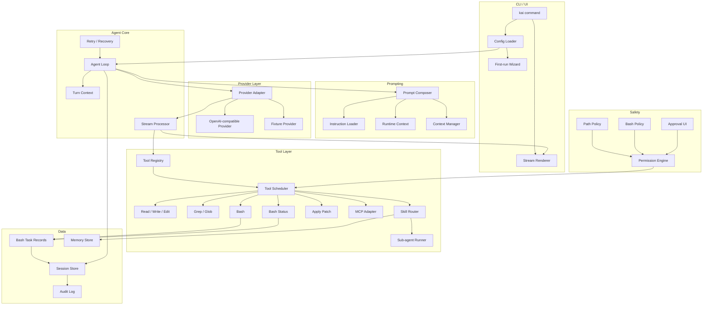

# Final Architecture

完成 Stage 13 后，Kai Code Agent 的最终形态是一个单进程 TypeScript CLI。它围绕 agent loop 组织能力：prompt composer 准备输入，provider adapter 输出流式事件，stream processor 驱动工具，tool result 进入 session store 并回传模型，context manager 在预算不足时压缩历史。

## 架构图



## 关键数据流

| 流程 | 步骤 |
| --- | --- |
| 首次启动 | `kai` 无子命令 -> config loader -> 缺少默认模型 -> first-run wizard -> 写入 `~/.kai-code-agent/config.yaml` |
| Provider 创建 | CLI 读取默认 model profile -> provider factory -> 根据内部 `provider` 类型创建 adapter |
| 普通回答 | CLI 输入 -> Prompt Composer -> Provider -> Stream Renderer -> Session Store |
| 工具调用 | Provider tool event -> Stream Processor -> Tool Registry -> Permission -> Tool execute -> ToolResult -> Provider continuation |
| Bash 进度 | bash tool -> ToolContext.emit(bash_progress) -> Stream Processor -> Stream Renderer |
| 文件修改 | edit/write/patch -> path policy -> approval if needed -> write -> diff summary -> session part |
| 上下文压缩 | token budget exceeded -> build summary prompt -> compact -> replace old messages with summary + tail |
| MCP 调用 | model tool name -> MCP adapter -> server/tool approval -> callTool -> normalized ToolResult |
| 子 Agent | AgentTool -> create isolated context -> run nested loop -> side transcript -> summary result |

## 模块接口

```ts
export interface AgentLoop {
  runTurn(input: UserInput, options: RunOptions): AsyncIterable<UiEvent>;
}

export interface ProviderAdapter {
  stream(input: ProviderInput, signal: AbortSignal): AsyncIterable<ProviderEvent>;
}

export interface ModelProfile {
  preset: string;
  provider: "openai" | string;
  baseURL: string;
  apiKey: string;
  model: string;
}

export interface ToolDef<TInput = JsonValue> {
  name: string;
  description: string;
  inputSchema: JsonSchema;
  safety: ToolSafety;
  execute(input: TInput, ctx: ToolContext): Promise<ToolResult>;
}

export interface ToolContext {
  cwd: string;
  signal: AbortSignal;
  sessionId: string;
  toolCallId: string;
  emit(event: ToolRuntimeEvent): void;
}

export type ToolRuntimeEvent =
  | { type: "bash_progress"; toolCallId: string; output: string; elapsedMs: number; totalBytes: number };

export interface BashToolResult {
  stdoutPreview: string;
  stderrPreview: string;
  exitCode: number | null;
  interrupted: boolean;
  outputBytes: number;
  backgroundTaskId?: string;
  persistedOutputPath?: string;
}

export interface PermissionEngine {
  evaluate(action: PermissionAction, ctx: PermissionContext): Promise<PermissionDecision>;
}
```

## 最终目录

```text
src/
  cli/
  agent/
  provider/
  tools/
  patch/
  session/
  prompt/
  context/
  mcp/
  skills/
  agents/
  permissions/
  ui/
  config/
```

## 参考来源

| 领域 | 主要参考 |
| --- | --- |
| Loop/stream | `$OPENCODE_REPO/packages/opencode/src/session/processor.ts` L118-L794 |
| Provider/config | `$OPENCODE_REPO/packages/opencode/src/session/llm.ts` L76-L129；`$OPENCODE_REPO/packages/opencode/src/provider/provider.ts` L92-L190 |
| Tool abstraction | `$OPENCODE_REPO/packages/opencode/src/tool/tool.ts` L16-L127 |
| Tool orchestration | `$CLAUDE_CODE_REPO/src/services/tools/StreamingToolExecutor.ts` L73-L205 |
| Bash command tool | `$CLAUDE_CODE_REPO/src/tools/BashTool/BashTool.tsx` L227-L294；`$OPENCODE_REPO/packages/opencode/src/tool/shell.ts` L261-L307 |
| Prompt/context | `$OPENCODE_REPO/packages/opencode/src/session/instruction.ts` L13-L163；`$CLAUDE_CODE_REPO/src/constants/prompts.ts` L444-L577 |
| Compaction | `$OPENCODE_REPO/packages/opencode/src/session/compaction.ts` L122-L203 |
| Patch | `$CODEX_REPO/codex-rs/core/src/tools/handlers/apply_patch.lark` L1-L19 |
| Permissions | `$OPENCODE_REPO/packages/opencode/src/permission/index.ts` L128-L185；`$CODEX_REPO/codex-rs/core/src/safety.rs` L21-L115 |
| MCP | `$OPENCODE_REPO/packages/opencode/src/mcp/index.ts` L132-L417；`$CODEX_REPO/codex-rs/core/src/tools/handlers/mcp.rs` L31-L139 |
