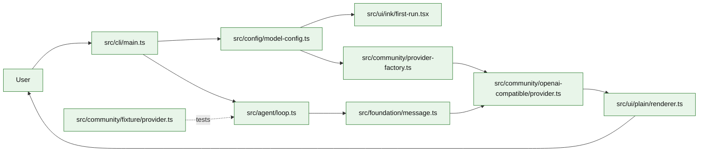

# Stage 01: Bun-first Foundation + Real LLM Loop

## 1. 本阶段目标

本阶段完成 Bun-first foundation 和最小真实 LLM 闭环：用户启动 `kai` 或执行 `kai run "<task>"`，CLI 先校验默认模型配置；如果没有模型配置，则进入 Ink 首次配置向导，收集 provider preset、API key、model name 和必要的 baseURL，并保存到用户级配置文件。配置完成后，Agent 把任务包装成 message，调用真实 OpenAI-compatible LLM API，流式打印回答，并把一次 turn 的内存状态保留下来。Provider adapter 从第一阶段就要区分用户可见 `text_delta` 和非默认展示的 `thinking_delta`，避免把 `<think>...</think>` 或 provider reasoning 字段裸打到 stdout。

Stage 01 的产品主路径是真实 API。fixture provider 只作为测试替身，用于无网络、无 API key 的单元测试和 CI，不作为用户默认路径。

闭环可调试性声明：本阶段完成后，可运行第 7 节中的 Demo commands 验证首次配置、真实 provider、fixture provider、CLI、测试和核心场景。

## 2. 前置依赖

| 依赖 | 用途 |
| --- | --- |
| Bun 1.3.x | CLI runtime、package manager、test runner |
| TypeScript | 主实现语言 |
| zod | message、provider config、fixture event 的轻量校验 |
| yaml | 读写用户级 `config.yaml` |
| bun:test | loop、provider、config、CLI smoke 测试 |
| Ink | 首次配置向导 |
| reasoning normalizer | provider 原生 reasoning_content / `<think>` 清洗，不进入普通正文 |

## 3. 三家方案对比

### 3.1 Loop 形态对比

| 维度 | OpenCode | Claude Code | Codex | 我们的选择 | 理由 |
| --- | --- | --- | --- | --- | --- |
| turn 初始化 | processor 创建上下文与 snapshot | query 在模型调用前聚合状态 | Rust session/turn 结构更重 | 只保留 `RunContext`、messages 和 provider profile；参考 §4 源码引用 | 个人项目优先小代码量、可调试、阶段闭环。 |
| 停止条件 | stop/continue/compact | 按 tool/result/abort 推进 | 协议事件驱动 | Stage 01 只有 `done` / provider error；参考 §4 源码引用 | 工具调用和恢复逻辑留到后续阶段。 |
| 状态复杂度 | 已包含 toolcalls | 已包含 executor | 已包含 approvals | 暂不引入工具状态；参考 §4 源码引用 | 先验证真实模型链路，再引入工具复杂度。 |

### 3.2 Provider 边界对比

| 维度 | OpenCode | Claude Code | Codex | 我们的选择 | 理由 |
| --- | --- | --- | --- | --- | --- |
| 输入 | messages + tools + system | query params + prompt sections | protocol items | `ProviderInput`，Stage 01 只含 messages/model；参考 §4 源码引用 | 后续可加 system、tools、metadata，不破坏 loop。 |
| 输出 | async stream，message part 可区分 | async generator，reasoning 不等于正文 | event stream | async iterable；`text_delta` / `thinking_delta` 分离；参考 §4 源码引用 | 能统一真实 API streaming、fixture replay，并避免 `<think>` 裸输出。 |
| 测试方式 | provider 可替换 | 多 fallback | Rust tests | 真实 provider 为主，fixture provider 用于测试；参考 §4 源码引用 | 避免 mock-first 偏离真实 API，同时保证 CI 可重复。 |

### 3.3 CLI 配置体验对比

| 维度 | OpenCode | Claude Code | Codex | 我们的选择 | 理由 |
| --- | --- | --- | --- | --- | --- |
| 首次启动 | 有 provider/config/auth 体系 | 产品内置账号与模型配置 | CLI 读取 config/profile | `kai` 无子命令时先校验配置，缺失则跑向导 | 个人 CLI 需要开箱即用，且 API key 不应进入项目仓库。 |
| 配置位置 | 项目/用户配置组合 | 产品私有配置 | 用户级配置为主 | `~/.kai-code-agent/config.yaml`，文件权限 `0600` | 保存 API key 时必须避开 repo root；后续再支持 project override。 |
| Provider 命名 | 多 vendor/provider | 产品内部模型路由 | provider profile | preset label 与内部 adapter 分离 | `Minimax Global` 可以映射到内部 `openai` adapter。 |

## 4. 源码引用（必读清单）

| 来源 | 行号 | 参考点 |
| --- | --- | --- |
| `$OPENCODE_REPO/packages/opencode/src/session/processor.ts` | L118-L144 | processor context 初始化 |
| `$OPENCODE_REPO/packages/opencode/src/session/llm.ts` | L76-L129 | provider/config/prompt 进入模型调用 |
| `$OPENCODE_REPO/packages/opencode/src/provider/provider.ts` | L92-L190 | provider profile 与 SDK map 思路 |
| `$CLAUDE_CODE_REPO/src/query.ts` | L620-L708 | 模型调用循环边界 |

## 5. 本阶段架构图（mermaid）



## 6. 详细设计

### 6.1 配置路径与格式

默认用户级配置文件：

```text
~/.kai-code-agent/config.yaml
```

选择这个路径的原因是 Stage 01 会保存 API key，不能放在项目根目录，避免误提交到 Git。写入时创建父目录并把文件权限设为 `0600`。后续阶段可支持项目级 `./kai.config.yaml` 做非密钥覆盖，但 Stage 01 不要求。

配置示例：

```yaml
version: 1
defaultModel: minimax-global
models:
  minimax-global:
    preset: Minimax Global
    provider: openai
    baseURL: https://api.minimax.io/v1
    apiKey: "sk-..."
    model: "MiniMax-Text-01"
```

`provider` 是内部 adapter 类型，不一定等于供应商名称。`provider: openai` 表示使用 OpenAI-compatible adapter。

### 6.2 首次配置向导

启动 CLI 且没有子命令时：

1. 读取 `~/.kai-code-agent/config.yaml`。
2. 校验是否存在 `defaultModel` 和对应 model profile。
3. 如果缺失，进入首次配置向导。
4. 让用户选择 preset。
5. preset 自动带出内部 `provider` 和 `baseURL`。
6. 只有选择 `Other` 时，额外询问自定义 `provider` 和 `baseURL`。
7. 询问 API key 和 model name。
8. 保存配置到用户级 `config.yaml`。
9. 继续启动默认交互或执行当前 task。

Stage 01 预设：

| Preset | baseURL | provider |
| --- | --- | --- |
| Minimax Global | `https://api.minimax.io/v1` | `openai` |
| Other | 用户输入 | 用户输入，默认 `openai` |

### 6.3 模块清单

| 文件路径 | 职责 | 预计行数 | 主要导出 |
|---|---|---:|---|
| `src/cli/main.ts` | 解析 `kai` / `kai run`，触发配置校验和任务执行 | ~130 | `runCli` |
| `src/config/model-config.ts` | 用户级配置路径、读写、zod 校验 | ~120 | `loadModelConfig`, `saveModelConfig` |
| `src/ui/ink/first-run.tsx` | 首次配置向导和 provider preset | ~160 | `ensureModelConfig` |
| `src/foundation/message.ts` | 定义 Message、Role、RunResult | ~70 | `Message` |
| `src/agent/loop.ts` | `runOnce()`，调用 provider，收集输出 | ~130 | `AgentLoop` |
| `src/foundation/model.ts` | provider 输入、输出、错误接口 | ~80 | `ProviderAdapter`, `ProviderEvent` |
| `src/community/openai-compatible/provider.ts` | OpenAI-compatible streaming adapter | ~180 | `OpenAIProvider` |
| `src/community/openai-compatible/reasoning.ts` | provider reasoning 字段和 `<think>` 包裹内容拆分 | ~40 | `splitProviderText` |
| `src/community/provider-factory.ts` | 根据 config 创建 provider adapter | ~60 | `createProvider` |
| `src/community/fixture/provider.ts` | 测试用 fixture event replay | ~70 | `FixtureProvider` |
| `src/ui/plain/renderer.ts` | 输出文本和 provider 错误摘要 | ~40 | `render` |

### 6.4 关键接口

```ts
export type Role = "system" | "user" | "assistant";

export interface Message {
  role: Role;
  content: string;
}

export interface ModelProfile {
  preset: string;
  provider: "openai" | string;
  baseURL: string;
  apiKey: string;
  model: string;
}

export interface ProviderInput {
  messages: Message[];
  model: string;
}

export type ProviderEvent =
  | { type: "text_delta"; text: string }
  | { type: "thinking_delta"; text: string; hidden: true }
  | { type: "usage"; inputTokens?: number; outputTokens?: number }
  | { type: "done" };

export interface ProviderAdapter {
  stream(input: ProviderInput, signal: AbortSignal): AsyncIterable<ProviderEvent>;
}
```

### 6.5 关键算法 / 数据流

1. CLI 启动。
2. `ensureModelConfig()` 读取并校验用户级配置；缺失时跑首次配置向导。
3. CLI 读取 task；无 task 时进入最小交互输入。
4. `createProvider()` 根据默认 model profile 的 `provider` 创建适配器。
5. `runOnce()` 构造 user message。
6. OpenAI-compatible provider 调用真实 API，把 provider 原生 reasoning 字段或 `<think>...</think>` 拆成 `thinking_delta`，其余内容转换为 `text_delta`。
7. renderer 只把 `text_delta` 写到 stdout；`thinking_delta` 默认隐藏，后续 Stage 03/04 进入 debug/session 策略。
8. loop 返回 assistant message。

## 7. 实施步骤（Step-by-step）

1. 初始化 `package.json`、`tsconfig.json`、Bun scripts 和 fixture test 目录。
2. 定义 message/provider/config 的最小接口。
3. 实现用户级配置路径、YAML 读写、`0600` 权限写入。
4. 实现首次配置向导：preset、API key、model name、Other baseURL。
5. 实现 OpenAI-compatible provider 的最小 streaming adapter，并拆分 text/thinking。
6. 实现 fixture provider，用 fixture replay 支撑单测和 CI。
7. 写 CLI 命令：`kai`、`kai run "<task>"`、`kai config show`。
8. 增加 config、provider adapter、thinking 清洗、loop、CLI smoke test。

Demo commands:

```bash
bun install
bun run kai
bun run kai run "summarize this repo"
bun run kai run --provider fixture --script fixtures/provider/basic-text.json "hello"
bun run kai run --provider fixture --script fixtures/provider/thinking-hidden.json "hello"
bun test -- stage-01
```

## 8. 验收标准

| 验收项 | 标准 |
| --- | --- |
| 首次配置 | 无 `~/.kai-code-agent/config.yaml` 时，`bun run kai` 进入配置向导并保存配置 |
| 配置安全 | 用户级配置不在项目目录内，写入权限为 `0600` |
| 真实 API 可跑 | 配置有效 API key 后，`bun run kai run "hello"` 能流式打印 assistant 文本 |
| thinking 隐藏 | provider 返回 `reasoning_content` 或 `<think>` 包裹内容时，plain 输出不出现 thinking 文本 |
| Preset 正确 | 选择 `Minimax Global` 时自动写入 `baseURL=https://api.minimax.io/v1` 和 `provider=openai` |
| Other 正确 | 选择 `Other` 时额外询问自定义 `baseURL`，默认内部 provider 为 `openai` |
| 测试稳定 | 单测和 CI 默认使用 fixture provider，不依赖真实网络和 API key |
| 代码预算 | 核心代码约 990 行 |
| 行为清晰 | 没有工具调用、没有文件写入、没有 session 落盘 |

## 9. 已知限制 & 下一阶段衔接

Stage 01 不支持工具、会话恢复、权限、provider retry、tool call 和上下文压缩。真实 provider 只要求流式文本闭环；tool schema、tool call arguments、tool result 回传在 Stage 02 与 Stage 03 继续补齐。下一阶段引入 ToolDef、ToolRegistry、read/write/edit/bash 四个核心工具，让模型可以通过工具影响 workspace。
