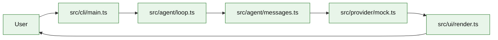

# Stage 01: Minimal Loop

## 1. 本阶段目标

本阶段只做最小可运行闭环：用户在 CLI 输入一个任务，Agent 把任务包装成 message，调用 mock provider，流式或一次性打印回答，并把一次 turn 的内存状态保留下来。阶段结束时，Kai 还不会调用工具，也不会写文件。

闭环可调试性声明：本阶段完成后，可运行第 7 节中的 Demo commands 验证 CLI、测试和核心场景。

## 2. 前置依赖

| 依赖 | 用途 |
| --- | --- |
| Node.js LTS | CLI runtime |
| TypeScript | 主实现语言 |
| zod | message 和 config 的轻量校验 |
| vitest | loop、provider、CLI smoke 测试 |

## 3. 三家方案对比

### 3.1 Loop 形态对比

| 维度 | OpenCode | Claude Code | Codex | 我们的选择 | 理由 |
| --- | --- | --- | --- | --- | --- |
| turn 初始化 | processor 创建上下文与 snapshot | query 在模型调用前聚合状态 | Rust session/turn 结构更重 | 只保留 `RunContext` 和 messages；参考 §4 源码引用 | 个人项目优先小代码量、可调试、阶段闭环。 |
| 停止条件 | stop/continue/compact | 按 tool/result/abort 推进 | 协议事件驱动 | Stage 01 只有 `done`；参考 §4 源码引用 | 个人项目优先小代码量、可调试、阶段闭环。 |
| 状态复杂度 | 已包含 toolcalls | 已包含 executor | 已包含 approvals | 暂不引入工具状态；参考 §4 源码引用 | 个人项目优先小代码量、可调试、阶段闭环。 |

### 3.2 Provider 边界对比

| 维度 | OpenCode | Claude Code | Codex | 我们的选择 | 理由 |
| --- | --- | --- | --- | --- | --- |
| 输入 | messages + tools + system | query params + prompt sections | protocol items | `ProviderInput`；参考 §4 源码引用 | 个人项目优先小代码量、可调试、阶段闭环。 |
| 输出 | async stream | async generator | event stream | async iterable；参考 §4 源码引用 | 个人项目优先小代码量、可调试、阶段闭环。 |
| 测试方式 | provider 可替换 | 多 fallback | Rust tests | mock provider 优先；参考 §4 源码引用 | 个人项目优先小代码量、可调试、阶段闭环。 |

### 3.3 项目取舍对比

| 维度 | OpenCode | Claude Code | Codex | 我们的选择 | 理由 |
| --- | --- | --- | --- | --- | --- |
| 模块数量 | 产品级拆分 | 产品级编排 | Rust crate 拆分 | 5 个小模块；参考 §4 源码引用 | 个人项目优先小代码量、可调试、阶段闭环。 |
| CLI 体验 | 面向完整产品 | 面向交互式编码 | 面向 sandbox 协议 | 先做命令可跑；参考 §4 源码引用 | 个人项目优先小代码量、可调试、阶段闭环。 |
| 风险 | 过早引入复杂工具 | 过早实现恢复逻辑 | 偏离 TS 目标 | 固定在最小闭环；参考 §4 源码引用 | 个人项目优先小代码量、可调试、阶段闭环。 |

## 4. 源码引用（必读清单）

| 来源 | 行号 | 参考点 |
| --- | --- | --- |
| `$OPENCODE_REPO/packages/opencode/src/session/processor.ts` | L118-L144 | processor context 初始化 |
| `$OPENCODE_REPO/packages/opencode/src/session/llm.ts` | L76-L129 | provider/config/prompt 进入模型调用 |
| `$CLAUDE_CODE_REPO/src/query.ts` | L620-L708 | 模型调用循环边界 |

## 5. 本阶段架构图（mermaid）



## 6. 详细设计

### 6.1 模块清单

| 文件路径 | 职责 | 预计行数 | 主要导出 |
|---|---|---:|---|
| `src/cli/main.ts` | 解析 `kai run`，读取用户输入 | ~90 | `runCli` |
| `src/agent/messages.ts` | 定义 Message、Role、RunResult | ~70 | `Message` |
| `src/agent/loop.ts` | `runOnce()`，调用 provider，收集输出 | ~120 | `AgentLoop` |
| `src/provider/types.ts` | provider 接口 | ~40 | `types` |
| `src/provider/mock.ts` | 可预测 mock 回复 | ~50 | `MockProvider` |
| `src/ui/render.ts` | 输出文本 | ~30 | `render` |

### 6.2 关键接口

```ts
export type Role = "system" | "user" | "assistant";

export interface Message {
  role: Role;
  content: string;
}

export interface ProviderAdapter {
  stream(input: { messages: Message[] }, signal: AbortSignal): AsyncIterable<ProviderEvent>;
}
```

### 6.3 关键算法 / 数据流

1. CLI 读取 task。
2. `runOnce()` 构造 user message。
3. mock provider 按 async iterable 输出 `text_delta` 和 `done`。
4. renderer 把 delta 写到 stdout。
5. loop 返回 assistant message。

## 7. 实施步骤（Step-by-step）

1. 初始化 `package.json`、`tsconfig.json`、`vitest.config.ts`。
2. 写 message/provider/loop 的最小接口。
3. 写 mock provider，固定返回 `Kai received: <task>`。
4. 写 CLI 命令 `kai run --provider mock "..."`。
5. 增加 loop 单测和 CLI smoke test。

Demo commands:

```bash
pnpm install
pnpm kai run --provider mock "summarize this repo"
pnpm test -- stage-01
```

## 8. 验收标准

| 验收项 | 标准 |
| --- | --- |
| CLI 可跑 | `pnpm kai run --provider mock "hello"` 打印 assistant 文本 |
| 无网络依赖 | mock provider 不访问外部 API |
| 可测试 | `pnpm test -- stage-01` 通过 |
| 代码预算 | 核心代码约 400 行 |
| 行为清晰 | 没有工具调用、没有文件写入、没有 session 落盘 |

## 9. 已知限制 & 下一阶段衔接

Stage 01 不支持工具、会话恢复、真实模型和权限。下一阶段引入 ToolDef、ToolRegistry、read/write/edit/bash 四个核心工具，让模型可以通过工具影响 workspace。
