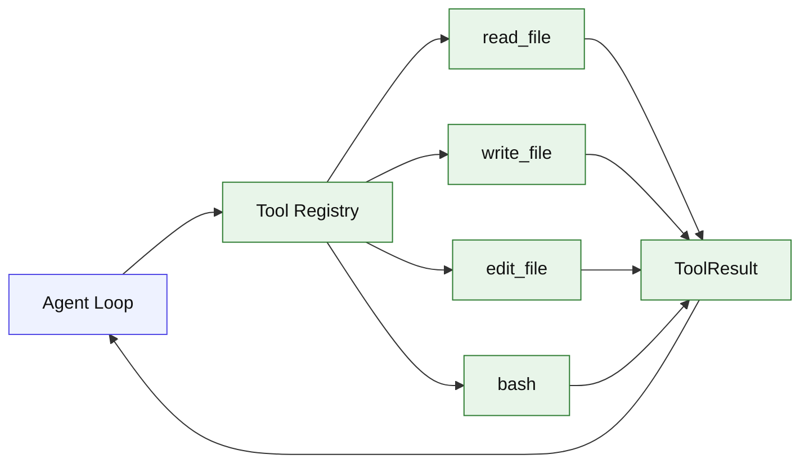

# Stage 02: Tool Protocol + Generic ReAct Loop + Core Coding Tools v0

## 1. 本阶段目标

引入 foundation-level Tool protocol、generic ReAct loop 和最小 coding tools：`read_file`、`write_file`、`edit_file`、`bash`。模型可以请求工具，Agent 执行后把 ToolResult 回传，再由 provider 继续产出最终回答。`bash` 的名称和最终产品形态向 Claude Code BashTool 靠拢，但 Stage 02 只实现最小前台命令执行：`command`、`timeout`、`description`、stdout/stderr preview、exitCode。

工具协议从本阶段开始区分 provider 原始 tool call 和可执行 ToolUse：runner 只接收已经 JSON parse 成功的 input。半截 tool arguments 的流式累积和 parse gate 在 Stage 03 补齐。

工具结果从本阶段开始区分 raw ToolResult 和 model-visible ToolResult：工具可以返回结构化 metadata、完整输出路径和诊断详情，但回传给模型前必须经过 `formatToolResultForModel(toolName, rawResult)`。formatter 统一 normalize success/error、推断 error kind、按工具策略截断或摘要，避免 bash、大文件、MCP、search 结果污染上下文。

闭环可调试性声明：本阶段完成后，可运行第 7 节中的 Demo commands 验证 CLI、测试和核心场景。

## 2. 前置依赖

| 依赖 | 用途 |
| --- | --- |
| Stage 01 | foundation message/model、CLI、loop、provider event 基础 |
| zod | 工具入参校验 |
| `Bun.file` / `Bun.write` | read/write |
| `Bun.spawn` | bash 命令执行 |

## 3. 三家方案对比

### 3.1 Tool 定义对比

| 维度 | OpenCode | Claude Code | Codex | 我们的选择 | 理由 |
| --- | --- | --- | --- | --- | --- |
| 工具接口 | `Tool.Def` + Context | tool object + runToolUse | ToolHandler trait | `ToolDef<TInput>`；参考 §4 源码引用 | 个人项目优先小代码量、可调试、阶段闭环。 |
| schema | 标准 schema 包装 | zod/自定义 schema | JSON schema/protocol | zod 作为内部权威；参考 §4 源码引用 | 个人项目优先小代码量、可调试、阶段闭环。 |
| 输出 | title/output/metadata | tool_result block | protocol item | `{ ok, output, metadata }`；参考 §4 源码引用 | 个人项目优先小代码量、可调试、阶段闭环。 |
| 模型可见结果 | truncate wrapper | tool_result block 经过格式化 | protocol item summary | raw result -> formatter -> model content | 统一控制上下文污染。 |

### 3.2 Tool Registry 对比

| 维度 | OpenCode | Claude Code | Codex | 我们的选择 | 理由 |
| --- | --- | --- | --- | --- | --- |
| builtin | registry 初始化内置工具 | 工具由上下文选择 | registry handler | 手工注册三件套；参考 §4 源码引用 | 个人项目优先小代码量、可调试、阶段闭环。 |
| 自定义工具 | 支持本地动态加载 | skills/agents 可扩展 | MCP handler 扩展 | Stage 14+ 再做插件；参考 §4 源码引用 | 个人项目优先小代码量、可调试、阶段闭环。 |
| provider 暴露 | 按模型过滤工具 | 按权限/模式过滤 | 按协议暴露 | 只暴露 enabled tools；参考 §4 源码引用 | 个人项目优先小代码量、可调试、阶段闭环。 |

### 3.3 执行策略对比

| 维度 | OpenCode | Claude Code | Codex | 我们的选择 | 理由 |
| --- | --- | --- | --- | --- | --- |
| read/write | 工具内部处理权限和诊断 | 读状态影响编辑 | sandbox/approval 强 | Stage 02 只限制 cwd；参考 §4 源码引用 | 个人项目优先小代码量、可调试、阶段闭环。 |
| bash | parse + ask + run | BashTool schema + progress/background | sandbox 外层 | 名称和目标形态参考 Claude Bash，Stage 02 执行骨架参考 OpenCode；参考 §4 源码引用 | 个人项目优先小代码量、可调试、阶段闭环。 |
| 并发 | processor 跟踪 toolcalls | 读工具可并发 | handler 支持 parallel 标记 | Stage 02 串行；参考 §4 源码引用 | 个人项目优先小代码量、可调试、阶段闭环。 |

## 4. 源码引用（必读清单）

| 来源 | 行号 | 参考点 |
| --- | --- | --- |
| `$OPENCODE_REPO/packages/opencode/src/tool/tool.ts` | L16-L45 | Tool.Context 与 ExecuteResult |
| `$OPENCODE_REPO/packages/opencode/src/tool/tool.ts` | L79-L127 | schema 校验、执行、截断包装 |
| `$OPENCODE_REPO/packages/opencode/src/tool/registry.ts` | L114-L132 | builtin 工具初始化 |
| `$OPENCODE_REPO/packages/opencode/src/tool/read.ts` | L29-L87 | read 参数、目录和不存在文件处理 |
| `$OPENCODE_REPO/packages/opencode/src/tool/write.ts` | L38-L90 | write、format、diagnostics 流程 |
| `$OPENCODE_REPO/packages/opencode/src/tool/shell.ts` | L261-L307 | 命令 parse、approval、process 创建 |
| `$CLAUDE_CODE_REPO/src/tools/BashTool/BashTool.tsx` | L227-L294 | BashTool 输入/输出 schema，作为 Kai `bash` 的目标形态 |
| `$CLAUDE_CODE_REPO/src/tools/BashTool/BashTool.tsx` | L852-L1142 | progress、background、long-running command 的后续增强方向 |
| `$CLAUDE_CODE_REPO/src/services/tools/toolOrchestration.ts` | L86-L176 | 读工具并发、危险工具串行的后续方向 |

## 5. 本阶段架构图（mermaid）



## 6. 详细设计

### 6.1 模块清单

| 文件路径 | 职责 | 预计行数 | 主要导出 |
|---|---|---:|---|
| `src/foundation/tool.ts` | ToolDef、ToolContext、ToolResult | ~90 | `ToolDef` |
| `src/coding/tools/registry.ts` | 注册、查找、provider schema 转换 | ~90 | `ToolRegistry` |
| `src/coding/tools/runner.ts` | zod 校验、异常捕获、输出 cap | ~90 | `runTool` |
| `src/agent/tool-result-formatter.ts` | raw ToolResult -> model-visible content | ~100 | `formatToolResultForModel` |
| `src/coding/tools/read.ts` | 读取文件、目录提示、offset/limit | ~100 | `readFileTool` |
| `src/coding/tools/write.ts` | 写入文件、返回摘要 | ~90 | `writeFileTool` |
| `src/coding/tools/edit.ts` | old/new string 精准替换、replaceAll、diff 摘要 | ~130 | `editFileTool` |
| `src/coding/tools/bash.ts` | Claude-like BashTool 最小版：Bun.spawn、timeout、stdout/stderr preview、exitCode | ~170 | `bashTool` |
| `src/agent/react-loop.ts` | tool call -> result -> continuation | ~90 | `runReactLoop` |

### 6.2 关键接口

```ts
export interface ToolContext {
  cwd: string;
  signal: AbortSignal;
  sessionId: string;
  toolCallId: string;
  emit(event: ToolRuntimeEvent): void;
}

export interface ToolResult {
  ok: boolean;
  output: string;
  metadata?: Record<string, JsonValue>;
  error?: ToolError;
}

export interface ToolError {
  kind: "validation" | "not_found" | "permission" | "timeout" | "interrupted" | "parse_error" | "execution" | "unknown";
  message: string;
  details?: JsonValue;
}

export interface ToolResultFormatPolicy {
  maxModelChars: number;
  mode: "body" | "summary" | "json";
  includeMetadataKeys?: string[];
}

export function formatToolResultForModel(toolName: string, rawResult: ToolResult): string;

export interface ExecutableToolUse {
  id: string;
  name: string;
  input: JsonObject;
}

export type ToolRuntimeEvent =
  | { type: "bash_progress"; toolCallId: string; output: string; elapsedMs: number; totalBytes: number };

export interface BashToolInput {
  command: string;
  timeout?: number;
  description?: string;
}

export interface BashToolResult {
  stdoutPreview: string;
  stderrPreview: string;
  exitCode: number | null;
  interrupted: boolean;
  outputBytes: number;
  persistedOutputPath?: string;
}
```

`bashTool` 的结构化结果放在 `ToolResult.metadata.bash` 中；`ToolResult.output` 只保存给用户和 formatter 使用的短摘要。真正回传给模型的内容由 `formatToolResultForModel("bash", rawResult)` 生成。为避免冗余，Stage 02 不在 `metadata.bash` 中保存完整 stdout/stderr，只保存 preview、输出字节数和可选 persisted output path。Stage 02 先不主动 emit progress，但 `ToolContext.emit` 从一开始预留，Stage 03 直接接入 `bash_progress`。

### 6.3 关键算法 / 数据流

1. Provider event 出现已完成的 executable `tool_call`。
2. registry 根据 name 找到 ToolDef。
3. runner 只接收 JSON parse 成功后的 input，再用 zod 校验。
4. 执行工具，捕获错误为 normalized `ToolResult`，失败时带结构化 `error.kind`。
5. `formatToolResultForModel(toolName, rawResult)` 根据 tool policy 生成 model-visible content。
6. loop 将 model-visible ToolResult 追加成 tool message；raw result 摘要和 metadata 进入 transcript/debug，再继续 provider。

### 6.4 初始格式化策略

| 工具 | 模型可见策略 |
| --- | --- |
| `read_file` | 在 offset/limit 内保留正文；超出时提示继续读取范围 |
| `write_file` | 只返回路径、字节数和简短摘要 |
| `edit_file` | 返回路径、替换数量、diff summary，不塞完整文件 |
| `bash` | 返回 command、exitCode、stdout/stderr preview、outputBytes、persistedOutputPath |
| unknown/error | 返回结构化 JSON：`ok:false`、`error.kind`、`message`、可选 details preview |

## 7. 实施步骤（Step-by-step）

1. 定义工具内部协议和 provider tool schema 转换。
2. 实现 registry 和 runner。
3. 实现 `formatToolResultForModel` 和每个内置工具的初始 format policy。
4. 实现 `read_file`，支持文本文件和目录提示。
5. 实现 `write_file`，限制在 cwd 内。
6. 实现 `edit_file`，要求 oldString 唯一匹配，必要时 replaceAll。
7. 实现 `bash`，默认 30 秒 timeout，输出 stdoutPreview/stderrPreview/exitCode/interrupted/outputBytes 到 `metadata.bash`；暂不支持 `run_in_background`。
8. 扩展 fixture provider：可按 fixture 触发 tool call。

Demo commands:

```bash
bun run kai run --provider fixture --script fixtures/read-file.json "read package"
bun run kai run --provider fixture --script fixtures/bash.json "run pwd"
bun test -- stage-02
```

## 8. 验收标准

| 验收项 | 标准 |
| --- | --- |
| 工具可注册 | registry 能列出四种工具 |
| read 可用 | 读取 cwd 内文本文件并返回内容摘要 |
| write 可用 | 写入 cwd 内新文件并返回路径 |
| edit 可用 | 对 cwd 内文本文件做唯一 old/new 替换 |
| bash 可用 | 执行 `pwd`、`ls` 等短命令，返回 stdout/stderr preview 和 exitCode |
| bash metadata | BashToolResult 固定写入 `ToolResult.metadata.bash` |
| executable input | runner 永远不接收字符串缓冲或半截 JSON，只接收已解析 object |
| result formatter | raw ToolResult 经过 `formatToolResultForModel` 后才进入 provider continuation |
| 错误回传 | schema 错误和执行错误都转成结构化 ToolResult，模型可见内容包含 `error.kind` |
| 大输出控制 | bash/search/file 大结果按 tool policy 截断或摘要 |
| 代码预算 | 累计核心代码约 1740 行 |

## 9. 已知限制 & 下一阶段衔接

此阶段 `bash` 只有基础 timeout，没有权限询问、progress event、长任务后台化和大输出持久化；write 没有 diff 和 LSP 诊断。下一阶段补 stream processor、tool argument accumulator 和 CLI 工具状态展示，并为 Stage 03 的 `bash_progress` 事件预留通道。
