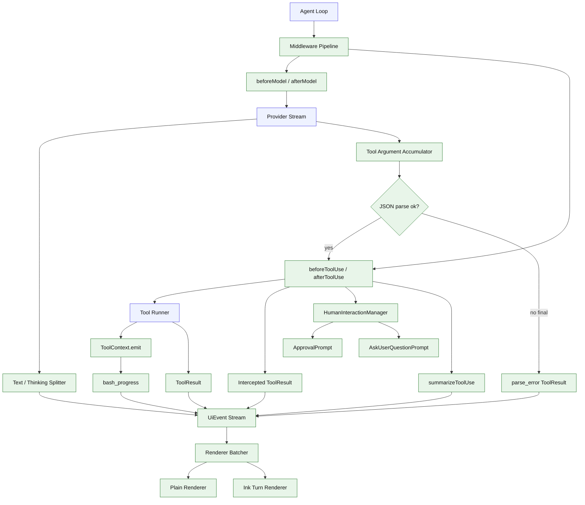

# Stage 03: Middleware Pipeline + HITL + Current-turn Ink Renderer

## 1. 本阶段目标

在 Stage 02 的工具闭环上加入早期可扩展底座：middleware pipeline、tool argument accumulator、thinking/text 拆分、HumanInteractionManager、Human-in-the-loop 工具、tool-specific summary 和当前 turn 的 Ink renderer。此阶段开始把 approval、ask_user_question、bash_progress、工具状态展示从 agent loop 中拆出去，让后续 plan guard、skills、memory、audit、permission 都能通过 middleware 和 manager queue 接入。

本阶段同时确立 transcript-first 的 UI 边界：`UiEvent` 是当前 turn 的实时过程事件，只负责让用户看见正在发生什么；长期历史、工具调用事实和恢复上下文必须在 Stage 04 进入 message/part transcript，而不是沉淀在 TUI 状态里。

闭环可调试性声明：本阶段完成后，可运行第 7 节中的 Demo commands 验证 middleware 拦截、结构化提问、审批 prompt、bash progress、tool argument parse gate 和当前 turn 渲染。

## 2. 前置依赖

| 依赖 | 用途 |
| --- | --- |
| Stage 02 | 已有 ToolDef、ToolResult、ToolContext 和工具执行闭环 |
| Ink | ApprovalPrompt、AskUserQuestionPrompt、当前 turn renderer |
| `ToolContext.emit` | bash_progress 等工具运行时事件 |
| AbortController | 用户中断 turn |
| foundation UiEvent | plain renderer 和 Ink renderer 共用当前 turn UI 协议 |
| Tool argument accumulator | 累积流式 tool argument delta，完整 JSON 后才产出 ExecutableToolUse |
| Reasoning/text splitter | provider stream 中的 thinking/reasoning_content 不能混入普通正文 |
| HumanInteractionManager | approval/question/plan approval 等交互通过 queue 进入 UI |
| ToolUse summary | plain 和 Ink 共用同一份工具展示摘要 |
| Render batcher | 高频 stream event 合并提交，避免 Ink 频繁重渲染 |

## 3. 三家方案对比

### 3.1 Middleware 对比

| 维度 | OpenCode | Claude Code | Codex | 我们的选择 | 理由 |
| --- | --- | --- | --- | --- | --- |
| 扩展方式 | permission/session/plugin 入口清晰 | hooks 和 tool executor 分散 | protocol boundary 清晰 | Stage 03 引入 middleware pipeline | 后续 approval、skills、memory、plan guard 不反复改 loop |
| 工具前拦截 | permission evaluate/ask | denied tool_result | approval/safety check | `beforeToolUse` 可直接返回 ToolResult | 能统一拒绝、审批失败、plan mode 禁止工具等行为 |
| 可测试性 | 模块化较好 | 产品路径复杂 | handler tests 清晰 | middleware 独立单测 + fixture turn | 个人项目需要小闭环 |

### 3.2 HITL 对比

| 维度 | OpenCode | Claude Code | Codex | 我们的选择 | 理由 |
| --- | --- | --- | --- | --- | --- |
| approval | permission ask | permission/plan approval | approval mode | Stage 03 先做通用 ApprovalPrompt | Stage 05 plan approval 和 Stage 12 permission 可复用 |
| elicitation | 部分交互由 TUI 承载 | 自然语言/工具混合 | MCP elicitation 有协议参考 | `ask_user_question` 工具 | 把澄清需求协议化，区别于授权 |
| 调用边界 | permission/UI 通过会话处理 | prompt/permission 体验耦合 | request/response 协议清晰 | 工具/middleware -> manager queue -> UI subscribe -> promise resolve | 工具层不依赖 Ink，plain/MCP/OAuth 后续可复用 |
| UI | 产品级 TUI | 交互丰富 | app protocol | Ink prompts + plain fallback | 既有产品感，也保持脚本友好 |

### 3.3 Current-turn Renderer 对比

| 维度 | OpenCode | Claude Code | Codex | 我们的选择 | 理由 |
| --- | --- | --- | --- | --- | --- |
| 文本流 | text delta | assistant delta | protocol item delta | `UiEvent.text_delta` | renderer 无关 |
| 工具状态 | tool lifecycle | tool_use block + executor | item status | tool start/result/progress 事件 | 当前 turn 已能看清模型在做什么 |
| chat shell | 完整产品 TUI | 产品交互 | app shell | Stage 03 只渲染当前 turn | session-backed chat shell 放到 Stage 04 |
| 长期状态 | session transcript | transcript blocks | rollout state | Stage 03 不持久化 UI 状态 | 避免 TUI 和 agent 状态分裂 |
| tool 参数流 | stream accumulator | executor 前完成 tool_use | handler parse gate | delta -> accumulator -> JSON parse -> ExecutableToolUse | 半截 JSON 不泄漏到 runner/approval/UI |
| thinking 展示 | thinking/message part 分离 | reasoning 不作为普通正文 | protocol item 边界清晰 | provider adapter 拆出 thinking part，renderer 默认隐藏 | 避免 `<think>` 裸输出 |
| 工具摘要 | tool-specific display | tool block 展示较成熟 | item summary | `summarizeToolUse` 统一生成 title/detail | 用户一眼看懂 agent 正在做什么 |
| 渲染刷新 | TUI 状态聚合 | 产品侧节流 | app 层聚合 | 30-80ms flush window | 减少终端闪烁和输入卡顿 |

## 4. 源码引用（必读清单）

| 来源 | 行号 | 参考点 |
| --- | --- | --- |
| `$OPENCODE_REPO/packages/opencode/src/session/processor.ts` | L286-L466 | tool input、running、result/error 状态 |
| `$OPENCODE_REPO/packages/opencode/src/permission/index.ts` | L128-L185 | permission evaluate/ask 流程 |
| `$CLAUDE_CODE_REPO/src/services/tools/StreamingToolExecutor.ts` | L73-L151 | streaming 工具队列 |
| `$CLAUDE_CODE_REPO/src/tools/BashTool/BashTool.tsx` | L624-L682 | Bash progress callback 消费 |
| `$CLAUDE_CODE_REPO/src/tools/BashTool/BashTool.tsx` | L1027-L1142 | progress loop 和输出轮询 |
| `$CODEX_REPO/codex-rs/core/src/session/mcp.rs` | L68-L159 | elicitation 作为结构化提问参考 |

## 5. 本阶段架构图（mermaid）



## 6. 详细设计

### 6.1 模块清单

| 文件路径 | 职责 | 预计行数 | 主要导出 |
|---|---|---:|---|
| `src/agent/middleware.ts` | middleware 类型、注册、顺序执行 | ~130 | `MiddlewarePipeline` |
| `src/agent/tool-accumulator.ts` | 累积 tool argument delta，parse 完整 JSON 后产出 ExecutableToolUse | ~100 | `ToolArgumentAccumulator` |
| `src/agent/tool-state.ts` | ToolState map 与 callId 状态 | ~80 | `ToolState` |
| `src/agent/human-interaction-manager.ts` | HITL request queue、subscribe、resolve/reject | ~120 | `HumanInteractionManager` |
| `src/agent/reasoning-splitter.ts` | provider text/thinking/reasoning_content 拆分和 `<think>` 清洗 | ~70 | `splitReasoningParts` |
| `src/foundation/ui-event.ts` | renderer-agnostic UI event 类型 | ~60 | `UiEvent` |
| `src/foundation/tool-summary.ts` | tool-specific 展示摘要 | ~80 | `summarizeToolUse` |
| `src/ui/plain/renderer.ts` | plain stdout 文本、工具、错误、bash progress | ~90 | `PlainRenderer` |
| `src/ui/ink/turn-renderer.tsx` | 当前 turn 的 Ink renderer | ~120 | `InkTurnRenderer` |
| `src/ui/render-batcher.ts` | stream event pending queue 和 30-80ms flush | ~60 | `createRenderBatcher` |
| `src/ui/prompts/approval.tsx` | 通用审批 prompt | ~80 | `ApprovalPrompt` |
| `src/ui/prompts/ask-user-question.tsx` | 结构化问题 prompt | ~120 | `AskUserQuestionPrompt` |
| `src/coding/tools/ask-user-question.ts` | 模型可调用澄清工具 | ~90 | `askUserQuestionTool` |
| `src/coding/middleware/approval.ts` | 简单 approval middleware | ~80 | `approvalMiddleware` |
| `src/cli/interrupt.ts` | Ctrl-C 到 AbortController | ~50 | `createInterruptSignal` |

### 6.2 关键接口

```ts
export interface Middleware {
  beforeAgentRun?(ctx: AgentRunContext): Promise<void>;
  afterAgentRun?(ctx: AgentRunContext): Promise<void>;
  beforeModel?(ctx: ModelContext): Promise<ModelInput | void>;
  afterModel?(ctx: ModelContext): Promise<void>;
  beforeToolUse?(ctx: ToolUseContext): Promise<ToolResult | void>;
  afterToolUse?(ctx: ToolUseContext): Promise<void>;
}

export interface ExecutableToolUse {
  id: string;
  name: string;
  input: JsonObject;
}

export type ToolAssemblyResult =
  | { type: "partial"; id: string; name?: string }
  | { type: "complete"; toolUse: ExecutableToolUse }
  | { type: "invalid"; id: string; name?: string; error: string; rawPreview: string };

export type UiEvent =
  | { type: "text_delta"; delta: string }
  | { type: "thinking_delta"; delta: string; hidden: true }
  | { type: "tool_start"; id: string; name: string; summary: ToolUseSummary }
  | { type: "tool_result"; id: string; ok: boolean; summary: string }
  | { type: "bash_progress"; toolCallId: string; output: string; elapsedMs: number; totalBytes: number }
  | { type: "approval_request"; id: string; title: string; body: string }
  | { type: "question_request"; id: string; questions: AskUserQuestionInput["questions"] }
  | { type: "turn_done" };

export interface ToolUseSummary {
  title: string;
  detail?: string;
}

export function summarizeToolUse(toolUse: ExecutableToolUse): ToolUseSummary;

export interface HumanInteractionManager<TRequest, TResult> {
  enqueue(request: TRequest): Promise<TResult>;
  subscribe(listener: (pending: PendingHumanInteraction<TRequest>) => void): () => void;
  resolve(id: string, result: TResult): void;
  reject(id: string, error: Error): void;
}

export interface PendingHumanInteraction<TRequest> {
  id: string;
  kind: "approval" | "question" | "plan_approval" | "mcp_elicitation" | "login";
  request: TRequest;
}
```

`ask_user_question` 输入：

```ts
export interface AskUserQuestionInput {
  questions: Array<{
    id: string;
    question: string;
    mode: "single" | "multi";
    options: Array<{ label: string; description: string; preview?: string }>;
  }>;
}
```

### 6.3 Transcript 边界

| 对象 | Stage 03 定位 |
| --- | --- |
| `UiEvent` | 当前 turn 的实时过程事件，用于流式文本、工具状态、bash progress、approval/question 展示 |
| Ink turn renderer | `UiEvent` 的投影，不保存长期历史事实 |
| plain renderer | `UiEvent` 的行式投影，不保存长期历史事实 |
| message/part transcript | Stage 04 开始成为长期状态权威；Stage 03 不把 TUI 状态当作事实源 |

### 6.4 Tool argument parse gate

| 对象 | 规则 |
| --- | --- |
| provider argument delta | 只能进入 `ToolArgumentAccumulator` |
| partial JSON | 不能进入 runner、approval、permission、plan guard、UI 参数展示或 executable transcript |
| complete JSON | parse 成功后创建 `ExecutableToolUse`，再触发 `beforeToolUse` 和 `tool_start` |
| final parse failure | 生成 non-executable parse_error ToolResult / failure event，不调用真实工具 |
| UI 展示 | parse 前最多显示“preparing tool call”，不能展示半截 input |

### 6.5 Thinking / reasoning 拆分

| 对象 | 规则 |
| --- | --- |
| provider adapter | 负责识别 provider 原生 `thinking`、`reasoning_content`，以及兼容模式下裸 `<think>...</think>` |
| message part | thinking 进入独立 `thinking` part 或 hidden/debug part，不混入用户可见 `text` |
| renderer | Ink/plain 默认忽略 `thinking_delta`；未来需要展示时必须走折叠区或 debug mode |
| session | Stage 04 可选择持久化 thinking part 的摘要或 debug 内容，但 resume 给模型的策略必须显式 |
| 测试 | fixture 返回 `<think>secret</think>visible` 时，plain stdout 只能出现 `visible` |

### 6.6 HITL manager queue

工具、middleware 和 plan guard 不直接 import Ink 组件。它们只向 manager 提交 request 并等待 promise：

```ts
tool invoke -> HumanInteractionManager.enqueue(request)
manager queue -> TUI/plain subscriber renders prompt
user answers -> manager.resolve(id, result)
tool receives structured result
```

同一个 manager 模型服务于 approval、`ask_user_question`、Stage 05 plan approval、Stage 09 MCP elicitation 和未来 OAuth/login prompt。ApprovalPrompt 和 AskUserQuestionPrompt 是订阅者视图，不是工具依赖。

### 6.7 ToolUse 展示摘要

`summarizeToolUse(toolUse)` 是 UI 共享模块，输入完整 `ExecutableToolUse`，输出结构化摘要：

| tool | title | detail |
| --- | --- | --- |
| `bash` | `Bash` | description + command |
| `read_file` | `Read file` | path |
| `grep_search` | `Search` | path/glob + pattern |
| `move_path` | `Move` | from -> to |
| `apply_patch` | `Apply patch` | touched files / diff summary |
| `todo_write` | `Update todos` | current task + completed/pending count |
| `ask_user_question` | `Ask question` | question count + first header |

plain renderer 和 Ink renderer 都消费 `{ title, detail? }`，避免各自把 tool input JSON 拼成用户可见文本。

### 6.8 Renderer batching

Ink renderer 不直接把每个 stream delta 写入 React state。`createRenderBatcher` 将当前 turn events 放入 pending queue，并以 30-80ms flush window 提交。`turn_done`、approval/question request、用户中断等边界事件可以立即 flush。plain renderer 可以行式输出，但仍应复用 summary 和 thinking-filter 逻辑。

## 7. 实施步骤（Step-by-step）

1. 定义 `Middleware`、`MiddlewarePipeline` 和 hook 执行顺序。
2. 将 AgentLoop 的 model/tool 调用改为经过 middleware pipeline。
3. 实现 ToolArgumentAccumulator：按 tool call id 累积 argument delta，JSON parse 成功后产出 `ExecutableToolUse`。
4. 支持 `beforeToolUse` 返回 ToolResult 以跳过真实工具执行。
5. 实现 reasoning/text splitter，保证 thinking 不进入普通正文。
6. 定义 `UiEvent`、`summarizeToolUse` 和 renderer batcher，让 plain renderer 和 Ink turn renderer 消费同一事件流。
7. 实现 HumanInteractionManager，ApprovalPrompt 和 AskUserQuestionPrompt 通过 subscribe/resolve 工作。
8. 实现 `ask_user_question` 工具和最小 approval middleware。
9. 接入 `ToolContext.emit` 的 `bash_progress`。
10. 增加 split-JSON tool arguments、final malformed arguments、thinking 清洗、HITL manager、renderer batching、Ctrl-C abort smoke test。

Demo commands:

```bash
bun run kai run --provider fixture --script fixtures/middleware-intercept.json "try risky action"
bun run kai run --provider fixture --script fixtures/ask-user-question.json "clarify"
bun run kai run --provider fixture --script fixtures/tool-args-split-json.json "read file"
bun run kai run --provider fixture --script fixtures/thinking-hidden.json "answer"
bun run kai run --provider fixture --script fixtures/tool-stream.json "inspect file"
bun test -- stage-03
```

## 8. 验收标准

| 验收项 | 标准 |
| --- | --- |
| middleware | `beforeModel`、`afterModel`、`beforeToolUse`、`afterToolUse` 都可被 fixture 覆盖 |
| tool intercept | `beforeToolUse` 返回 ToolResult 时不执行真实工具 |
| partial arguments | fixture 分多 chunk 输出 JSON 参数时，runner 只能在完整 JSON parse 成功后执行 |
| malformed arguments | 最终帧仍无法 parse 时返回 parse_error ToolResult，不触发 runner/approval |
| thinking separation | provider 返回 `thinking`/`reasoning_content`/`<think>` 时，renderer 默认不把它当正文输出 |
| HITL manager | approval/question 都通过 manager queue 发起，工具层不直接依赖 Ink |
| approval | 风险工具可弹出 ApprovalPrompt，拒绝时返回 denied ToolResult |
| ask_user_question | 模型可发起结构化问题，用户选择后回传结构化 answer |
| tool summary | bash/read_file/grep/apply_patch/todo/question 的 tool_start 展示来自 `summarizeToolUse` |
| renderer batching | 高频 text delta fixture 不导致每个 chunk 一次 Ink state commit，且不丢失最终文本 |
| bash progress | 长命令运行超过阈值时显示 progress 行 |
| renderer contract | 同一 UiEvent 流可被 plain 和 Ink turn renderer 消费 |
| transcript boundary | renderer 不产生或持有长期历史事实；当前 turn 结束后必须能把必要事实交给 Stage 04 transcript |
| 命令兼容 | `kai run` 默认仍可 plain 输出，不强制进入完整 chat shell |
| 代码预算 | 累计核心代码约 2600 行 |

## 9. 已知限制 & 下一阶段衔接

Stage 03 的 Ink renderer 只展示当前 turn，不展示持久化历史；approval 也是轻量版，不记住决策。Stage 04 增加 transcript store、session-backed chat shell、输入编辑器和 bun:sqlite 持久化，Stage 05 用同一套 HITL manager 实现 plan approval。
