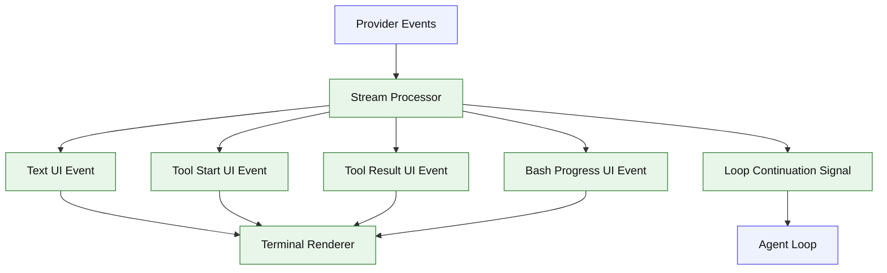

# Stage 03: Streaming CLI

## 1. 本阶段目标

把 provider 的流式事件变成用户可理解的终端输出：文本 delta 连续打印，tool call 显示开始、输入摘要、完成或失败。对 `bash` 工具，Stage 03 开始实现最小 `bash_progress` 事件：展示最近输出、耗时和输出规模，但暂不后台化。

闭环可调试性声明：本阶段完成后，可运行第 7 节中的 Demo commands 验证 CLI、测试和核心场景。

## 2. 前置依赖

| 依赖 | 用途 |
| --- | --- |
| Stage 02 | 已有 tool call 执行闭环 |
| AsyncIterable | provider stream 和 UI event |
| AbortController | 用户中断 turn |
| chalk | 区分文本、工具、错误 |

## 3. 三家方案对比

### 3.1 Stream 事件对比

| 维度 | OpenCode | Claude Code | Codex | 我们的选择 | 理由 |
| --- | --- | --- | --- | --- | --- |
| 文本 | text start/delta/end | assistant message delta | protocol item delta | `text_delta`；参考 §4 源码引用 | 个人项目优先小代码量、可调试、阶段闭环。 |
| 工具 | input start/delta/result/error | tool_use block + executor | tool call item lifecycle | `tool_start/input/result`；参考 §4 源码引用 | 个人项目优先小代码量、可调试、阶段闭环。 |
| bash progress | metadata preview | BashProgress generator | status item | `bash_progress` UI event；参考 Claude BashTool progress 形态 | 先给长命令可见性，不引入后台任务。 |
| 结束 | finish-step + cleanup | query loop yield | event status | `turn_done`；参考 §4 源码引用 | 个人项目优先小代码量、可调试、阶段闭环。 |

### 3.2 Tool 状态对比

| 维度 | OpenCode | Claude Code | Codex | 我们的选择 | 理由 |
| --- | --- | --- | --- | --- | --- |
| 状态存储 | context.toolcalls map | executor queue | session event | 内存 `Map<callId, ToolState>`；参考 §4 源码引用 | 个人项目优先小代码量、可调试、阶段闭环。 |
| 输入增量 | pending tool part | observable input | raw args parse | 收集 JSON 字符串；参考 §4 源码引用 | 个人项目优先小代码量、可调试、阶段闭环。 |
| 完成策略 | 等待 pending toolcalls | ordered completed results | notify started/done | result 后立刻写 UI；参考 §4 源码引用 | 个人项目优先小代码量、可调试、阶段闭环。 |

### 3.3 CLI 呈现对比

| 维度 | OpenCode | Claude Code | Codex | 我们的选择 | 理由 |
| --- | --- | --- | --- | --- | --- |
| UI 复杂度 | 产品级 TUI | 进度文本丰富 | app protocol | stdout 行式；参考 §4 源码引用 | 个人项目优先小代码量、可调试、阶段闭环。 |
| 长输出 | truncate + file hint | large output 保存 | output cap | Stage 03 只截断并显示 bash progress；参考 §4 源码引用 | 个人项目优先小代码量、可调试、阶段闭环。 |
| 用户中断 | abort cleanup | abort 补 tool result | cancellation token | Ctrl-C -> abort signal；参考 §4 源码引用 | 个人项目优先小代码量、可调试、阶段闭环。 |

## 4. 源码引用（必读清单）

| 来源 | 行号 | 参考点 |
| --- | --- | --- |
| `$OPENCODE_REPO/packages/opencode/src/session/processor.ts` | L286-L390 | tool input start、delta、running 状态 |
| `$OPENCODE_REPO/packages/opencode/src/session/processor.ts` | L394-L466 | tool result 和 tool error |
| `$OPENCODE_REPO/packages/opencode/src/session/processor.ts` | L562-L595 | text start/delta |
| `$OPENCODE_REPO/packages/opencode/src/session/processor.ts` | L638-L696 | cleanup 等待工具和 abort 标记 |
| `$CLAUDE_CODE_REPO/src/query.ts` | L826-L862 | assistant/tool_use 累积和 completed result |
| `$CLAUDE_CODE_REPO/src/services/tools/StreamingToolExecutor.ts` | L73-L151 | streaming 工具队列 |
| `$CLAUDE_CODE_REPO/src/tools/BashTool/BashTool.tsx` | L624-L682 | BashTool progress callback 消费 |
| `$CLAUDE_CODE_REPO/src/tools/BashTool/BashTool.tsx` | L1027-L1142 | progress loop 和输出轮询 |

## 5. 本阶段架构图（mermaid）



## 6. 详细设计

### 6.1 模块清单

| 文件路径 | 职责 | 预计行数 | 主要导出 |
|---|---|---:|---|
| `src/agent/stream.ts` | provider event -> internal event | ~220 | `StreamProcessor` |
| `src/agent/toolState.ts` | ToolState map 与 callId 状态 | ~80 | `ToolState` |
| `src/ui/events.ts` | UI event 类型，包含 `bash_progress` | ~60 | `UiEvent` |
| `src/ui/renderer.ts` | 文本、工具、bash progress、错误输出 | ~90 | `StreamRenderer` |
| `src/cli/interrupt.ts` | Ctrl-C 到 AbortController | ~50 | `createInterruptSignal` |

### 6.2 关键接口

```ts
export type UiEvent =
  | { type: "text"; delta: string }
  | { type: "tool_start"; id: string; name: string }
  | { type: "tool_result"; id: string; ok: boolean; summary: string }
  | { type: "bash_progress"; toolCallId: string; output: string; elapsedMs: number; totalBytes: number }
  | { type: "turn_done" };
```

### 6.3 关键算法 / 数据流

1. `processProviderStream()` 逐个消费 provider event。
2. text delta 直接 yield UI event。
3. tool call 输入增量写入 ToolState。
4. tool call 完整后调用 runner；若工具是 `bash`，runner 通过 `ToolContext.emit` 发出 `bash_progress`。
5. result 写入 UI event 并交给 loop 继续模型调用。

## 7. 实施步骤（Step-by-step）

1. 统一 provider event 类型。
2. 添加 StreamProcessor 和 ToolState。
3. 改造 AgentLoop，让它 yield UiEvent。
4. 增加 renderer，对工具事件打印短状态行，对 `bash_progress` 打印最近输出和耗时。
5. 增加 Ctrl-C abort smoke test。

Demo commands:

```bash
pnpm kai run --provider fixture --script fixtures/stream-text.json "stream"
pnpm kai run --provider fixture --script fixtures/tool-stream.json "inspect file"
pnpm test -- stage-03
```

## 8. 验收标准

| 验收项 | 标准 |
| --- | --- |
| 文本流 | mock delta 被连续输出 |
| 工具状态 | tool start/result 至少各显示一行 |
| bash progress | 长命令运行超过阈值时显示 progress 行 |
| 中断 | Ctrl-C 后工具收到 abort signal |
| 不丢结果 | tool result 能继续进入 loop |
| 代码预算 | 累计核心代码约 1700 行 |

## 9. 已知限制 & 下一阶段衔接

Stage 03 的事件只在内存存在。下一阶段增加 session store，让消息、part、tool result 和 UI event 的关键摘要可以恢复和审计。
