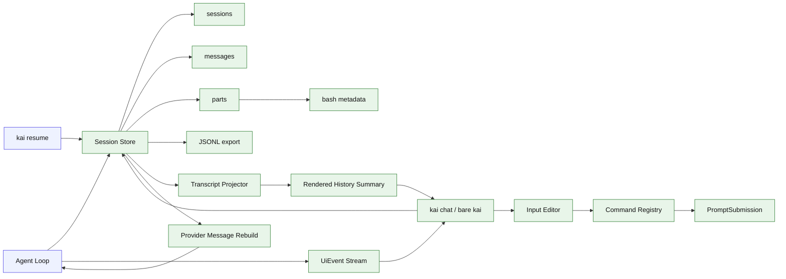

# Stage 04: Session Persistence + Session-backed Ink Chat Shell

## 1. 本阶段目标

引入 transcript-first 的持久化会话。每次 turn、message、part、tool call、tool result 都写入 transcript store，CLI 能通过 session id 恢复上下文继续对话。对 `bash` 工具，本阶段必须显式持久化最小 BashRun metadata：`command`、`cwd`、`exitCode`、`interrupted`、输出摘要和起止时间。Stage 04 先使用 `bun:sqlite`，也提供 JSONL debug export。

本阶段是完整对话 TUI 的最早落点：基于 Stage 03 的 `UiEvent` contract 和本阶段的 transcript store，提供最小 session-backed chat shell。它支持新建/恢复 session、多轮输入、从 transcript 投影当前会话历史摘要，以及显示当前 turn 流式输出。输入层单独拆成 pure input editor、keyboard state machine 和 command registry，避免把光标、历史、slash picker 和 Ctrl-C 逻辑塞进主 App。slash command 从本阶段起不是纯本地命令，而是可以生成 `PromptSubmission` metadata，影响下一轮 agent context。复杂布局、搜索、主题和发布级 polish 留到 Stage 14。

闭环可调试性声明：本阶段完成后，可运行第 7 节中的 Demo commands 验证 CLI、测试和核心场景。

## 2. 前置依赖

| 依赖 | 用途 |
| --- | --- |
| Stage 03 | 已有 stream event 和 tool result |
| `bun:sqlite` | 本地持久化 |
| crypto randomUUID | session/message/part id |
| JSONL writer | debug export |
| Stage 03 `UiEvent` contract | chat TUI 从同一事件流更新当前 turn |
| Transcript projector | 从 messages/parts 重建历史摘要 |
| Stage 03 reasoning splitter | thinking/reasoning part 不作为普通正文进入 renderer |
| Stage 03 render batcher | chat shell 当前 turn 复用批量事件提交策略 |
| PromptSubmission | slash command 和普通输入统一提交 text + metadata |

## 3. 三家方案对比

### 3.1 存储模型对比

| 维度 | OpenCode | Claude Code | Codex | 我们的选择 | 理由 |
| --- | --- | --- | --- | --- | --- |
| session | SQL 表 | query 上下文组合 | rollout/protocol state | SQLite `sessions`；参考 §4 源码引用 | 个人项目优先小代码量、可调试、阶段闭环。 |
| message | message + part 表 | transcript blocks | TurnItem | `messages` + `parts`；参考 §4 源码引用 | 个人项目优先小代码量、可调试、阶段闭环。 |
| bash run | tool part metadata | Bash transcript/output fields | tool call item metadata | Stage 04 存 `parts.metadata_json.bash` 摘要；Stage 14 增加 `bash_tasks` 事实表；参考 §4 源码引用 | transcript 和任务查询职责分离。 |
| permission | 单独表 | hooks/permission result | approval event | Stage 12 扩展字段；参考 §4 源码引用 | 个人项目优先小代码量、可调试、阶段闭环。 |

### 3.2 恢复策略对比

| 维度 | OpenCode | Claude Code | Codex | 我们的选择 | 理由 |
| --- | --- | --- | --- | --- | --- |
| snapshot | processor finish snapshot | transcript cleanup | state db | 每 turn 存 snapshot meta；参考 §4 源码引用 | 个人项目优先小代码量、可调试、阶段闭环。 |
| tool 悬空 | cleanup 标错 | missing result backfill | status item | Stage 08 补强；参考 §4 源码引用 | 个人项目优先小代码量、可调试、阶段闭环。 |
| 恢复输入 | session messages | compacted transcript | protocol items | store -> provider messages；参考 §4 源码引用 | 个人项目优先小代码量、可调试、阶段闭环。 |
| UI 恢复 | transcript -> UI state | transcript blocks | rollout items | transcript -> rendered history summary；参考 §4 源码引用 | UI 不能成为恢复事实源。 |

### 3.3 Debug 对比

| 维度 | OpenCode | Claude Code | Codex | 我们的选择 | 理由 |
| --- | --- | --- | --- | --- | --- |
| 可查询 | SQL | 内部日志 | state db | SQLite；参考 §4 源码引用 | 个人项目优先小代码量、可调试、阶段闭环。 |
| 可读性 | 需要工具展示 | transcript 易读 | protocol 重 | JSONL export；参考 §4 源码引用 | 个人项目优先小代码量、可调试、阶段闭环。 |
| 个人项目成本 | 中等 | 中等 | 偏高 | 简单 schema；参考 §4 源码引用 | 个人项目优先小代码量、可调试、阶段闭环。 |

### 3.4 Chat TUI 边界对比

| 维度 | OpenCode | Claude Code | Codex | 我们的选择 | 理由 |
| --- | --- | --- | --- | --- | --- |
| 对话入口 | 产品级 TUI/session | 连续 query/transcript | app protocol + history | 最小 `kai chat` / bare `kai` chat shell | Stage 04 已有 session store，足以支撑多轮恢复。 |
| 历史展示 | 完整消息和 part | transcript blocks | rollout items | 显示 user/assistant 摘要和当前 session id | 先保证恢复正确，不做复杂布局。 |
| 当前 turn | 流式 UI | streaming executor | event stream | 复用 Stage 03 `UiEvent` renderer | 避免 chat TUI 复制 stream 逻辑。 |
| 输入编辑 | TUI 内部状态机 | 产品级 prompt 编辑 | app 输入事件 | `input-editor.ts` + `use-command-input.ts` | 光标/历史/slash picker 可单测，不污染 App。 |
| slash 语义 | command/agent action 混合 | slash 可改变模式 | app command metadata | command registry 返回 `PromptSubmission` 或 local action | `/skill`、`/plan`、`/model` 能影响 agent run context。 |

## 4. 源码引用（必读清单）

| 来源 | 行号 | 参考点 |
| --- | --- | --- |
| `$OPENCODE_REPO/packages/opencode/src/session/session.sql.ts` | L16-L137 | Session、Message、Part、Permission 表结构 |
| `$OPENCODE_REPO/packages/opencode/src/session/processor.ts` | L499-L558 | finish-step usage、snapshot、compaction flag |
| `$OPENCODE_REPO/packages/opencode/src/session/processor.ts` | L638-L696 | cleanup 中补工具失败状态 |
| `$OPENCODE_REPO/packages/opencode/src/tool/shell.ts` | L569-L579 | command output、exit、truncated metadata |
| `$CLAUDE_CODE_REPO/src/tools/BashTool/BashTool.tsx` | L279-L294 | BashTool stdout/stderr/background/output path schema |
| `$CLAUDE_CODE_REPO/src/tools/AgentTool/runAgent.ts` | L747-L806 | sidechain transcript 记录思路 |

## 5. 本阶段架构图（mermaid）



## 6. 详细设计

### 6.1 模块清单

| 文件路径 | 职责 | 预计行数 | 主要导出 |
|---|---|---:|---|
| `src/session/schema.ts` | SQL schema，包含 `parts.metadata_json` 的 bash 字段约定 | ~90 | `sessionSchema` |
| `src/session/store.ts` | create/load/append | ~120 | `Store` |
| `src/session/rebuild.ts` | store -> provider messages | ~50 | `rebuildMessages` |
| `src/session/projector.ts` | transcript -> rendered history summary | ~70 | `projectHistory` |
| `src/session/export.ts` | JSONL debug export，包含 BashRun metadata | ~40 | `exportJsonl` |
| `src/cli/chat.ts` | `kai chat`、bare `kai` 的 session-backed 多轮入口 | ~80 | `chatCommand` |
| `src/ui/chatShell.ts` | Ink chat shell：session id、历史摘要、当前输入和当前 turn 状态 | ~120 | `ChatShell` |
| `src/ui/input-editor.ts` | 纯文本、光标、插入、删除、历史选择操作 | ~90 | `InputEditorState`, `reduceInputEditor` |
| `src/ui/use-command-input.ts` | 键盘状态机：slash picker、Enter/Tab/Esc/Ctrl-C | ~100 | `useCommandInput` |
| `src/ui/command-registry.ts` | built-in slash commands；返回 local action / PromptSubmission / input transform；Stage 10 接入 skills | ~110 | `CommandRegistry` |

### 6.2 关键接口

```ts
export interface SessionStore {
  createSession(input: CreateSessionInput): Promise<SessionRecord>;
  appendMessage(message: MessageRecord): Promise<void>;
  appendPart(part: PartRecord): Promise<void>;
  loadConversation(sessionId: string): Promise<Message[]>;
}

export interface BashRunMetadata {
  command: string;
  cwd: string;
  exitCode: number | null;
  interrupted: boolean;
  outputPreview: string;
  outputBytes: number;
  startedAt: string;
  endedAt: string;
}

export interface PartRecord {
  id: string;
  messageId: string;
  type: "text" | "thinking" | "tool_call" | "tool_result" | "summary";
  modelContent?: string;
  metadata?: { bash?: BashRunMetadata } & Record<string, JsonValue>;
}
```

```ts
export interface ChatSessionState {
  sessionId: string;
  renderedHistory: RenderedHistoryItem[];
  currentTurnEvents: UiEvent[];
}

export interface RenderedHistoryItem {
  messageId: string;
  role: "user" | "assistant" | "tool";
  summary: string;
  toolName?: string;
  status?: "pending" | "running" | "completed" | "failed";
}
```

`ChatSessionState` 是 UI 状态，不是新的持久化权威；权威数据仍来自 `SessionStore` 的 messages/parts。Chat TUI 只从 transcript projector 读取历史摘要、从 Stage 03 `UiEvent` 更新当前 turn，并在 turn 完成后重新投影或追加会话状态。

输入编辑器也是 UI 状态，不写入 transcript。只有用户按 Enter 提交后的完整文本才作为 user message 持久化。

```ts
export interface InputEditorState {
  text: string;
  cursor: number;
  historyIndex: number | null;
  placeholder?: string;
}

export type CommandInputAction =
  | { type: "insert"; text: string }
  | { type: "move"; by: -1 | 1 }
  | { type: "backspace" }
  | { type: "delete" }
  | { type: "history_prev" | "history_next" }
  | { type: "open_picker" | "close_picker" }
  | { type: "accept_picker" }
  | { type: "submit" }
  | { type: "abort_turn" };

export interface PromptSubmission {
  text: string;
  metadata?: {
    requestedSkillName?: string;
    requestedProfile?: "build" | "plan" | string;
    requestedModel?: string;
    requestedMode?: string;
    resumeSessionId?: string;
    slashCommand?: string;
  };
}

export type CommandResult =
  | { type: "submit_prompt"; submission: PromptSubmission }
  | { type: "local_action"; action: string; input?: JsonValue }
  | { type: "input_transform"; text: string };
```

### 6.3 关键算法 / 数据流

1. CLI 未传 session id 时创建 session。
2. 用户输入写入 user message。
3. 每个 stream event 转为 part 记录。
4. tool result part 写入 formatter 产出的 `modelContent`，同时在 metadata 中保存 raw result 摘要；`bash` tool result 写入 `parts.metadata_json.bash`，保存 command/cwd/exitCode/interrupted/outputPreview/outputBytes/startedAt/endedAt；不保存完整 stdout/stderr。
5. thinking/reasoning part 作为 `type: "thinking"` 写入或按配置摘要写入，默认不投影为用户可见正文。
6. assistant 完成后写 message summary。
7. `kai resume` 根据 session id 重建 messages；BashRun metadata 默认只用于审计、projection 和 export，不直接注入模型上下文。
8. transcript projector 从 messages/parts 生成 rendered history summary，供 chat shell 展示；thinking part 默认被隐藏或折叠。
9. `kai chat` 或 bare `kai` 创建/加载 session，显示历史摘要，循环读取用户输入并运行 turn。
10. Chat TUI 当前 turn 显示复用 Stage 03 `UiEvent` 和 render batcher；turn 完成后由 transcript store 成为下一轮上下文和历史投影来源。
11. `use-command-input` 负责光标移动、删除、历史上下、slash picker、Tab/Enter 接受、Esc 关闭 picker 或 abort、Ctrl-C 中断当前 turn。
12. command registry 可以把 `/plan`、`/profile`、`/model`、`/mode`、`/resume` 等选择转成 `PromptSubmission.metadata`，交给 agent run context；也可以返回 `/plan open` 这类 local action。

## 7. 实施步骤（Step-by-step）

1. 使用 `bun:sqlite` 初始化 schema。
2. 给 loop 注入 SessionStore。
3. 在 stream processor 写 part。
4. 为 `bash` tool result 添加 BashRun metadata 写入逻辑。
5. 增加 `kai sessions`、`kai resume <id>`。
6. 实现 transcript projector，从 messages/parts 生成稳定 rendered history summary。
7. 实现 `input-editor.ts` 的纯 reducer 单测，覆盖 cursor offset、左右移动、backspace/delete、输入历史。
8. 实现 `use-command-input.ts`，覆盖 slash picker 上下选择、Tab/Enter 接受命令、Esc 关闭 picker 或 abort、Ctrl-C 中断当前 turn、placeholder 状态。
9. 实现 `PromptSubmission`：普通输入提交 `{ text }`，slash context command 提交 `{ text, metadata }`，local command 不进入 agent loop。
10. 增加最小 `kai chat` / bare `kai` chat shell：新建或恢复 session，多轮输入，显示历史摘要和当前 turn 状态。
11. 增加 JSONL export 命令，导出 bash command/cwd/exitCode/outputPreview，并在文档里注明 Stage 14 会把后台任务迁入 `bash_tasks` 可查询记录。

Demo commands:

```bash
bun run kai run --provider fixture --session new --script fixtures/session-alpha.json "remember alpha"
bun run kai run --provider fixture --script fixtures/bash.json --session <session-id> "run pwd"
bun run kai sessions
bun run kai resume <session-id> "what did I say?"
bun run kai chat --session <session-id>
bun run kai sessions replay <session-id>
bun test -- src/ui/input-editor.test.ts src/ui/use-command-input.test.ts
bun test -- stage-04
```

## 8. 验收标准

| 验收项 | 标准 |
| --- | --- |
| 会话创建 | 每次新 run 生成 session id |
| 消息落盘 | user/assistant/tool part 可查询 |
| BashRun 落盘 | `bash` 的 command/cwd/exitCode/interrupted/outputPreview 可在 JSONL export 中看到 |
| 模型内容可复现 | tool_result part 保存 formatter 产出的 modelContent，resume 时不重新随意格式化 |
| thinking 隔离 | `thinking` part 不作为普通 text 渲染；plain replay 不出现裸 `<think>` |
| 会话恢复 | resume 后 provider 收到历史 messages |
| Chat TUI | `kai chat` 能在同一 session 中连续提交多轮输入 |
| 输入编辑 | cursor offset、左右移动、backspace/delete、历史上下、placeholder 有纯单测 |
| slash 输入 | `/` 打开 picker，上下选择、Tab/Enter 接受、Esc 关闭或回到输入态 |
| slash context | slash command 可返回 `PromptSubmission.metadata`；`/plan`、`/model`、`/profile` 不被设计成只执行本地命令 |
| local command | `/plan open`、`/resume list` 这类命令可返回 local action，不进入 agent loop |
| 中断 | Ctrl-C 中断当前 turn；无运行 turn 时按 CLI 退出策略处理 |
| 历史显示 | chat shell 显示 session id 和 user/assistant 历史摘要 |
| 历史重放 | replay session -> rendered history summary stable |
| 当前 turn | chat shell 复用 Stage 03 `UiEvent` 显示文本、工具和 bash progress |
| Debug 导出 | JSONL 文件包含 turn 顺序 |
| 代码预算 | 累计核心代码约 3280 行 |

## 9. 已知限制 & 下一阶段衔接

Stage 04 记录原始 transcript 并提供最小 session-backed chat TUI 和可测试输入层，但不做复杂聊天布局、历史搜索、主题或发布级交互 polish。下一阶段引入 plan mode，让 Agent 先规划、审批后再进入 build；Stage 10 将 skills 接入同一个 command registry，Stage 13 完善长期 memory，Stage 14 再把后台 Bash 任务提升为可查询任务记录，并统一打磨 CLI/TUI 体验。
