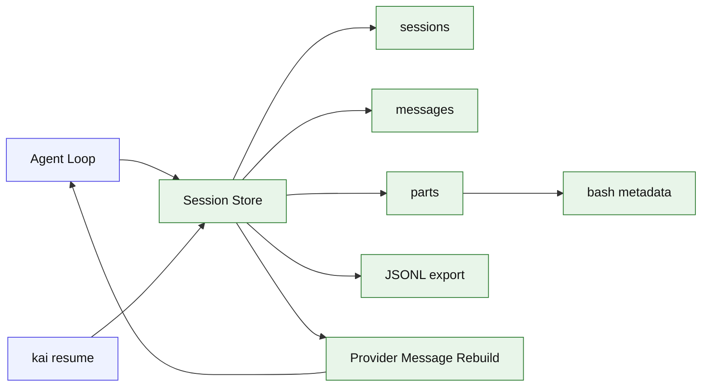

# Stage 04: Session Persistence

## 1. 本阶段目标

引入持久化会话。每次 turn、message、part、tool call、tool result 都写入 store，CLI 能通过 session id 恢复上下文继续对话。对 `bash` 工具，本阶段必须显式持久化最小 BashRun metadata：`command`、`cwd`、`exitCode`、`interrupted`、输出摘要和起止时间。Stage 04 先使用 SQLite，也提供 JSONL debug export。

闭环可调试性声明：本阶段完成后，可运行第 7 节中的 Demo commands 验证 CLI、测试和核心场景。

## 2. 前置依赖

| 依赖 | 用途 |
| --- | --- |
| Stage 03 | 已有 stream event 和 tool result |
| SQLite library | 本地持久化 |
| crypto randomUUID | session/message/part id |
| JSONL writer | debug export |

## 3. 三家方案对比

### 3.1 存储模型对比

| 维度 | OpenCode | Claude Code | Codex | 我们的选择 | 理由 |
| --- | --- | --- | --- | --- | --- |
| session | SQL 表 | query 上下文组合 | rollout/protocol state | SQLite `sessions`；参考 §4 源码引用 | 个人项目优先小代码量、可调试、阶段闭环。 |
| message | message + part 表 | transcript blocks | TurnItem | `messages` + `parts`；参考 §4 源码引用 | 个人项目优先小代码量、可调试、阶段闭环。 |
| bash run | tool part metadata | Bash transcript/output fields | tool call item metadata | Stage 04 存 `parts.metadata_json.bash` 摘要；Stage 13 增加 `bash_tasks` 事实表；参考 §4 源码引用 | transcript 和任务查询职责分离。 |
| permission | 单独表 | hooks/permission result | approval event | Stage 12 扩展字段；参考 §4 源码引用 | 个人项目优先小代码量、可调试、阶段闭环。 |

### 3.2 恢复策略对比

| 维度 | OpenCode | Claude Code | Codex | 我们的选择 | 理由 |
| --- | --- | --- | --- | --- | --- |
| snapshot | processor finish snapshot | transcript cleanup | state db | 每 turn 存 snapshot meta；参考 §4 源码引用 | 个人项目优先小代码量、可调试、阶段闭环。 |
| tool 悬空 | cleanup 标错 | missing result backfill | status item | Stage 08 补强；参考 §4 源码引用 | 个人项目优先小代码量、可调试、阶段闭环。 |
| 恢复输入 | session messages | compacted transcript | protocol items | store -> provider messages；参考 §4 源码引用 | 个人项目优先小代码量、可调试、阶段闭环。 |

### 3.3 Debug 对比

| 维度 | OpenCode | Claude Code | Codex | 我们的选择 | 理由 |
| --- | --- | --- | --- | --- | --- |
| 可查询 | SQL | 内部日志 | state db | SQLite；参考 §4 源码引用 | 个人项目优先小代码量、可调试、阶段闭环。 |
| 可读性 | 需要工具展示 | transcript 易读 | protocol 重 | JSONL export；参考 §4 源码引用 | 个人项目优先小代码量、可调试、阶段闭环。 |
| 个人项目成本 | 中等 | 中等 | 偏高 | 简单 schema；参考 §4 源码引用 | 个人项目优先小代码量、可调试、阶段闭环。 |

## 4. 源码引用（必读清单）

| 来源 | 行号 | 参考点 |
| --- | --- | --- |
| `$OPENCODE_REPO/packages/opencode/src/session/session.sql.ts` | L16-L137 | Session、Message、Part、Permission 表结构 |
| `$OPENCODE_REPO/packages/opencode/src/session/processor.ts` | L499-L558 | finish-step usage、snapshot、compaction flag |
| `$OPENCODE_REPO/packages/opencode/src/session/processor.ts` | L638-L696 | cleanup 中补工具失败状态 |
| `$OPENCODE_REPO/packages/opencode/src/tool/shell.ts` | L569-L579 | command output、exit、truncated metadata |
| `$CLAUDE_CODE_REPO/src/tools/BashTool/BashTool.tsx` | L279-L294 | BashTool stdout/stderr/background/output path schema |
| `$CLAUDE_CODE_REPO/src/tools/AgentTool/runAgent.ts` | L747-L806 | sidechain transcript 记录思路 |

## 5. 本阶段架构图（mermaid）



## 6. 详细设计

### 6.1 模块清单

| 文件路径 | 职责 | 预计行数 | 主要导出 |
|---|---|---:|---|
| `src/session/schema.ts` | SQL schema，包含 `parts.metadata_json` 的 bash 字段约定 | ~90 | `sessionSchema` |
| `src/session/store.ts` | create/load/append | ~120 | `Store` |
| `src/session/rebuild.ts` | store -> provider messages | ~50 | `rebuildMessages` |
| `src/session/export.ts` | JSONL debug export，包含 BashRun metadata | ~40 | `exportJsonl` |

### 6.2 关键接口

```ts
export interface SessionStore {
  createSession(input: CreateSessionInput): Promise<SessionRecord>;
  appendMessage(message: MessageRecord): Promise<void>;
  appendPart(part: PartRecord): Promise<void>;
  loadConversation(sessionId: string): Promise<Message[]>;
}

export interface BashRunMetadata {
  command: string;
  cwd: string;
  exitCode: number | null;
  interrupted: boolean;
  outputPreview: string;
  outputBytes: number;
  startedAt: string;
  endedAt: string;
}

export interface PartRecord {
  id: string;
  messageId: string;
  type: "text" | "tool_call" | "tool_result" | "summary";
  metadata?: { bash?: BashRunMetadata } & Record<string, JsonValue>;
}
```

### 6.3 关键算法 / 数据流

1. CLI 未传 session id 时创建 session。
2. 用户输入写入 user message。
3. 每个 stream event 转为 part 记录。
4. `bash` tool result 写入 `parts.metadata_json.bash`，保存 command/cwd/exitCode/interrupted/outputPreview/outputBytes/startedAt/endedAt；不保存完整 stdout/stderr。
5. assistant 完成后写 message summary。
6. `kai resume` 根据 session id 重建 messages；BashRun metadata 默认只用于审计和 export，不直接注入模型上下文。

## 7. 实施步骤（Step-by-step）

1. 选择 SQLite 库并初始化 schema。
2. 给 loop 注入 SessionStore。
3. 在 stream processor 写 part。
4. 为 `bash` tool result 添加 BashRun metadata 写入逻辑。
5. 增加 `kai sessions`、`kai resume <id>`。
6. 增加 JSONL export 命令，导出 bash command/cwd/exitCode/outputPreview，并在文档里注明 Stage 13 会把后台任务迁入 `bash_tasks` 可查询记录。

Demo commands:

```bash
pnpm kai run --provider fixture --session new --script fixtures/session-alpha.json "remember alpha"
pnpm kai run --provider fixture --script fixtures/bash.json --session <session-id> "run pwd"
pnpm kai sessions
pnpm kai resume <session-id> "what did I say?"
pnpm test -- stage-04
```

## 8. 验收标准

| 验收项 | 标准 |
| --- | --- |
| 会话创建 | 每次新 run 生成 session id |
| 消息落盘 | user/assistant/tool part 可查询 |
| BashRun 落盘 | `bash` 的 command/cwd/exitCode/interrupted/outputPreview 可在 JSONL export 中看到 |
| 会话恢复 | resume 后 provider 收到历史 messages |
| Debug 导出 | JSONL 文件包含 turn 顺序 |
| 代码预算 | 累计核心代码约 2000 行 |

## 9. 已知限制 & 下一阶段衔接

Stage 04 只记录原始上下文，不做 prompt 组织，也不建立 `bash_tasks` 事实表。下一阶段引入 instruction loader 和 prompt composer，让 Agent 能理解项目级规则；Stage 13 再把后台 Bash 任务提升为可查询任务记录。
