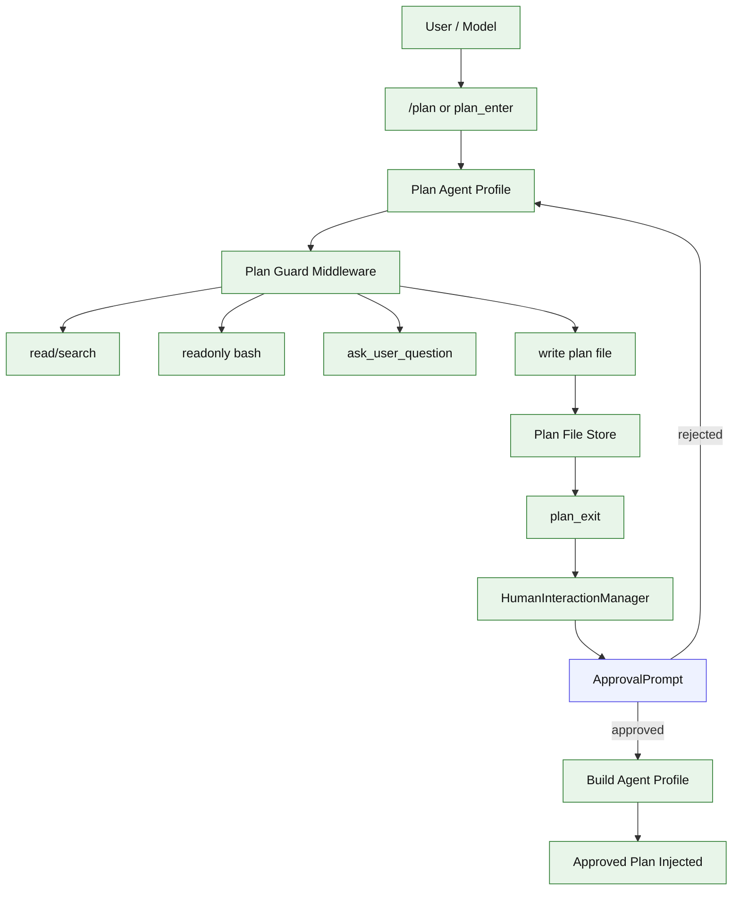

# Stage 05: Plan Mode

## 1. 本阶段目标

实现计划模式：用户可通过 `/plan` 进入 plan agent/profile，模型也可通过 `plan_enter` 主动进入。plan agent 只能读取、搜索、执行只读 bash、向用户提问，以及写入计划文件。`plan_exit` 读取计划文件后向 HumanInteractionManager 提交 plan approval request，由 ApprovalPrompt 订阅展示；用户批准后切回 build agent，并把 approved plan 注入后续实现上下文。

Plan 能力采用 OpenCode-first + Claude approval：结构上参考 OpenCode 的 plan agent/profile 和 permission model，体验上靠近 Claude Code 的 EnterPlanMode / ExitPlanMode / plan approval。

闭环可调试性声明：本阶段完成后，可运行第 7 节中的 Demo commands 验证 `/plan`、`plan_enter`、计划文件、`plan_exit`、审批和 build-agent handoff。

## 2. 前置依赖

| 依赖 | 用途 |
| --- | --- |
| Stage 03 | middleware、HumanInteractionManager、ApprovalPrompt、ask_user_question |
| Stage 04 | session store、session-backed chat shell |
| Core tools | `read_file`、readonly `bash`、plan file write |
| Config paths | 项目 `.kai/` 和用户级 `~/.kai-code-agent/` |

## 3. 三家方案对比

### 3.1 Plan 形态对比

| 维度 | OpenCode | Claude Code | Codex | 我们的选择 | 理由 |
| --- | --- | --- | --- | --- | --- |
| agent/profile | plan agent 是独立模式 | plan mode 有进入/退出体验 | 无完全对应产品形态 | `plan` profile + `build` profile | 权限、prompt、工具范围天然分离 |
| 计划文件 | session/agent 状态可持久 | plan approval 体验强 | patch 前强调安全边界 | Markdown plan file | 用户可读、可 diff、可审批 |
| 退出 | profile 切换 | ExitPlanMode + 用户批准 | approval 边界明确 | `plan_exit` -> HumanInteractionManager -> ApprovalPrompt -> build handoff | 计划和执行分开，减少模型直接动手 |

### 3.2 权限边界对比

| 维度 | OpenCode | Claude Code | Codex | 我们的选择 | 理由 |
| --- | --- | --- | --- | --- | --- |
| read/search | profile 决定工具 | plan mode 限制写操作 | sandbox profile | 允许 read/search | 计划需要理解代码 |
| bash | permission 分类 | BashTool 有危险边界 | safety check | 只允许 readonly bash | Stage 12 前先用窄 plan guard |
| 写入 | permission engine | plan mode 不直接改代码 | patch safety | 只允许写 plan file | 防止计划阶段修改业务文件 |

### 3.3 交互对比

| 维度 | OpenCode | Claude Code | Codex | 我们的选择 | 理由 |
| --- | --- | --- | --- | --- | --- |
| 用户入口 | slash/agent | plan mode 入口明确 | CLI 协议清晰 | `/plan` 生成 PromptSubmission metadata，`/plan open` 是 local action | 用户主动控制，且 slash 可影响 agent context |
| 模型入口 | agent 可切换 | EnterPlanMode 工具 | tool boundary | `plan_enter` 工具 | 模型发现需要先规划时可切换 |
| 批准 | permission/approval | plan approval | approval protocol | HumanInteractionManager -> ApprovalPrompt | 复用 Stage 03 HITL，不让 plan tool 直接依赖 Ink |

## 4. 源码引用（必读清单）

| 来源 | 行号 | 参考点 |
| --- | --- | --- |
| `$OPENCODE_REPO/packages/opencode/src/agent` | agent/profile 组织方式 | plan/build profile 分离 |
| `$OPENCODE_REPO/packages/opencode/src/permission/index.ts` | L128-L185 | evaluate/ask 流程 |
| `$CLAUDE_CODE_REPO/src/tools/ExitPlanModeTool` | plan approval 体验 | `plan_exit` 参考目标 |
| `$CLAUDE_CODE_REPO/src/query.ts` | plan mode 相关状态推进 | 进入/退出时的上下文切换 |
| `$CODEX_REPO/codex-rs/core/src/safety.rs` | L21-L115 | safety boundary 思路 |

## 5. 本阶段架构图（mermaid）



## 6. 详细设计

### 6.1 模块清单

| 文件路径 | 职责 | 预计行数 | 主要导出 |
|---|---|---:|---|
| `src/coding/profiles/build.ts` | build agent profile | ~60 | `buildProfile` |
| `src/coding/profiles/plan.ts` | plan agent profile、允许工具集合 | ~90 | `planProfile` |
| `src/coding/plan/store.ts` | plan file path、创建、读取、打开 | ~120 | `PlanStore` |
| `src/coding/plan/tools.ts` | `plan_enter`、`plan_exit` | ~120 | `planTools` |
| `src/coding/plan/guard-middleware.ts` | plan mode 工具限制 | ~90 | `planGuardMiddleware` |
| `src/ui/prompts/plan-approval.tsx` | plan approval 订阅 manager request 并复用 ApprovalPrompt | ~60 | `PlanApprovalPrompt` |
| `src/cli/commands/plan.ts` | `/plan`、`/plan open` 命令处理 | ~80 | `planCommand` |

### 6.2 关键接口

```ts
export type AgentProfileName = "build" | "plan";

export interface AgentProfile {
  name: AgentProfileName;
  promptId: string;
  allowedTools: string[];
  writableScopes: Array<"plan_file" | "workspace">;
}

export interface PlanFile {
  path: string;
  createdAt: string;
  slug: string;
  approvedAt?: string;
}

export interface PlanExitResult {
  approved: boolean;
  planPath: string;
  approvedPlan?: string;
}
```

工具输入：

```ts
plan_enter: {}
plan_exit: {}
```

### 6.3 计划文件路径

| 场景 | 路径 |
| --- | --- |
| 项目内 | `.kai/plans/<created>-<slug>.md` |
| 无项目 / 不可写 | `~/.kai-code-agent/plans/<created>-<slug>.md` |

Stage 05 只要求写 plan file；是否把 `.kai/plans` 加入版本管理由项目自己决定。

## 7. 实施步骤（Step-by-step）

1. 定义 build/plan agent profiles。
2. 实现 `PlanStore`，支持 project path 和 user fallback。
3. 实现 `/plan` 和 `/plan open`：`/plan` 提交 `PromptSubmission.metadata.requestedProfile="plan"`，`/plan open` 作为 local action 打开计划文件。
4. 实现 `plan_enter`，切换当前 session profile 为 `plan`。
5. 实现 plan guard middleware，限制 plan agent 工具范围和写入范围。
6. 实现 `plan_exit`，读取 plan file，向 HumanInteractionManager enqueue plan approval request。
7. 批准后切回 build profile，并把 approved plan 注入当前 session。
8. 增加 fixture：进入计划、写计划、拒绝计划、批准后执行。

Demo commands:

```bash
bun run kai chat --provider fixture --script fixtures/plan-enter.json
bun run kai plan open
bun run kai run --provider fixture --script fixtures/plan-exit-approved.json "plan then build"
bun test -- stage-05
```

## 8. 验收标准

| 验收项 | 标准 |
| --- | --- |
| `/plan` | 用户可显式进入 plan profile |
| slash context | `/plan` 通过 PromptSubmission metadata 改变下一轮 agent context，不只是本地命令 |
| `plan_enter` | 模型可请求进入 plan profile |
| 工具限制 | plan profile 不能写业务文件、不能执行非只读 bash |
| plan file | 计划写入 `.kai/plans` 或用户 fallback 路径 |
| `plan_exit` | 读取 plan file，通过 HumanInteractionManager 弹出审批 |
| build handoff | 批准后切回 build profile，并注入 approved plan |
| 拒绝处理 | 拒绝后继续留在 plan profile 或让用户修改计划 |
| 代码预算 | 累计核心代码约 3780 行 |

## 9. 已知限制 & 下一阶段衔接

Stage 05 不是完整 permission engine，只用 plan guard middleware 做窄约束。Claude-style `prePlanMode` 完整 restore、记住审批、跨工具统一 audit 延后到 Stage 12。下一阶段补 Context Kernel、ModelInputBuilder、prompt composer 和 context management，让 build/plan profiles 都有稳定 prompt、预算控制和可解释裁剪。
