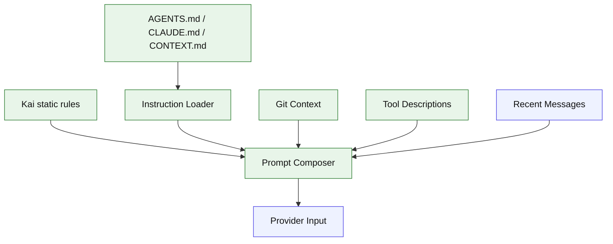

# Stage 05: System Prompt

## 1. 本阶段目标

建立可解释的 prompt composer：把 Kai 的固定行为原则、项目说明文件、当前工作区信息、可用工具说明组合成 provider input。此阶段让 Agent 开始理解项目边界，但不引入 skills 和 memory。

闭环可调试性声明：本阶段完成后，可运行第 7 节中的 Demo commands 验证 CLI、测试和核心场景。

## 2. 前置依赖

| 依赖 | 用途 |
| --- | --- |
| Stage 04 | 可读取 session 历史 |
| `fs/promises` | 读取 instruction 文件 |
| `git` subprocess | 获取分支、状态、最近提交 |
| date/time provider | 注入当前日期 |

## 3. 三家方案对比

### 3.1 Instruction Loader 对比

| 维度 | OpenCode | Claude Code | Codex | 我们的选择 | 理由 |
| --- | --- | --- | --- | --- | --- |
| 文件名 | AGENTS/CLAUDE/CONTEXT | CLAUDE.md + user context | AGENTS 类规则 | 支持三种文件；参考 §4 源码引用 | 个人项目优先小代码量、可调试、阶段闭环。 |
| 搜索范围 | global/project/config | 项目与用户上下文 | workspace policy | cwd 向上查找；参考 §4 源码引用 | 个人项目优先小代码量、可调试、阶段闭环。 |
| 输出 | system prompt fragments | prompt sections | instructions | `PromptSection[]`；参考 §4 源码引用 | 个人项目优先小代码量、可调试、阶段闭环。 |

### 3.2 Prompt 组成对比

| 维度 | OpenCode | Claude Code | Codex | 我们的选择 | 理由 |
| --- | --- | --- | --- | --- | --- |
| 静态规则 | system prompt transform | 大段静态 prompt | protocol/developer rules | Kai 自有短规则；参考 §4 源码引用 | 个人项目优先小代码量、可调试、阶段闭环。 |
| 动态上下文 | instruction + tools | git/date/memory/MCP | config/session | 显式 section；参考 §4 源码引用 | 个人项目优先小代码量、可调试、阶段闭环。 |
| 顺序 | provider 输入前合成 | resolve prompt sections | config layering | fixed order；参考 §4 源码引用 | 个人项目优先小代码量、可调试、阶段闭环。 |

### 3.3 项目上下文对比

| 维度 | OpenCode | Claude Code | Codex | 我们的选择 | 理由 |
| --- | --- | --- | --- | --- | --- |
| Git 信息 | instruction/context 组合 | 并行获取 git status | runtime metadata | branch/status/diff summary；参考 §4 源码引用 | 个人项目优先小代码量、可调试、阶段闭环。 |
| Token 控制 | Stage 06 压缩 | 提示段控制 | budget policy | 每段有 max chars；参考 §4 源码引用 | 个人项目优先小代码量、可调试、阶段闭环。 |
| 用户可解释 | 较清晰 | 功能丰富 | 协议化 | `kai prompt --debug`；参考 §4 源码引用 | 个人项目优先小代码量、可调试、阶段闭环。 |

## 4. 源码引用（必读清单）

| 来源 | 行号 | 参考点 |
| --- | --- | --- |
| `$OPENCODE_REPO/packages/opencode/src/session/instruction.ts` | L13-L18 | instruction 文件名 |
| `$OPENCODE_REPO/packages/opencode/src/session/instruction.ts` | L106-L163 | systemPaths 和读取逻辑 |
| `$OPENCODE_REPO/packages/opencode/src/session/llm.ts` | L103-L129 | system prompt 与 transform 合成 |
| `$CLAUDE_CODE_REPO/src/constants/prompts.ts` | L444-L577 | 动态 prompt sections 合成 |
| `$CLAUDE_CODE_REPO/src/context.ts` | L36-L149 | git/system context 构造 |
| `$CLAUDE_CODE_REPO/src/utils/systemPrompt.ts` | L28-L123 | prompt override 优先级 |

## 5. 本阶段架构图（mermaid）



## 6. 详细设计

### 6.1 模块清单

| 文件路径 | 职责 | 预计行数 | 主要导出 |
|---|---|---:|---|
| `src/prompt/sections.ts` | PromptSection 类型 | ~40 | `PromptSection` |
| `src/prompt/instructions.ts` | 查找并读取 instruction 文件 | ~90 | `loadInstructions` |
| `src/prompt/context.ts` | cwd、date、git status | ~70 | `buildRuntimeContext` |
| `src/prompt/composer.ts` | section 排序、裁剪、debug 输出 | ~100 | `PromptComposer` |

### 6.2 关键接口

```ts
export interface PromptSection {
  id: string;
  priority: number;
  content: string;
  maxChars?: number;
}

export interface PromptComposer {
  compose(input: ComposeInput): Promise<Message[]>;
}
```

### 6.3 关键算法 / 数据流

1. 读取 Kai 固定规则。
2. 从 cwd 向上查找 instruction 文件，按距离排序。
3. 并行获取 git/date/cwd context。
4. 生成 tool 描述 section。
5. 按 priority 合并，并对低优先级 section 裁剪。

## 7. 实施步骤（Step-by-step）

1. 写 PromptSection 和 composer。
2. 写 instruction loader，支持全局目录预留。
3. 写 git context helper，失败时降级为空 section。
4. 加 `kai prompt --debug` 输出最终 prompt 摘要。
5. 改造 provider input，所有模型调用都走 composer。

Demo commands:

```bash
pnpm kai prompt --debug
pnpm kai run --provider mock "what repo rules apply?"
pnpm test -- stage-05
```

## 8. 验收标准

| 验收项 | 标准 |
| --- | --- |
| 文件加载 | cwd 下 `AGENTS.md` 能进入 prompt |
| 动态上下文 | prompt debug 包含 cwd/date/git 摘要 |
| 顺序稳定 | section 顺序测试固定 |
| 失败降级 | 非 git 目录仍可运行 |
| 代码预算 | 累计核心代码约 2300 行 |

## 9. 已知限制 & 下一阶段衔接

Prompt 还没有 token 预算，只按字符粗裁剪。下一阶段引入 context manager，在模型上下文接近上限时生成摘要并保留最近尾部。
