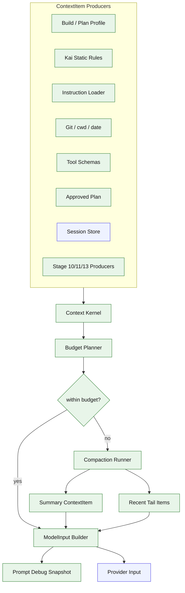

# Stage 06: Context Kernel + Prompt Composer + Budgeted ModelInput

## 1. 本阶段目标

Stage 06 是必改地基，不再只是把几段 prompt 拼起来。它要建立一个稳定的 Context Kernel：所有会进入模型的内容先表示为 `ContextItem`，再由唯一的 `ModelInputBuilder` 组装成 provider input。后续 skill、memory、sub-agent、permission、plan handoff 都只能通过 ContextItem 注入，避免每个能力各自改 prompt。

本阶段拆成两个子阶段：

| 子阶段 | 目标 |
| --- | --- |
| Stage 06A | Context Kernel / ModelInput builder：统一 ContextItem、来源、优先级、预算标签、debug metadata 和 provider input 输出 |
| Stage 06B | Compaction / prompt debug / budget tuning：完成历史压缩、tool pair 保护、prompt debug、预算裁剪和 golden tests |

闭环可调试性声明：本阶段完成后，可运行第 7 节中的 Demo commands 验证 prompt debug、profile prompt、approved plan 注入、长上下文压缩、summary 落盘、ContextItem 裁剪原因和 ModelInput 快照。

## 2. 前置依赖

| 依赖 | 用途 |
| --- | --- |
| Stage 04 | session store 读取历史 messages/parts |
| Stage 04 | PromptSubmission metadata 进入 agent run context |
| Stage 05 | build/plan profile 和 approved plan handoff |
| Bun file APIs | 读取 instruction 文件 |
| `git` subprocess | 获取分支、状态、最近提交 |
| Token estimator | 粗略预算和 compaction 触发 |
| Provider adapter | summary 生成可用 fixture/真实 provider |

## 3. 三家方案对比

### 3.1 Context Kernel 对比

| 维度 | OpenCode | Claude Code | Codex | 我们的选择 | 理由 |
| --- | --- | --- | --- | --- | --- |
| 上下文组织 | instruction/context/compaction 边界清楚 | 动态 prompt section 丰富 | protocol item / snapshot 思路强 | `ContextItem[] -> ModelInput` | 后续能力只扩展 item，不散改 prompt |
| 来源可解释 | session usage、snapshot、overflow | user/system context 来源明确 | debug/context snapshot 可审计 | item 记录 `kind/source/priority/cutReason` | prompt debug 能解释为什么进入或被裁剪 |
| 能力注入 | instruction、skill、tool context | skills/memory/agent context | memory/tool result 有协议边界 | middleware 产出 ContextItem | Stage 10/11/13 不直接拼系统提示词 |

### 3.2 Instruction / Runtime Context 对比

| 维度 | OpenCode | Claude Code | Codex | 我们的选择 | 理由 |
| --- | --- | --- | --- | --- | --- |
| 文件名 | AGENTS/CLAUDE/CONTEXT | CLAUDE.md + user context | AGENTS 类规则 | 支持 `AGENTS.md`、`CLAUDE.md`、`CONTEXT.md` | 兼容常见项目规则文件 |
| 搜索范围 | global/project/config | 项目与用户上下文 | workspace policy | cwd 向上查找 + 用户级预留 | 小实现但可解释 |
| 输出 | system prompt fragments | prompt sections | instructions | `ContextItem(kind="instruction")` | 进入同一预算和 debug 通道 |

### 3.3 Compaction 对比

| 维度 | OpenCode | Claude Code | Codex | 我们的选择 | 理由 |
| --- | --- | --- | --- | --- | --- |
| 触发时机 | finish/next call | query 前和失败后 | turn context | provider call 前 | 简单且避免 context overflow |
| 摘要内容 | previous summary + tail | transcript 清理 | rollout summary | summary + unresolved notes + approved plan | 保留任务连续性 |
| 存储 | session part/message | transcript | state item | `messages.kind=summary`，原始记录不删 | 可审计、可导出 |
| 保护规则 | turn splitting | cleanup pending tool results | tool/result protocol item | tool_use/tool_result pair 不拆散 | 避免 provider continuation 不合法 |

## 4. 源码引用（必读清单）

| 来源 | 行号 | 参考点 |
| --- | --- | --- |
| `$OPENCODE_REPO/packages/opencode/src/session/instruction.ts` | L13-L18 | instruction 文件名 |
| `$OPENCODE_REPO/packages/opencode/src/session/instruction.ts` | L106-L163 | systemPaths 和读取逻辑 |
| `$OPENCODE_REPO/packages/opencode/src/session/llm.ts` | L103-L129 | system prompt 与 transform 合成 |
| `$OPENCODE_REPO/packages/opencode/src/session/overflow.ts` | L6-L26 | usable context 与 overflow 判断 |
| `$OPENCODE_REPO/packages/opencode/src/session/compaction.ts` | L122-L203 | summary prompt、recent budget 和 turn splitting |
| `$CLAUDE_CODE_REPO/src/constants/prompts.ts` | L444-L577 | 动态 prompt sections 合成 |
| `$CLAUDE_CODE_REPO/src/context.ts` | L36-L149 | git/system context 构造 |
| `$CLAUDE_CODE_REPO/src/query.ts` | L709-L740 | fallback 时清理 pending tool results |
| `$CODEX_REPO/codex-rs/core/src/session` | context snapshots / protocol items | prompt debug、上下文审计边界 |

## 5. 本阶段架构图（mermaid）



## 6. 详细设计

### 6.1 模块清单

| 文件路径 | 职责 | 预计行数 | 主要导出 |
|---|---|---:|---|
| `src/coding/context/items.ts` | ContextItem 类型、kind/source/priority 约定 | ~90 | `ContextItem`, `ContextItemKind` |
| `src/coding/context/model-input-builder.ts` | ContextItem -> provider ModelInput 的唯一出口 | ~140 | `ModelInputBuilder` |
| `src/coding/context/debug.ts` | prompt debug snapshot、裁剪原因、diff-friendly 输出 | ~100 | `buildContextDebugSnapshot` |
| `src/coding/context/tokens.ts` | token 估算与 usage 回写 | ~90 | `estimateTokens` |
| `src/coding/context/budget.ts` | usable context、reserved output、per-kind budget | ~110 | `ContextBudget` |
| `src/coding/context/turns.ts` | message -> turns，保护 tool pair | ~120 | `splitTurns` |
| `src/coding/context/compaction.ts` | 构造 summary prompt，写 summary | ~230 | `compactContext` |
| `src/coding/context/manager.ts` | provider 调用前决策与 compaction orchestration | ~120 | `ContextManager` |
| `src/coding/prompt/instructions.ts` | 查找并读取 instruction 文件，输出 ContextItem | ~90 | `loadInstructionItems` |
| `src/coding/prompt/runtime-context.ts` | cwd、date、git status，输出 ContextItem | ~80 | `buildRuntimeContextItems` |
| `src/coding/prompt/profiles.ts` | build/plan profile prompt，输出 ContextItem | ~80 | `buildProfileItems` |

### 6.2 关键接口

```ts
export type ContextItemKind =
  | "base"
  | "profile"
  | "environment"
  | "instruction"
  | "history"
  | "summary"
  | "tool_result"
  | "plan"
  | "skill"
  | "memory"
  | "permission"
  | "subagent";

export interface ContextItem {
  id: string;
  kind: ContextItemKind;
  source: string;
  content: string;
  priority: number;
  estimatedTokens?: number;
  maxTokens?: number;
  sticky?: boolean;
  cacheStable?: boolean;
  metadata?: Record<string, unknown>;
}

export interface ContextBudget {
  maxInputTokens: number;
  reservedOutputTokens: number;
  compactThreshold: number;
  perKindMaxTokens?: Partial<Record<ContextItemKind, number>>;
}

export interface ContextDebugItem {
  id: string;
  kind: ContextItemKind;
  source: string;
  priority: number;
  estimatedTokens: number;
  included: boolean;
  cutReason?: "over_budget" | "deduped" | "replaced_by_summary" | "disabled" | "empty";
}

export interface ModelInputBuildResult {
  system: string[];
  messages: Message[];
  tools: ProviderToolSchema[];
  generation: {
    maxOutputTokens: number;
    temperature?: number;
  };
  debug: {
    items: ContextDebugItem[];
    estimatedInputTokens: number;
    budget: ContextBudget;
  };
}

export interface CompactionResult {
  summaryMessageId: string;
  preservedMessageIds: string[];
  summaryItem: ContextItem;
  estimatedTokens: number;
}
```

### 6.3 Stage 06A: Context Kernel / ModelInput Builder

1. 根据当前 agent profile 生成 `profile` ContextItem，区分 build/plan。
2. 读取 PromptSubmission metadata，例如 requestedProfile/requestedModel/requestedMode/resumeSessionId，并转换为 run context，不直接拼 prompt。
3. 读取项目 instruction 文件，输出 `instruction` ContextItem，并按 cwd 距离排序。
4. 生成 cwd/date/git/tool/approved plan 等动态 ContextItem。
5. 从 session store 读取历史，把 message/part 投影为 `history`、`tool_result`、`summary` ContextItem。
6. `ModelInputBuilder` 按稳定顺序把 ContextItem 合成为 provider input；agent loop 和 middleware 不能绕过 builder 手写 provider messages。
7. `cacheStable=true` 的 item 尽量保持顺序和内容稳定，为后续 prompt cache 诊断预留。

### 6.4 Stage 06B: Compaction / Prompt Debug / Budget Tuning

1. 估算 system + history + tool schema token，先预留 output budget。
2. 超过阈值时按 turn 切分旧消息，保护 tool_use/tool_result pair，避免 provider continuation 断链。
3. 用 fixture/真实 provider 生成 summary，把 summary 作为 `summary` ContextItem 和 session summary message 写入。
4. summary schema 固定，便于 replay 和后续 Stage 15 质量评估：

```md
# Current Goal
# Progress
# Decisions / Constraints
# Critical Files / Commands / Errors
# Remaining Work
```

5. `kai prompt --debug` 输出 ContextItem 列表、token 估算、裁剪原因、最终 ModelInput 摘要和 compaction 结果。
6. 增加 golden tests：同一输入下 ContextItem 顺序、裁剪原因和 ModelInput snapshot 稳定。

## 7. 实施步骤（Step-by-step）

1. 定义 `ContextItem`、`ContextBudget`、`ModelInputBuildResult` 和 debug item。
2. 写 `ModelInputBuilder`，并把 AgentLoop 的 provider 调用改为只消费 builder 输出。
3. 写 instruction loader、runtime context、profile prompt producer，全部输出 ContextItem。
4. 接入 build/plan profile prompt、PromptSubmission metadata 和 approved plan 注入。
5. 实现 token 估算函数、per-kind budget 和 reserved output budget。
6. 实现 turn splitter 和 tool_use/tool_result pair 保护。
7. 实现 compaction prompt、summary schema 和 summary message 落盘。
8. 加 `kai prompt --debug` 输出 ContextItem、裁剪原因、预算和 ModelInput 摘要。
9. 增加 overflow fixture、PromptSubmission metadata、summary、tool pair、debug snapshot golden test。
10. 为 Stage 10/11/13 预留 middleware 注入 API：middleware 只能追加/更新 ContextItem，不能直接拼 provider messages。

Demo commands:

```bash
bun run kai prompt --debug
bun run kai prompt --debug --show-items
bun run kai run --provider fixture --script fixtures/long-context.json --max-input-tokens 800 "long task"
bun run kai sessions export <session-id>
bun test -- stage-06
```

## 8. 验收标准

| 验收项 | 标准 |
| --- | --- |
| ContextItem 地基 | profile、instruction、runtime、history、summary、plan 都以 ContextItem 进入 builder |
| 唯一出口 | provider input 只能由 `ModelInputBuilder` 产生，AgentLoop/middleware 不手写 messages |
| 文件加载 | cwd 下 `AGENTS.md` 能进入 `instruction` ContextItem |
| profile prompt | build/plan profile 产生不同 `profile` ContextItem |
| prompt submission | `/plan`、`/profile`、`/model`、`/mode` metadata 能进入 run context |
| approved plan | Stage 05 批准的计划进入 `plan` ContextItem |
| 动态上下文 | prompt debug 包含 cwd/date/git 摘要 |
| 预算计算 | 长历史触发 compaction，reserved output budget 生效 |
| 摘要落盘 | summary message 写入 store，并作为 `summary` ContextItem 回注 |
| tail 保留 | 最近用户请求和未完成工具结果保留 |
| tool pair 保护 | tool_use/tool_result pair 不被裁剪拆散 |
| debug 可解释 | `kai prompt --debug` 展示每个 item 的 included/cutReason/token/source |
| 后续扩展边界 | Stage 10/11/13 只能通过 ContextItem 注入 skill/memory/sub-agent context |
| 原始可追溯 | 旧 messages 不物理删除 |
| 代码预算 | 累计核心代码约 4680 行 |

## 9. 已知限制 & 下一阶段衔接

Token estimator 不是精确 tokenizer；Stage 06 只要求预算稳定、可解释、可测试。真实 tokenizer 校准、ranking/budget 调优、prompt cache stability 和基于 dogfooding trace 的质量优化放到 Stage 15。下一阶段加入 grep/glob/apply_patch，让 Agent 可以更高效地理解和修改代码。
