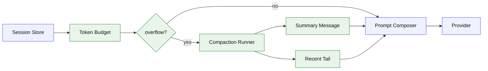

# Stage 06: Context Management

## 1. 本阶段目标

在 provider 调用前计算上下文预算，发现历史消息过长时自动压缩旧 turn：生成 summary message，保留最近 tail 和未完成工具结果。目标是让 Agent 可以处理更长任务而不因 context overflow 崩掉。

闭环可调试性声明：本阶段完成后，可运行第 7 节中的 Demo commands 验证 CLI、测试和核心场景。

## 2. 前置依赖

| 依赖 | 用途 |
| --- | --- |
| Stage 05 | prompt composer 可插入 summary |
| Session Store | 读取历史 messages/parts |
| Token estimator | 粗略预算 |
| Provider mock | 测试 compaction prompt |

## 3. 三家方案对比

### 3.1 Budget 计算对比

| 维度 | OpenCode | Claude Code | Codex | 我们的选择 | 理由 |
| --- | --- | --- | --- | --- | --- |
| usable context | context - reserved output | 模型调用前限制 | model metadata | `maxInput - reservedOutput`；参考 §4 源码引用 | 个人项目优先小代码量、可调试、阶段闭环。 |
| token 来源 | usage + estimate | prompt/tool blocks | protocol accounting | 估算优先，usage 回写；参考 §4 源码引用 | 个人项目优先小代码量、可调试、阶段闭环。 |
| 触发时机 | finish/next call | query 前和失败后 | turn context | provider call 前；参考 §4 源码引用 | 个人项目优先小代码量、可调试、阶段闭环。 |

### 3.2 Compaction 内容对比

| 维度 | OpenCode | Claude Code | Codex | 我们的选择 | 理由 |
| --- | --- | --- | --- | --- | --- |
| 摘要 prompt | previous summary + tail | transcript 清理 | rollout summary | summary + unresolved notes；参考 §4 源码引用 | 个人项目优先小代码量、可调试、阶段闭环。 |
| tail 保留 | preserve recent budget | 保留当前相关消息 | active turn | 最近 N tokens；参考 §4 源码引用 | 个人项目优先小代码量、可调试、阶段闭环。 |
| 工具结果 | serialize model messages | missing result 另处理 | item status | 已完成 result 可摘要；参考 §4 源码引用 | 个人项目优先小代码量、可调试、阶段闭环。 |

### 3.3 存储策略对比

| 维度 | OpenCode | Claude Code | Codex | 我们的选择 | 理由 |
| --- | --- | --- | --- | --- | --- |
| summary 位置 | session part/message | transcript message | state item | `messages.kind=summary`；参考 §4 源码引用 | 个人项目优先小代码量、可调试、阶段闭环。 |
| 可回溯 | 原 part 仍在 | transcript 清理可控 | state db | 原始记录不删；参考 §4 源码引用 | 个人项目优先小代码量、可调试、阶段闭环。 |
| 调试 | compaction flag | hooks/cleanup | protocol events | JSONL 记录 compact event；参考 §4 源码引用 | 个人项目优先小代码量、可调试、阶段闭环。 |

## 4. 源码引用（必读清单）

| 来源 | 行号 | 参考点 |
| --- | --- | --- |
| `$OPENCODE_REPO/packages/opencode/src/session/overflow.ts` | L6-L26 | usable context 与 overflow 判断 |
| `$OPENCODE_REPO/packages/opencode/src/session/compaction.ts` | L122-L155 | summary prompt 与 message serialization |
| `$OPENCODE_REPO/packages/opencode/src/session/compaction.ts` | L157-L203 | recent budget 和 turn splitting |
| `$OPENCODE_REPO/packages/opencode/src/session/processor.ts` | L698-L725 | context overflow 后设置 compaction |
| `$CLAUDE_CODE_REPO/src/query.ts` | L709-L740 | fallback 时清理 pending tool results |

## 5. 本阶段架构图（mermaid）



## 6. 详细设计

### 6.1 模块清单

| 文件路径 | 职责 | 预计行数 | 主要导出 |
|---|---|---:|---|
| `src/context/tokens.ts` | token 估算与 usage 回写 | ~90 | `estimateTokens` |
| `src/context/budget.ts` | usable context、reserved output | ~100 | `ContextBudget` |
| `src/context/turns.ts` | message -> turns，保护 tool pair | ~120 | `splitTurns` |
| `src/context/compaction.ts` | 构造 summary prompt，写 summary | ~220 | `compactContext` |
| `src/context/manager.ts` | provider 调用前决策 | ~70 | `Manager` |

### 6.2 关键接口

```ts
export interface ContextBudget {
  maxInputTokens: number;
  reservedOutputTokens: number;
  compactThreshold: number;
}

export interface CompactionResult {
  summaryMessageId: string;
  preservedMessageIds: string[];
  estimatedTokens: number;
}
```

### 6.3 关键算法 / 数据流

1. 根据模型配置得到预算。
2. 对 system + history + tool schema 估算 token。
3. 未超过阈值时直接调用 provider。
4. 超过阈值时按 turn 切分旧消息。
5. 用 mock/真实 provider 生成 summary，并把 summary + tail 作为新上下文。

## 7. 实施步骤（Step-by-step）

1. 实现 token 估算函数和预算配置。
2. 实现 turn splitter，确保 tool_use/tool_result 不拆散。
3. 实现 compaction prompt。
4. 在 AgentLoop 调 provider 前调用 ContextManager。
5. 增加 overflow fixture 和 summary golden test。

Demo commands:

```bash
pnpm kai run --provider mock --max-input-tokens 800 "long task"
pnpm kai sessions export <session-id>
pnpm test -- stage-06
```

## 8. 验收标准

| 验收项 | 标准 |
| --- | --- |
| 预算计算 | 长历史触发 compaction |
| 摘要落盘 | summary message 写入 store |
| tail 保留 | 最近用户请求和未完成工具结果保留 |
| 原始可追溯 | 旧 messages 不物理删除 |
| 代码预算 | 累计核心代码约 2900 行 |

## 9. 已知限制 & 下一阶段衔接

Token estimator 不是精确 tokenizer；复杂 provider 的真实 token 差异后续再校准。下一阶段加入 grep/glob/apply_patch，让 Agent 可以更高效地理解和修改代码。
