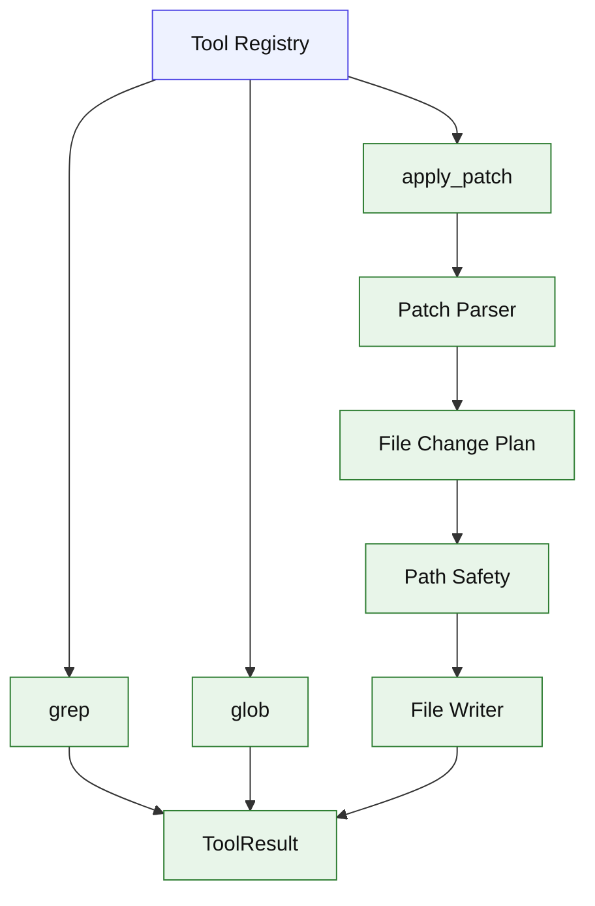

# Stage 07: Grep, Glob, Apply Patch

## 1. 本阶段目标

补齐代码任务最核心的搜索与结构化编辑能力：`grep`、`glob`、`apply_patch`。grep/glob 通过 ripgrep 获取文件和匹配；apply_patch 使用自写 parser 将补丁转成 file change plan，经过路径安全检查后应用。

闭环可调试性声明：本阶段完成后，可运行第 7 节中的 Demo commands 验证 CLI、测试和核心场景。

## 2. 前置依赖

| 依赖 | 用途 |
| --- | --- |
| Stage 02 | Tool registry 和 file IO |
| Stage 06 | 大搜索结果可进入上下文预算 |
| ripgrep | 快速搜索 |
| diff helper | 返回补丁摘要 |

## 3. 三家方案对比

### 3.1 搜索工具对比

| 维度 | OpenCode | Claude Code | Codex | 我们的选择 | 理由 |
| --- | --- | --- | --- | --- | --- |
| grep | rg wrapper + mtime sort | 支持多 output mode | 不作为主参考 | rg wrapper，先 files/content；参考 §4 源码引用 | 个人项目优先小代码量、可调试、阶段闭环。 |
| glob | rg.files + limit | glob path validate | 不作为主参考 | rg files + pattern filter；参考 §4 源码引用 | 个人项目优先小代码量、可调试、阶段闭环。 |
| 输出限制 | limit + truncation | head limit/pagination | output cap | max results + summary；参考 §4 源码引用 | 个人项目优先小代码量、可调试、阶段闭环。 |

### 3.2 Patch Grammar 对比

| 维度 | OpenCode | Claude Code | Codex | 我们的选择 | 理由 |
| --- | --- | --- | --- | --- | --- |
| 格式 | Begin/End + hunks | FileEdit 精准替换 | Lark grammar 明确 | 采用 Codex grammar；参考 §4 源码引用 | 个人项目优先小代码量、可调试、阶段闭环。 |
| 解析 | TS parser | edit 工具不等同 patch | parser + lenient mode | TS parser，先 strict 后 lenient；参考 §4 源码引用 | 个人项目优先小代码量、可调试、阶段闭环。 |
| 应用 | fileChanges 后写入 | old/new string | seek sequence | plan -> apply；参考 §4 源码引用 | 个人项目优先小代码量、可调试、阶段闭环。 |

### 3.3 安全与可用性对比

| 维度 | OpenCode | Claude Code | Codex | 我们的选择 | 理由 |
| --- | --- | --- | --- | --- | --- |
| 路径安全 | permission ask | prior read/stale check | writable path safety | cwd 内 auto，其它 reject；参考 §4 源码引用 | 个人项目优先小代码量、可调试、阶段闭环。 |
| 匹配策略 | patch chunk seek | exact/replaceAll | exact/trim/normalized | exact -> trim，unicode normalize 后续；参考 §4 源码引用 | 个人项目优先小代码量、可调试、阶段闭环。 |
| 失败反馈 | diagnostics | friendly errors | parse/apply errors | structured error result；参考 §4 源码引用 | 个人项目优先小代码量、可调试、阶段闭环。 |

## 4. 源码引用（必读清单）

| 来源 | 行号 | 参考点 |
| --- | --- | --- |
| `$OPENCODE_REPO/packages/opencode/src/tool/grep.ts` | L56-L115 | rg 搜索、mtime sort、limit |
| `$OPENCODE_REPO/packages/opencode/src/tool/glob.ts` | L31-L78 | rg.files、limit 和排序 |
| `$OPENCODE_REPO/packages/opencode/src/tool/apply_patch.ts` | L30-L104 | patch parse 与 planned file changes |
| `$OPENCODE_REPO/packages/opencode/src/patch/index.ts` | L189-L245 | Begin/End patch parse |
| `$CLAUDE_CODE_REPO/src/tools/GrepTool/GrepTool.ts` | L310-L575 | rg 参数组合与输出模式 |
| `$CLAUDE_CODE_REPO/src/tools/FileEditTool/FileEditTool.ts` | L275-L342 | prior read、stale check、多匹配处理 |
| `$CODEX_REPO/codex-rs/core/src/tools/handlers/apply_patch.lark` | L1-L19 | apply_patch grammar |
| `$CODEX_REPO/codex-rs/apply-patch/src/parser.rs` | L176-L260 | strict/lenient boundary parse |
| `$CODEX_REPO/codex-rs/apply-patch/src/seek_sequence.rs` | L12-L109 | 多级匹配策略 |

## 5. 本阶段架构图（mermaid）



## 6. 详细设计

### 6.1 模块清单

| 文件路径 | 职责 | 预计行数 | 主要导出 |
|---|---|---:|---|
| `src/tools/grep.ts` | rg 搜索与结果裁剪 | ~80 | `grepTool` |
| `src/tools/glob.ts` | 文件模式匹配 | ~60 | `globTool` |
| `src/tools/applyPatch.ts` | tool wrapper | ~70 | `applyPatchTool` |
| `src/patch/parser.ts` | grammar parser | ~120 | `parsePatch` |
| `src/patch/apply.ts` | chunk seek 与文件更新 | ~120 | `applyPatchPlan` |
| `src/patch/summary.ts` | 输出 touched files/diff summary | ~50 | `summarizeResult` |

### 6.2 关键接口

```ts
export type PatchChange =
  | { type: "add"; path: string; content: string }
  | { type: "delete"; path: string }
  | { type: "update"; path: string; moveTo?: string; chunks: PatchChunk[] };
```

### 6.3 关键算法 / 数据流

1. grep/glob 调用 `rg`，限制 cwd 和结果数量。
2. patch parser 校验 Begin/End marker。
3. hunk 转成 add/delete/update plan。
4. apply 前检查所有路径位于 cwd。
5. update chunk 按 exact、trim-end、trim 查找。
6. 写入文件并返回变更摘要。

## 7. 实施步骤（Step-by-step）

1. 实现 grep/glob 工具。
2. 按 Codex grammar 写 patch parser 单测。
3. 实现 add/delete/update apply。
4. 给 patch 加路径安全检查。
5. 增加 fixture：新增文件、修改函数、删除文件、匹配失败。

Demo commands:

```bash
pnpm kai run --provider fixture --script fixtures/grep.json "find marker"
pnpm kai run --provider fixture --script fixtures/apply-patch.json "patch file"
pnpm test -- stage-07
```

## 8. 验收标准

| 验收项 | 标准 |
| --- | --- |
| grep | 能返回匹配文件、行号、摘要 |
| glob | 能按 pattern 返回文件列表 |
| patch parse | 支持 add/delete/update |
| patch apply | 修改 cwd 内文件并返回摘要 |
| patch failure | 匹配失败不写部分文件 |
| 代码预算 | 累计核心代码约 3400 行 |

## 9. 已知限制 & 下一阶段衔接

Patch 初版不支持复杂 rename 冲突和二进制文件；grep 输出模式先少后多。下一阶段处理网络、模型和工具失败，确保 tool_use 不悬空。
