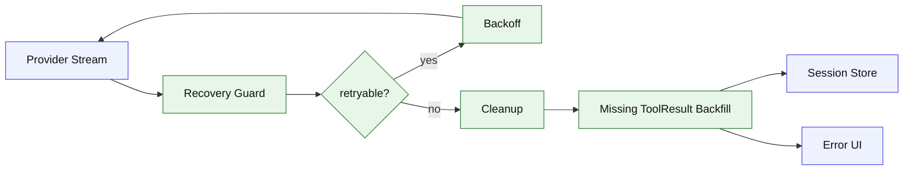

# Stage 08: Failure Handling

## 1. 本阶段目标

让 Agent 在模型、网络、工具、用户中断、上下文异常时保持协议完整。核心是 retry policy、tool result backfill、abort cleanup 和可解释错误输出。对 `bash` 工具，Stage 08 明确 timeout、abort、非零 exit code 的标准结果格式，为后续后台任务打基础。

闭环可调试性声明：本阶段完成后，可运行第 7 节中的 Demo commands 验证 CLI、测试和核心场景。

## 2. 前置依赖

| 依赖 | 用途 |
| --- | --- |
| Stage 03 | stream processor 可捕获中断 |
| Stage 04 | session store 可记录失败 |
| Stage 06 | overflow 可触发 compaction |
| Stage 07 | patch/search 失败可作为 fixture |

## 3. 三家方案对比

### 3.1 Retry 策略对比

| 维度 | OpenCode | Claude Code | Codex | 我们的选择 | 理由 |
| --- | --- | --- | --- | --- | --- |
| retryable error | 分类函数 + headers | fallback retry | transport status | 按 status/code 分类；参考 §4 源码引用 | 个人项目优先小代码量、可调试、阶段闭环。 |
| backoff | schedule + jitter | 清理后重试 | protocol retry | 指数退避 + cap；参考 §4 源码引用 | 个人项目优先小代码量、可调试、阶段闭环。 |
| 次数 | policy 控制 | fallback 有条件 | config 控制 | 默认 3 次；参考 §4 源码引用 | 个人项目优先小代码量、可调试、阶段闭环。 |

### 3.2 Missing ToolResult 对比

| 维度 | OpenCode | Claude Code | Codex | 我们的选择 | 理由 |
| --- | --- | --- | --- | --- | --- |
| cleanup | pending toolcalls 标错 | 生成 missing tool_result | item status error | 统一补 error result；参考 §4 源码引用 | 个人项目优先小代码量、可调试、阶段闭环。 |
| 时机 | stream cleanup | fallback/abort | handler error | turn 结束前；参考 §4 源码引用 | 个人项目优先小代码量、可调试、阶段闭环。 |
| 存储 | part update | transcript block | event item | session part；参考 §4 源码引用 | 个人项目优先小代码量、可调试、阶段闭环。 |

### 3.3 用户中断对比

| 维度 | OpenCode | Claude Code | Codex | 我们的选择 | 理由 |
| --- | --- | --- | --- | --- | --- |
| abort signal | processor/tools 传递 | child abort + cleanup | cancellation token | 全工具传 signal，`bash` 返回 interrupted；参考 §4 源码引用 | 个人项目优先小代码量、可调试、阶段闭环。 |
| 输出 | tool error/aborted | interruption message | status canceled | UI 显示 canceled；参考 §4 源码引用 | 个人项目优先小代码量、可调试、阶段闭环。 |
| 后续 | 可继续 session | 可继续 query | turn state | session 可 resume；参考 §4 源码引用 | 个人项目优先小代码量、可调试、阶段闭环。 |

## 4. 源码引用（必读清单）

| 来源 | 行号 | 参考点 |
| --- | --- | --- |
| `$OPENCODE_REPO/packages/opencode/src/session/retry.ts` | L24-L197 | retry header、retryable error、schedule |
| `$OPENCODE_REPO/packages/opencode/src/session/processor.ts` | L638-L696 | cleanup pending toolcalls |
| `$OPENCODE_REPO/packages/opencode/src/session/processor.ts` | L727-L794 | stream retry 和最终结果 |
| `$CLAUDE_CODE_REPO/src/query.ts` | L709-L740 | fallback 清理 streaming executor |
| `$CLAUDE_CODE_REPO/src/query.ts` | L893-L930 | missing tool result backfill |
| `$CLAUDE_CODE_REPO/src/query.ts` | L1011-L1051 | abort 时消耗剩余工具结果 |
| `$CLAUDE_CODE_REPO/src/tools/BashTool/BashTool.tsx` | L683-L720 | Bash 结果解释、中断和 ShellError |

## 5. 本阶段架构图（mermaid）



## 6. 详细设计

### 6.1 模块清单

| 文件路径 | 职责 | 预计行数 | 主要导出 |
|---|---|---:|---|
| `src/agent/retry.ts` | retryable 分类和 backoff | ~120 | `RetryPolicy` |
| `src/agent/recovery.ts` | cleanup、missing result | ~160 | `recoverTurn` |
| `src/tools/errors.ts` | ToolError 与 BashToolResult 标准化 | ~60 | `normalizeError` |
| `src/ui/errors.ts` | 用户可读错误 | ~60 | `normalizeError` |

### 6.2 关键接口

```ts
export interface RetryPolicy {
  maxAttempts: number;
  baseDelayMs: number;
  maxDelayMs: number;
}

export interface RecoveryAction {
  type: "retry" | "backfill_tool_result" | "stop";
  reason: string;
}
```

### 6.3 关键算法 / 数据流

1. provider 抛错时分类。
2. retryable 且未超次数则等待 backoff 后重试。
3. 不可重试时扫描 ToolState。
4. 对每个未完成 tool call 写入 error ToolResult；`bash` timeout/abort 必须带 `interrupted`、`exitCode` 和输出摘要。
5. session store 写入 failure event，UI 打印摘要。

## 7. 实施步骤（Step-by-step）

1. 实现 retry policy。
2. 包装 provider stream，统一错误入口。
3. 给 ToolState 增加 `started/running/completed/failed`。
4. 实现 missing result backfill。
5. 增加 provider failure、tool failure、abort fixture。

Demo commands:

```bash
pnpm kai run --provider mock --script fixtures/provider-retry.json "retry"
pnpm kai run --provider mock --script fixtures/bash-abort.json "abort bash"
pnpm test -- stage-08
```

## 8. 验收标准

| 验收项 | 标准 |
| --- | --- |
| retry | mock 500 错误按策略重试 |
| backfill | 悬空 tool_call 生成 error result |
| abort | Ctrl-C 后 session 仍可 resume |
| bash failure | timeout、abort、非零 exit code 都转成结构化 BashToolResult |
| UI | 用户看到短错误摘要 |
| 代码预算 | 累计核心代码约 3800 行 |

## 9. 已知限制 & 下一阶段衔接

Stage 08 的恢复只处理本地 loop，不处理外部 MCP server 的 elicitation。下一阶段加入 MCP client，把外部工具纳入统一工具协议。
