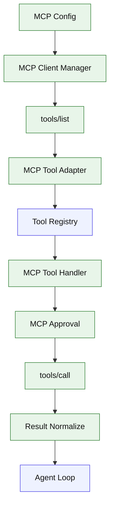

# Stage 09: MCP Client

## 1. 本阶段目标

让 Kai 能连接本地 MCP server，读取 server tools，把 MCP tool 适配成内部 ToolDef，并在模型发起调用时转发到 MCP `tools/call`。本阶段只做 stdio transport 和工具调用，不做资源浏览的完整 UI。

闭环可调试性声明：本阶段完成后，可运行第 7 节中的 Demo commands 验证 CLI、测试和核心场景。

## 2. 前置依赖

| 依赖 | 用途 |
| --- | --- |
| Stage 02 | Tool registry 可注册动态工具 |
| Stage 08 | MCP 调用失败可恢复 |
| MCP TypeScript SDK | client、stdio transport |
| Config loader | 读取 mcp server 配置 |

## 3. 三家方案对比

### 3.1 MCP 连接对比

| 维度 | OpenCode | Claude Code | Codex | 我们的选择 | 理由 |
| --- | --- | --- | --- | --- | --- |
| transport | local/remote 都支持 | 子 Agent 可有 MCP | session manager | Stage 09 只做 stdio；参考 §4 源码引用 | 个人项目优先小代码量、可调试、阶段闭环。 |
| config | 本地与远程 schema | agent 定义可含 mcpServers | config layers | `kai.config.json`；参考 §4 源码引用 | 个人项目优先小代码量、可调试、阶段闭环。 |
| lifecycle | manager 维护连接 | agent 初始化 MCP | session services | CLI 启动时 lazy connect；参考 §4 源码引用 | 个人项目优先小代码量、可调试、阶段闭环。 |

### 3.2 Tool 适配对比

| 维度 | OpenCode | Claude Code | Codex | 我们的选择 | 理由 |
| --- | --- | --- | --- | --- | --- |
| list tools | listTools 转工具 | MCP skills/tools 合并 | ToolInfo -> handler | server/tool -> ToolDef；参考 §4 源码引用 | 个人项目优先小代码量、可调试、阶段闭环。 |
| 名称 | namespaced | tool name 受 agent 影响 | canonical name | `mcp__server__tool`；参考 §4 源码引用 | 个人项目优先小代码量、可调试、阶段闭环。 |
| schema | 转 provider schema | 合并到可用工具 | handler payload | 保留 JSON schema；参考 §4 源码引用 | 个人项目优先小代码量、可调试、阶段闭环。 |

### 3.3 Approval 对比

| 维度 | OpenCode | Claude Code | Codex | 我们的选择 | 理由 |
| --- | --- | --- | --- | --- | --- |
| 默认策略 | permission 系统 | hooks/permissions | approval mode | Stage 09 先 ask/allow config；参考 §4 源码引用 | 个人项目优先小代码量、可调试、阶段闭环。 |
| hook input | plugin transform | pre tool hooks | pre/post payload | 预留 pre/post hook；参考 §4 源码引用 | 个人项目优先小代码量、可调试、阶段闭环。 |
| 结果 | normalized attachment/result | tool_result | CallToolResult | ToolResult normalize；参考 §4 源码引用 | 个人项目优先小代码量、可调试、阶段闭环。 |

## 4. 源码引用（必读清单）

| 来源 | 行号 | 参考点 |
| --- | --- | --- |
| `$OPENCODE_REPO/packages/opencode/src/mcp/index.ts` | L132-L173 | listTools 与 convertMcpTool |
| `$OPENCODE_REPO/packages/opencode/src/mcp/index.ts` | L301-L417 | remote/local connect 结构 |
| `$OPENCODE_REPO/packages/opencode/src/mcp/index.ts` | L662-L700 | MCP tools 暴露入口 |
| `$OPENCODE_REPO/packages/opencode/src/config/mcp.ts` | L5-L48 | local/remote config shape |
| `$CODEX_REPO/codex-rs/core/src/tools/handlers/mcp.rs` | L31-L139 | MCP handler 生命周期 |
| `$CODEX_REPO/codex-rs/core/src/mcp_tool_call.rs` | L110-L240 | args parse、approval、started event |
| `$CODEX_REPO/codex-rs/core/src/session/mcp.rs` | L200-L260 | session 调用 MCP manager |

## 5. 本阶段架构图（mermaid）



## 6. 详细设计

### 6.1 模块清单

| 文件路径 | 职责 | 预计行数 | 主要导出 |
|---|---|---:|---|
| `src/mcp/config.ts` | mcp server 配置 schema | ~70 | `McpConfig` |
| `src/mcp/client.ts` | stdio connect、listTools、callTool | ~140 | `McpClientManager` |
| `src/mcp/adapter.ts` | MCP tool -> ToolDef | ~90 | `adaptMcpTool` |
| `src/mcp/result.ts` | CallToolResult normalize | ~60 | `normalizeMcpResult` |
| `src/mcp/approval.ts` | 简单 allow/ask/reject | ~40 | `approveMcpTool` |

### 6.2 关键接口

```ts
export interface McpServerConfig {
  command: string;
  args?: string[];
  env?: Record<string, string>;
  approval?: "allow" | "ask" | "reject";
}
```

### 6.3 关键算法 / 数据流

1. 启动时读取 MCP config，但不立即连接。
2. 第一次需要工具列表时启动 stdio client。
3. `tools/list` 返回的工具转换为 namespaced ToolDef。
4. 调用前按 server/tool 做 approval。
5. `tools/call` 结果转换为 Kai ToolResult。

## 7. 实施步骤（Step-by-step）

1. 增加 config loader 的 MCP 部分。
2. 封装 MCP client manager。
3. 实现 tool adapter 和 namespacing。
4. 把 MCP tools 注册进 registry。
5. 写一个 fixture MCP server 供测试。

Demo commands:

```bash
pnpm kai mcp list
pnpm kai run --provider fixture --script fixtures/mcp-tool.json "call memory tool"
pnpm test -- stage-09
```

## 8. 验收标准

| 验收项 | 标准 |
| --- | --- |
| list | `kai mcp list` 能列出 fixture server tools |
| call | 模型可调用 `mcp__fixture__echo` |
| approval | reject server 不会执行 |
| failure | MCP 调用失败生成 ToolResult |
| 代码预算 | 累计核心代码约 4200 行 |

## 9. 已知限制 & 下一阶段衔接

Stage 09 不完整支持 resources、prompts、elicitation。下一阶段增加 skill 和 memory，让 Agent 能根据任务动态加载专门知识。
