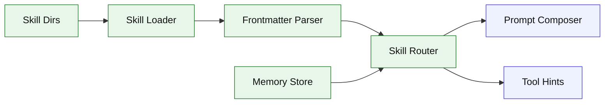

# Stage 10: Skill Memory

## 1. 本阶段目标

实现本地 skill 系统和轻量 memory。Skill 是包含 frontmatter 与说明的目录或 Markdown 文件，Agent 根据 `when_to_use`、用户任务和文件上下文选择 skill，把相关说明注入 prompt。Memory 用于记录用户偏好和项目事实。

闭环可调试性声明：本阶段完成后，可运行第 7 节中的 Demo commands 验证 CLI、测试和核心场景。

## 2. 前置依赖

| 依赖 | 用途 |
| --- | --- |
| Stage 05 | prompt composer 可插入 skill section |
| Stage 09 | skills 可声明 MCP/tool 需求 |
| yaml parser | frontmatter |
| Session store | memory 持久化 |

## 3. 三家方案对比

### 3.1 Skill Discovery 对比

| 维度 | OpenCode | Claude Code | Codex | 我们的选择 | 理由 |
| --- | --- | --- | --- | --- | --- |
| 扫描 | skill index 扫描 | loadSkillsDir | 不作为主参考 | `.kai/skills` + project；参考 §4 源码引用 | 个人项目优先小代码量、可调试、阶段闭环。 |
| frontmatter | description 等 | rich fields | 不作为主参考 | 精简 schema；参考 §4 源码引用 | 个人项目优先小代码量、可调试、阶段闭环。 |
| 激活 | dynamic tool description | when_to_use/model/tools | 不作为主参考 | rule score + explicit mention；参考 §4 源码引用 | 个人项目优先小代码量、可调试、阶段闭环。 |

### 3.2 Prompt 注入对比

| 维度 | OpenCode | Claude Code | Codex | 我们的选择 | 理由 |
| --- | --- | --- | --- | --- | --- |
| skill 内容 | dynamic skill tool | forked skill/context | protocol resource | prompt section；参考 §4 源码引用 | 个人项目优先小代码量、可调试、阶段闭环。 |
| token 控制 | tool description | token estimate | budget | skill summary + file refs；参考 §4 源码引用 | 个人项目优先小代码量、可调试、阶段闭环。 |
| 冲突处理 | provider transform | priority/agent hooks | config layers | explicit skill wins；参考 §4 源码引用 | 个人项目优先小代码量、可调试、阶段闭环。 |

### 3.3 Memory 对比

| 维度 | OpenCode | Claude Code | Codex | 我们的选择 | 理由 |
| --- | --- | --- | --- | --- | --- |
| 存储 | 项目状态/skills | memory prefetch | state db | SQLite memory table；参考 §4 源码引用 | 个人项目优先小代码量、可调试、阶段闭环。 |
| 类型 | session/project | user/project | protocol | preference/fact/decision；参考 §4 源码引用 | 个人项目优先小代码量、可调试、阶段闭环。 |
| 注入 | prompt context | query prefetch | config context | top relevant memories；参考 §4 源码引用 | 个人项目优先小代码量、可调试、阶段闭环。 |

## 4. 源码引用（必读清单）

| 来源 | 行号 | 参考点 |
| --- | --- | --- |
| `$OPENCODE_REPO/packages/opencode/src/skill/index.ts` | L22-L25 | skill 文件模式 |
| `$OPENCODE_REPO/packages/opencode/src/skill/index.ts` | L165-L204 | skill 扫描 |
| `$OPENCODE_REPO/packages/opencode/src/skill/index.ts` | L243-L247 | skill customize |
| `$OPENCODE_REPO/packages/opencode/src/tool/registry.ts` | L273-L290 | dynamic skill tool description |
| `$CLAUDE_CODE_REPO/src/skills/loadSkillsDir.ts` | L185-L265 | frontmatter 字段 |
| `$CLAUDE_CODE_REPO/src/tools/SkillTool/SkillTool.ts` | L81-L130 | skill 命令发现和 forked skill |
| `$CLAUDE_CODE_REPO/src/query.ts` | L1592-L1614 | memory prefetch consume |

## 5. 本阶段架构图（mermaid）



## 6. 详细设计

### 6.1 模块清单

| 文件路径 | 职责 | 预计行数 | 主要导出 |
|---|---|---:|---|
| `src/skills/frontmatter.ts` | parse/validate skill metadata | ~100 | `parseFrontmatter` |
| `src/skills/loader.ts` | 扫描全局和项目 skills | ~120 | `Loader` |
| `src/skills/router.ts` | 根据任务选择 skills | ~120 | `Router` |
| `src/skills/prompt.ts` | skill section 生成 | ~80 | `buildSkillPrompt` |
| `src/memory/store.ts` | preference/fact 存取 | ~80 | `Store` |

### 6.2 关键接口

```ts
export interface SkillDefinition {
  name: string;
  description: string;
  whenToUse?: string;
  allowedTools?: string[];
  path: string;
}
```

### 6.3 关键算法 / 数据流

1. 扫描 `.kai/skills`、项目 `skills`、用户目录。
2. 解析 frontmatter，生成 SkillDefinition。
3. explicit mention 命中时强制激活。
4. 否则按 description/whenToUse 简单打分。
5. 将激活 skill 的摘要注入 prompt。

## 7. 实施步骤（Step-by-step）

1. 定义 skill frontmatter schema。
2. 写 loader 和缓存。
3. 写 router，支持 `$skillName` 显式触发。
4. 增加 memory table 和 `kai memory add/list`。
5. composer 注入 skill/memory section。

Demo commands:

```bash
pnpm kai skills list
pnpm kai memory add preference "Prefer concise final answers"
pnpm kai run "$typescript refactor this file"
pnpm test -- stage-10
```

## 8. 验收标准

| 验收项 | 标准 |
| --- | --- |
| skill list | CLI 能列出 skill 名称和描述 |
| explicit activation | `$name` 一定激活对应 skill |
| auto routing | 任务关键词可激活匹配 skill |
| memory | 可写入并注入相关 memory |
| 代码预算 | 累计核心代码约 4700 行 |

## 9. 已知限制 & 下一阶段衔接

Skill 初版只注入提示，不 fork 单独执行。下一阶段引入 sub-agent，把局部探索、修复、验证放入隔离 agent loop。
