# Stage 10: Skills + Memory v0 + Slash Activation

## 1. 本阶段目标

实现多目录 skill 系统、Memory v0 和 slash activation。Skill 以目录为单位，核心文件为 `SKILL.md`；系统启动时只扫描 frontmatter 和简要描述，把 skill catalog 作为 Stage 06 的 `ContextItem(kind="skill")` 候选注入，并注册到 Stage 04 的 shared command registry。显式 slash 触发时，command 不直接读取完整 skill 或执行本地命令，而是提交 `PromptSubmission.metadata.requestedSkillName`；进入 agent loop 后由 skills middleware 产出 explicit skill invocation ContextItem。只有显式触发或自动路由命中时，才 progressive load 完整 `SKILL.md`。

Memory 在本阶段只做可解释的 v0：手动 `add/list/search/delete`、基础 scope/type 字段、按任务文本检索 top relevant memories，并通过 middleware 输出 `ContextItem(kind="memory")` 交给 Stage 06 ModelInputBuilder 统一预算。自动提取、引用追踪、secret guard、stale/merge/delete 生命周期和 post-turn extraction sub-agent 留到 Stage 13 Memory System。

闭环可调试性声明：本阶段完成后，可运行第 7 节中的 Demo commands 验证多目录发现、frontmatter scan、slash command、显式 invocation、progressive loading、duplicate/priority 和 manual memory 注入。

## 2. 前置依赖

| 依赖 | 用途 |
| --- | --- |
| Stage 03 | middleware 可在 `beforeModel` 注入 skill/memory prompt |
| Stage 06 | ContextItem、ModelInputBuilder、context budget 和 prompt debug |
| Stage 09 | skills 可声明 MCP/tool 需求 |
| YAML/frontmatter parser | 读取 `SKILL.md` metadata |
| Session store / SQLite | Memory v0 持久化 |
| Stage 04 command registry | skills 注册为 slash command，复用 input editor / command input hook |
| Stage 04 PromptSubmission | slash skill command 通过 metadata 影响下一轮 agent context |

## 3. 三家方案对比

### 3.1 Skill Discovery 对比

| 维度 | OpenCode | Claude Code | Codex | 我们的选择 | 理由 |
| --- | --- | --- | --- | --- | --- |
| 扫描 | skill index 扫描 | loadSkillsDir | Codex skills 多目录 | project + user 多目录发现 | 符合已有 code agent/skills 生态 |
| frontmatter | description 等 | rich fields | skill description | 先读 frontmatter/description | 不把全部 skill 内容塞进上下文 |
| duplicate | index/priority | 目录优先级 | install path 优先 | 显式 priority + path priority | 可解释、可调试 |

### 3.2 激活方式对比

| 维度 | OpenCode | Claude Code | Codex | 我们的选择 | 理由 |
| --- | --- | --- | --- | --- | --- |
| 自动路由 | dynamic skill tool description | when_to_use/model/tools | system skill catalog | rule score + model-visible catalog | 低成本可用 |
| 显式触发 | slash/task 入口 | skill command 发现 | `$SkillName`/工具环境 | command registry -> PromptSubmission metadata + `$skillName` | 用户控制优先于模型猜测，且不把 skill loading 写进 UI |
| progressive loading | dynamic description | forked skill/context | progressive disclosure | 命中后再读完整 `SKILL.md` | 节省 token，避免上下文污染 |

### 3.3 Memory v0 对比

| 维度 | OpenCode | Claude Code | Codex | 我们的选择 | 理由 |
| --- | --- | --- | --- | --- | --- |
| 存储 | instruction/context state | memory prefetch | memory state db | `bun:sqlite` memory table | 与 session/audit 共用本地存储 |
| 类型 | project/instruction context | user/project/reference | protocol memory mode | preference/fact/decision/project/reference | Stage 10 只落基础字段，Stage 13 完成完整类型语义 |
| 注入 | prompt context | relevant memory prefetch | model context/citation | top relevant memories | 控制 token 和可解释性 |
| 写入 | 主要靠文件/指令 | 自动提取 + 手动 | tool/protocol 驱动 | v0 只做手动写入 | 先避免误存和隐私风险 |

## 4. 源码引用（必读清单）

| 来源 | 行号 | 参考点 |
| --- | --- | --- |
| `$OPENCODE_REPO/packages/opencode/src/skill/index.ts` | L22-L25 | skill 文件模式 |
| `$OPENCODE_REPO/packages/opencode/src/skill/index.ts` | L165-L204 | skill 扫描 |
| `$OPENCODE_REPO/packages/opencode/src/skill/index.ts` | L243-L247 | skill customize |
| `$OPENCODE_REPO/packages/opencode/src/tool/registry.ts` | L273-L290 | dynamic skill tool description |
| `$CLAUDE_CODE_REPO/src/skills/loadSkillsDir.ts` | L185-L265 | frontmatter 字段 |
| `$CLAUDE_CODE_REPO/src/tools/SkillTool/SkillTool.ts` | L81-L130 | skill 命令发现和 forked skill |
| `$CLAUDE_CODE_REPO/src/query.ts` | L1592-L1614 | memory prefetch consume |
| `$CLAUDE_CODE_REPO/src/services/extractMemories/extractMemories.ts` | 全文件 | Stage 13 post-turn extraction sub-agent 参考 |
| `$CODEX_REPO/codex-rs/core/src/client.rs` | memory summarize 相关段落 | Stage 13 memory consolidation 参考 |

## 5. 本阶段架构图（mermaid）

```mermaid
flowchart LR
  Dirs["Skill Dirs"] --> Discover["Discovery"]
  Discover --> Frontmatter["Frontmatter Scan"]
  Frontmatter --> Catalog["Skill Catalog"]
  Catalog --> Registry["Command Registry"]
  Registry --> Slash["Slash Command Picker"]
  Slash --> Submission["PromptSubmission.requestedSkillName"]
  Catalog --> Router["Skill Router"]
  Submission --> Explicit["Explicit Invocation"]
  Explicit --> Router
  Auto["Auto Routing"] --> Router
  Router --> Loader["Progressive SKILL.md Loader"]
  Loader --> Middleware["Skills Middleware"]
  Memory["Memory Store"] --> Middleware
  Middleware --> Items["ContextItem Injection"]
  Items --> Builder["ModelInputBuilder"]

  classDef existing fill:#eef2ff,stroke:#4f46e5,color:#111;
  classDef new fill:#e8f5e9,stroke:#2e7d32,color:#111;
  class Builder existing;
  class Dirs,Discover,Frontmatter,Catalog,Registry,Slash,Submission,Router,Explicit,Auto,Loader,Middleware,Memory,Items new;
```



## 6. 详细设计

### 6.1 Skill 目录优先级

| 优先级 | 目录 |
| ---: | --- |
| 1 | `<project>/skills` |
| 2 | `<project>/.agents/skills` |
| 3 | `<project>/.kai/skills` |
| 4 | `~/skills` |
| 5 | `~/.agents/skills` |
| 6 | `~/.kai-code-agent/skills` |

同名 skill 的默认规则：高优先级目录覆盖低优先级目录；如果 frontmatter 显式声明 `priority`，先比较 priority，再比较目录优先级。被覆盖的 skill 不注入 prompt，但 `kai skills list --all` 可显示 shadowed 来源。

### 6.2 模块清单

| 文件路径 | 职责 | 预计行数 | 主要导出 |
|---|---|---:|---|
| `src/skills/frontmatter.ts` | parse/validate `SKILL.md` metadata | ~110 | `parseSkillFrontmatter` |
| `src/skills/discovery.ts` | 多目录扫描、duplicate/priority 规则 | ~150 | `discoverSkills` |
| `src/skills/catalog.ts` | 只保存 frontmatter/description 的 catalog | ~90 | `SkillCatalog` |
| `src/skills/router.ts` | explicit invocation + auto routing | ~130 | `SkillRouter` |
| `src/skills/loader.ts` | progressive loading 完整 `SKILL.md` | ~90 | `loadSkillBody` |
| `src/skills/middleware.ts` | `beforeModel` 产出 skill ContextItem | ~90 | `skillsMiddleware` |
| `src/ui/slash/skills.ts` | 将 skill catalog 注册到 shared command registry，返回 PromptSubmission metadata | ~90 | `registerSkillCommands` |
| `src/memory/types.ts` | Memory v0 scope/type/schema | ~50 | `MemoryRecord` |
| `src/memory/store.ts` | manual preference/fact/decision/project/reference 存取 | ~100 | `MemoryStore` |
| `src/memory/retrieval.ts` | 简单关键词/recency 相关性检索 | ~50 | `retrieveRelevantMemories` |
| `src/memory/middleware.ts` | relevant memory ContextItem 注入 | ~80 | `memoryMiddleware` |

### 6.3 关键接口

```ts
export interface SkillDefinition {
  name: string;
  description: string;
  whenToUse?: string;
  allowedTools?: string[];
  path: string;
  priority?: number;
  source: "project" | "user";
  shadowedBy?: string;
}

export interface SkillActivation {
  name: string;
  mode: "explicit" | "auto";
  reason: string;
  path: string;
}

export type MemoryScope = "session" | "projectLocal" | "project" | "user";
export type MemoryType = "preference" | "fact" | "decision" | "project" | "reference";

export interface MemoryRecord {
  id: string;
  scope: MemoryScope;
  type: MemoryType;
  text: string;
  sourceSessionId?: string;
  tags?: string[];
  createdAt: string;
  updatedAt: string;
}
```

显式 slash 激活示例：

```ts
{
  type: "submit_prompt",
  submission: {
    text: "refactor this file",
    metadata: {
      slashCommand: "/typescript",
      requestedSkillName: "typescript"
    }
  }
}
```

Skills middleware 在 `beforeModel` 读取 `requestedSkillName`，标记为 explicit activation，并产出带 source/priority/budget metadata 的 ContextItem；完整 `SKILL.md` 仍通过 progressive loading 进入同一 ContextItem 通道。

## 7. 实施步骤（Step-by-step）

1. 定义 `SKILL.md` frontmatter schema。
2. 写多目录 discovery 和 duplicate/priority 规则。
3. 写 catalog，只读取 frontmatter 和首段描述。
4. 将 catalog 作为 ContextItem 注入，提示模型命中后读取完整 skill。
5. 将 skill catalog 注册到 Stage 04 command registry：`/frontend-design`、`/skill-creator` 等来自 skill catalog，并返回 PromptSubmission metadata。
6. 实现显式 invocation：slash 选择或 `$skillName` 一定优先生效。
7. 实现 auto routing：根据 description/whenToUse/任务关键词打分。
8. 实现 progressive loader：命中后再读取完整 `SKILL.md`。
9. 增加 Memory v0 table 和 `kai memory add/list/search/delete`。
10. 通过 middleware 注入 activated skills 和 relevant memories 的 ContextItem。

Demo commands:

```bash
bun run kai skills list
bun run kai skills list --all
bun run kai memory add preference "Prefer concise final answers"
bun run kai memory search concise
bun run kai run "$typescript refactor this file"
bun test -- stage-10
```

## 8. 验收标准

| 验收项 | 标准 |
| --- | --- |
| 多目录发现 | project/user 多个目录的 skill 都能被发现 |
| duplicate | 同名 skill 按 priority/path 规则稳定选择 |
| catalog | 未激活时只注入 frontmatter/description ContextItem，不注入完整正文 |
| explicit activation | slash 或 `$name` 一定激活对应 skill |
| prompt metadata | slash skill command 生成 `requestedSkillName`，skills middleware 负责注入，不由 UI 直接读取完整 `SKILL.md` |
| progressive loading | 激活后才读取完整 `SKILL.md` |
| slash picker | skills 通过 shared command registry 出现在 slash command picker 中 |
| auto routing | 任务关键词可激活匹配 skill |
| context injection | skills/memory 只通过 Stage 06 ContextItem 注入，不直接拼 provider messages |
| memory v0 | 可手动写入、搜索、删除，并注入 top relevant memory ContextItem |
| 代码预算 | 累计核心代码约 6900 行 |

## 9. 已知限制 & 下一阶段衔接

Skill 初版只注入提示，不 fork 单独执行。Memory v0 也只做手动写入和基础检索，不做自动提取、引用、secret guard 和生命周期治理。下一阶段引入 sub-agent，把局部探索、修复、验证放入隔离 agent loop；skill 也可以成为 sub-agent definition 的输入。Stage 13 会在 Stage 11 sub-agent 和 Stage 12 permission engine 之后，把 memory 升级为完整的 typed/scoped memory system。
