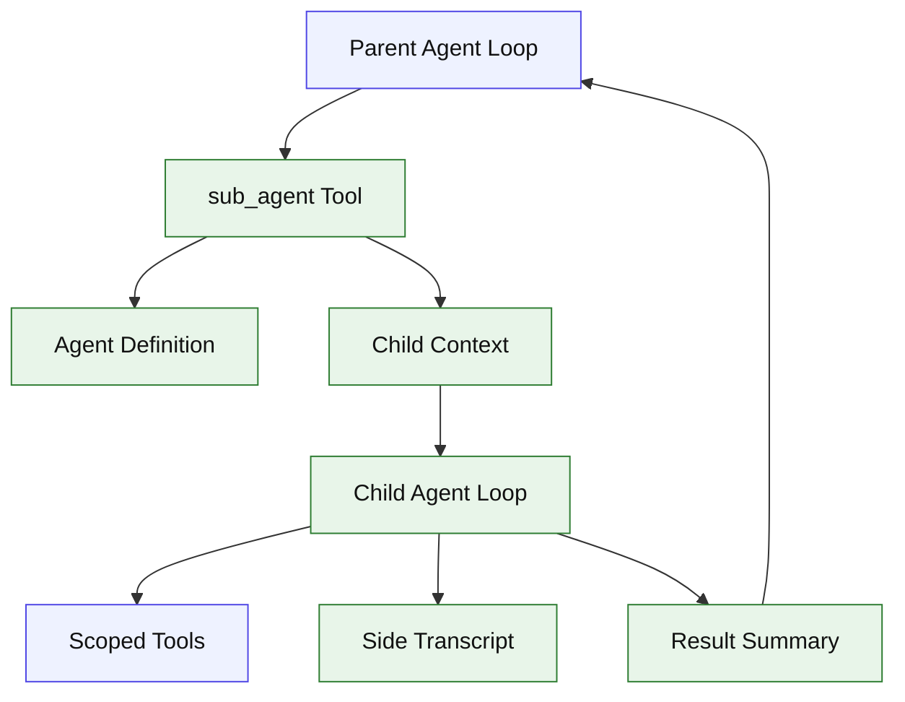

# Stage 11: Sub-agent

## 1. 本阶段目标

实现子 Agent：主 Agent 可以通过 `sub_agent` 工具创建隔离上下文，让子 Agent 执行探索、验证或局部改动，然后把简明结果返回主 Agent。个人项目中，子 Agent 默认串行执行，后续再优化并发。

闭环可调试性声明：本阶段完成后，可运行第 7 节中的 Demo commands 验证 CLI、测试和核心场景。

## 2. 前置依赖

| 依赖 | 用途 |
| --- | --- |
| Stage 08 | 子 Agent 失败可恢复 |
| Stage 10 | agent definitions 可声明 skills |
| Session store | side transcript |
| Permission engine stub | 子 Agent 权限收敛 |

## 3. 三家方案对比

### 3.1 Agent 定义对比

| 维度 | OpenCode | Claude Code | Codex | 我们的选择 | 理由 |
| --- | --- | --- | --- | --- | --- |
| 入口 | task tool/dynamic task | AgentTool | 不作为主参考 | `sub_agent` tool；参考 §4 源码引用 | 个人项目优先小代码量、可调试、阶段闭环。 |
| 定义 | task description | agent json/frontmatter | 不作为主参考 | `.kai/agents/*.md`；参考 §4 源码引用 | 个人项目优先小代码量、可调试、阶段闭环。 |
| 类型 | general task | builtin/custom agents | 不作为主参考 | explorer/worker/verifier；参考 §4 源码引用 | 个人项目优先小代码量、可调试、阶段闭环。 |

### 3.2 上下文隔离对比

| 维度 | OpenCode | Claude Code | Codex | 我们的选择 | 理由 |
| --- | --- | --- | --- | --- | --- |
| message fork | task tool 独立 prompt | fork context/read state | session item | 默认只传任务 +摘要；参考 §4 源码引用 | 个人项目优先小代码量、可调试、阶段闭环。 |
| 工具范围 | tool filter | agent tools/permissions | profile | allowlist；参考 §4 源码引用 | 个人项目优先小代码量、可调试、阶段闭环。 |
| transcript | session parts | sidechain transcript | rollout state | `agent_runs` + JSONL；参考 §4 源码引用 | 个人项目优先小代码量、可调试、阶段闭环。 |

### 3.3 执行策略对比

| 维度 | OpenCode | Claude Code | Codex | 我们的选择 | 理由 |
| --- | --- | --- | --- | --- | --- |
| 并发 | task tool 可扩展 | background/multi-agent | runtime dependent | Stage 11 串行；参考 §4 源码引用 | 个人项目优先小代码量、可调试、阶段闭环。 |
| 返回 | tool result summary | agent final result | protocol item | summary + changed files；参考 §4 源码引用 | 个人项目优先小代码量、可调试、阶段闭环。 |
| 安全 | permission 继承 | permission mode override | sandbox profile | 子 Agent 权限不高于父；参考 §4 源码引用 | 个人项目优先小代码量、可调试、阶段闭环。 |

## 4. 源码引用（必读清单）

| 来源 | 行号 | 参考点 |
| --- | --- | --- |
| `$OPENCODE_REPO/packages/opencode/src/tool/registry.ts` | L292-L305 | dynamic task description |
| `$CLAUDE_CODE_REPO/src/tools/AgentTool/AgentTool.tsx` | L81-L102 | AgentTool input schema |
| `$CLAUDE_CODE_REPO/src/tools/AgentTool/runAgent.ts` | L368-L410 | context messages 与 user/system context |
| `$CLAUDE_CODE_REPO/src/tools/AgentTool/runAgent.ts` | L412-L529 | permission、tools、abort controller |
| `$CLAUDE_CODE_REPO/src/tools/AgentTool/runAgent.ts` | L747-L806 | query loop 和 sidechain transcript |
| `$CLAUDE_CODE_REPO/src/tools/AgentTool/loadAgentsDir.ts` | L73-L133 | agent definition schema |
| `$CLAUDE_CODE_REPO/src/tools/AgentTool/builtInAgents.ts` | L13-L72 | builtin agent 思路 |

## 5. 本阶段架构图（mermaid）



## 6. 详细设计

### 6.1 模块清单

| 文件路径 | 职责 | 预计行数 | 主要导出 |
|---|---|---:|---|
| `src/agents/definitions.ts` | agent schema 和 loader | ~90 | `AgentDefinition` |
| `src/agents/runner.ts` | 创建 child loop、执行、汇总 | ~170 | `runTool` |
| `src/agents/transcript.ts` | side transcript store | ~60 | `SideTranscript` |
| `src/tools/subAgent.ts` | tool wrapper | ~80 | `subAgentTool` |

### 6.2 关键接口

```ts
export interface AgentDefinition {
  name: string;
  description: string;
  prompt: string;
  tools: string[];
  skills?: string[];
  maxTurns?: number;
}
```

### 6.3 关键算法 / 数据流

1. 主 Agent 调用 `sub_agent`。
2. loader 找 agent definition。
3. runner 创建 child RunContext，工具按 allowlist 过滤。
4. child loop 最多运行 `maxTurns`。
5. side transcript 落盘，final summary 作为 ToolResult 返回。

## 7. 实施步骤（Step-by-step）

1. 设计 `.kai/agents/*.md` frontmatter。
2. 写 agent loader。
3. 写 sub_agent tool。
4. 改造 AgentLoop 允许嵌套调用但共享 provider factory。
5. 增加 explorer fixture。

Demo commands:

```bash
pnpm kai agents list
pnpm kai run --provider mock --script fixtures/sub-agent.json "ask explorer to inspect"
pnpm test -- stage-11
```

## 8. 验收标准

| 验收项 | 标准 |
| --- | --- |
| agent list | CLI 能列出 agent definitions |
| 子 Agent 执行 | sub_agent tool 返回 summary |
| 上下文隔离 | 子 Agent 不自动继承全部历史 |
| transcript | side transcript 可导出 |
| 代码预算 | 累计核心代码约 5100 行 |

## 9. 已知限制 & 下一阶段衔接

Stage 11 默认串行子 Agent，不做复杂并行调度。下一阶段补全 permission engine，使父子 Agent、bash、patch、MCP 都受同一安全策略约束。
