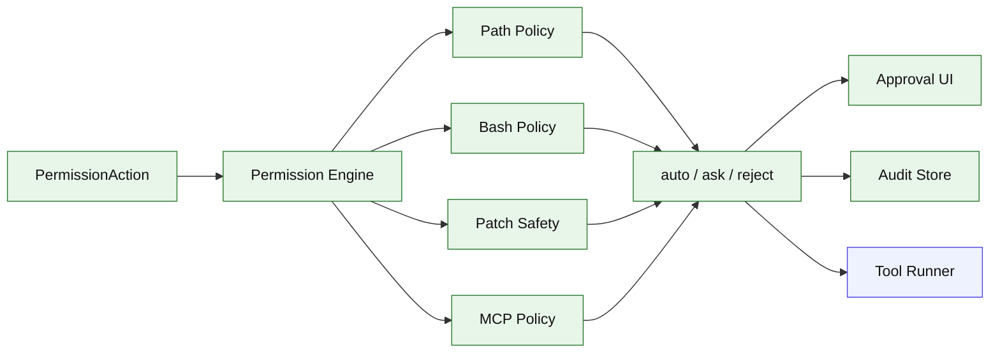

# Stage 12: Permissions

## 1. 本阶段目标

建立统一权限引擎，对文件写入、bash、apply_patch、MCP、sub-agent 工具范围做 auto/ask/reject 决策。所有决策记录进 session store，用户可以复盘为什么某个操作被允许或拒绝。

闭环可调试性声明：本阶段完成后，可运行第 7 节中的 Demo commands 验证 CLI、测试和核心场景。

## 2. 前置依赖

| 依赖 | 用途 |
| --- | --- |
| Stage 02 | read/write/edit/bash 工具 |
| Stage 07 | apply_patch plan |
| Stage 09 | MCP 调用 |
| Stage 11 | 子 Agent 工具范围 |
| CLI renderer | approval prompt |

## 3. 三家方案对比

### 3.1 决策模型对比

| 维度 | OpenCode | Claude Code | Codex | 我们的选择 | 理由 |
| --- | --- | --- | --- | --- | --- |
| 输入 | permission action | tool permission check | patch action/profile | `PermissionAction`；参考 §4 源码引用 | 个人项目优先小代码量、可调试、阶段闭环。 |
| 输出 | allow/ask/reject | denied tool_result | SafetyCheck | `auto/ask/reject`；参考 §4 源码引用 | 个人项目优先小代码量、可调试、阶段闭环。 |
| 记录 | permission table/event | hooks result | protocol approval | session audit；参考 §4 源码引用 | 个人项目优先小代码量、可调试、阶段闭环。 |

### 3.2 文件安全对比

| 维度 | OpenCode | Claude Code | Codex | 我们的选择 | 理由 |
| --- | --- | --- | --- | --- | --- |
| 写入 | tool 内请求 permission | prior read/stale | writable roots | cwd + allowlist；参考 §4 源码引用 | 个人项目优先小代码量、可调试、阶段闭环。 |
| patch | planned changes permission | edit old/new check | assess_patch_safety | plan 后统一检查；参考 §4 源码引用 | 个人项目优先小代码量、可调试、阶段闭环。 |
| 路径解析 | resolver/reference | file path validation | normalize + writable roots | realpath + lexical normalize；参考 §4 源码引用 | 个人项目优先小代码量、可调试、阶段闭环。 |

### 3.3 Bash/MCP 安全对比

| 维度 | OpenCode | Claude Code | Codex | 我们的选择 | 理由 |
| --- | --- | --- | --- | --- | --- |
| bash 分类 | command parser | command class + sandbox notes | sandbox policy | denylist + asklist + allowlist；参考 §4 源码引用 | 个人项目优先小代码量、可调试、阶段闭环。 |
| MCP | server/tool permission | tool hooks | approval mode | server/tool profile；参考 §4 源码引用 | 个人项目优先小代码量、可调试、阶段闭环。 |
| 用户确认 | ask permission | permission denied result | guardian/reviewer | terminal prompt；参考 §4 源码引用 | 个人项目优先小代码量、可调试、阶段闭环。 |

## 4. 源码引用（必读清单）

| 来源 | 行号 | 参考点 |
| --- | --- | --- |
| `$OPENCODE_REPO/packages/opencode/src/permission/index.ts` | L64-L85 | permission events/errors |
| `$OPENCODE_REPO/packages/opencode/src/permission/index.ts` | L128-L185 | evaluate/ask 流程 |
| `$OPENCODE_REPO/packages/opencode/src/permission/index.ts` | L291-L297 | edit tools 合并策略 |
| `$OPENCODE_REPO/packages/opencode/src/tool/shell.ts` | L261-L288 | command parse 和 permission ask |
| `$CLAUDE_CODE_REPO/src/tools/BashTool/BashTool.tsx` | L227-L259 | BashTool 对 `dangerouslyDisableSandbox` 等字段的边界处理 |
| `$CLAUDE_CODE_REPO/src/services/tools/toolExecution.ts` | L916-L1042 | permission check 与 denied tool_result |
| `$CODEX_REPO/codex-rs/core/src/safety.rs` | L21-L115 | SafetyCheck 决策 |
| `$CODEX_REPO/codex-rs/core/src/safety.rs` | L138-L193 | writable path constraint |

## 5. 本阶段架构图（mermaid）



## 6. 详细设计

### 6.1 模块清单

| 文件路径 | 职责 | 预计行数 | 主要导出 |
|---|---|---:|---|
| `src/permissions/types.ts` | action、decision、profile | ~60 | `types` |
| `src/permissions/engine.ts` | 策略分发 | ~100 | `PermissionEngine` |
| `src/permissions/pathPolicy.ts` | cwd/writable roots | ~60 | `PathPolicy` |
| `src/permissions/bashPolicy.ts` | bash command 分类 | ~50 | `BashPolicy` |
| `src/permissions/audit.ts` | 决策落盘 | ~30 | `auditPermission` |

### 6.2 关键接口

```ts
export type PermissionDecision =
  | { type: "auto"; reason: string }
  | { type: "ask"; reason: string; prompt: string }
  | { type: "reject"; reason: string };
```

### 6.3 关键算法 / 数据流

1. 工具执行前构造 PermissionAction。
2. engine 根据 action type 调用子策略。
3. reject 直接返回 denied ToolResult。
4. ask 调用 terminal approval UI。
5. auto/approved 执行工具并记录 audit。
6. `dangerouslyDisableSandbox` 不出现在模型可见 `bash` schema 中；如未来需要，只能由 CLI/profile 层显式开启。

## 7. 实施步骤（Step-by-step）

1. 定义 permission profile：readOnly、workspaceWrite、dangerFullAccess。
2. 将 write/edit/patch/bash/MCP 接入 engine。
3. 写 terminal approval prompt。
4. session store 增加 permission audit。
5. 增加拒绝、确认、记住本会话的测试。

Demo commands:

```bash
pnpm kai run --permission readOnly --provider fixture --script fixtures/write-file.json "write"
pnpm kai run --permission workspaceWrite --provider fixture --script fixtures/bash-danger.json "remove"
pnpm test -- stage-12
```

## 8. 验收标准

| 验收项 | 标准 |
| --- | --- |
| readOnly | 写文件和 bash 写操作被拒绝 |
| workspaceWrite | cwd 内 patch 可 auto |
| ask | 危险 bash 命令进入确认 |
| sandbox bypass | 模型无法通过 `bash` 输入传入 `dangerouslyDisableSandbox` |
| audit | 每次决策可在 session export 中看到 |
| 代码预算 | 累计核心代码约 5400 行 |

## 9. 已知限制 & 下一阶段衔接

Stage 12 不是 OS 级强沙箱，只是 agent 内权限控制。Stage 13 做发布级 polish：配置、诊断、日志、文档、包发布准备。
