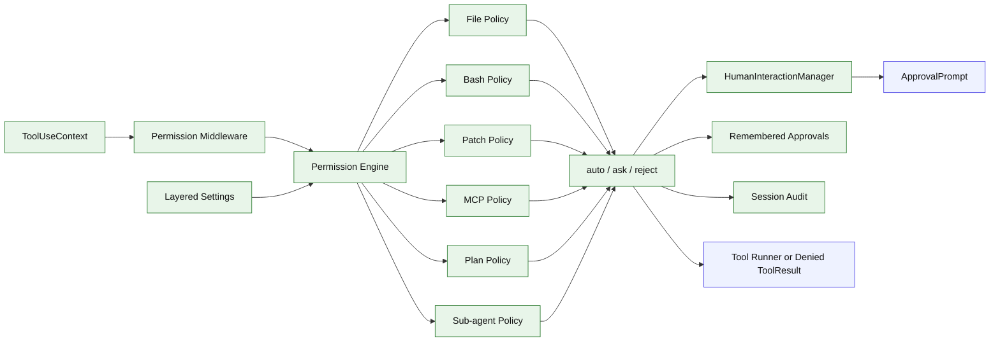

# Stage 12: Full Permission Engine

## 1. 本阶段目标

建立统一权限引擎，对 file、bash、apply_patch、MCP、sub-agent 工具范围和 plan mode restrictions 做 auto/ask/reject 决策。所有 ask 决策通过 Stage 03 的 HumanInteractionManager 进入 ApprovalPrompt，而不是 permission engine 直接调用 UI。所有决策记录进 session audit。用户可以选择把批准记住在 session、project local 或 user scope；approval persistence 不再只存在 session 内。Stage 05 的 plan guard 在本阶段迁入统一 permission engine。

闭环可调试性声明：本阶段完成后，可运行第 7 节中的 Demo commands 验证 readOnly/workspaceWrite/dangerFullAccess、remembered approvals、plan restrictions、audit export 和拒绝 ToolResult。

## 2. 前置依赖

| 依赖 | 用途 |
| --- | --- |
| Stage 03 | middleware `beforeToolUse` 可拦截工具，HumanInteractionManager 可发起 approval |
| Stage 05 | plan/build profiles 和 plan restrictions |
| Stage 07 | apply_patch plan |
| Stage 09 | MCP 调用 |
| Stage 11 | 子 Agent 工具范围 |
| Stage 04 | session store、PromptSubmission 和 audit 持久化 |
| Layered settings | user/project/project-local settings 合并，保存 scoped remembered approvals |

## 3. 三家方案对比

### 3.1 决策模型对比

| 维度 | OpenCode | Claude Code | Codex | 我们的选择 | 理由 |
| --- | --- | --- | --- | --- | --- |
| 输入 | permission action | tool permission check | SafetyCheck | `PermissionAction` | 统一 file/bash/patch/MCP/sub-agent |
| 输出 | allow/ask/reject | denied tool_result | SafetyCheck result | `auto/ask/reject` | 能被 middleware 直接转成 ToolResult |
| 记录 | permission table/event + settings | hooks result | protocol approval | session audit + layered settings approvals | 可复盘、可复用、可 debug |
| settings 合并 | allow union | settings 层级 | config profile | allow/deny union，普通字段覆盖 | remembered approvals 能跨 session 生效 |

### 3.2 文件与 Patch 安全对比

| 维度 | OpenCode | Claude Code | Codex | 我们的选择 | 理由 |
| --- | --- | --- | --- | --- | --- |
| 写入 | tool 内请求 permission | prior read/stale | writable roots | cwd + allowlist + remembered approval | 适合个人 CLI |
| patch | edit tools 合并策略 | old/new check | assess_patch_safety | patch plan 后统一检查 | 避免边解析边写 |
| 路径解析 | resolver/reference | file path validation | normalize + writable roots | realpath + lexical normalize | 防止路径逃逸 |

### 3.3 Bash/MCP/Plan 对比

| 维度 | OpenCode | Claude Code | Codex | 我们的选择 | 理由 |
| --- | --- | --- | --- | --- | --- |
| bash 分类 | command parser | command class + sandbox notes | sandbox policy | allowlist/asklist/denylist + readonly classifier | plan mode 也能复用 |
| MCP | server/tool permission | tool hooks | approval mode | server/tool profile | 外部工具默认更谨慎 |
| plan restrictions | agent/profile 权限 | plan mode 禁写 | profile safety | permission engine policy | Stage 05 窄 guard 迁入统一引擎 |

## 4. 源码引用（必读清单）

| 来源 | 行号 | 参考点 |
| --- | --- | --- |
| `$OPENCODE_REPO/packages/opencode/src/permission/index.ts` | L64-L85 | permission events/errors |
| `$OPENCODE_REPO/packages/opencode/src/permission/index.ts` | L128-L185 | evaluate/ask 流程 |
| `$OPENCODE_REPO/packages/opencode/src/permission/index.ts` | L291-L297 | edit tools 合并策略 |
| `$OPENCODE_REPO/packages/opencode/src/tool/shell.ts` | L261-L288 | command parse 和 permission ask |
| `$CLAUDE_CODE_REPO/src/tools/BashTool/BashTool.tsx` | L227-L259 | BashTool 对 `dangerouslyDisableSandbox` 等字段的边界处理 |
| `$CLAUDE_CODE_REPO/src/services/tools/toolExecution.ts` | L916-L1042 | permission check 与 denied tool_result |
| `$CODEX_REPO/codex-rs/core/src/safety.rs` | L21-L115 | SafetyCheck 决策 |
| `$CODEX_REPO/codex-rs/core/src/safety.rs` | L138-L193 | writable path constraint |

## 5. 本阶段架构图（mermaid）



## 6. 详细设计

### 6.1 模块清单

| 文件路径 | 职责 | 预计行数 | 主要导出 |
|---|---|---:|---|
| `src/permissions/types.ts` | action、decision、profile | ~80 | `PermissionAction` |
| `src/permissions/engine.ts` | 策略分发和 remembered approvals | ~130 | `PermissionEngine` |
| `src/permissions/file-policy.ts` | cwd/writable roots | ~70 | `FilePolicy` |
| `src/permissions/bash-policy.ts` | bash command 分类、readonly 判定 | ~90 | `BashPolicy` |
| `src/permissions/patch-policy.ts` | apply_patch plan 决策 | ~80 | `PatchPolicy` |
| `src/permissions/mcp-policy.ts` | server/tool profile | ~70 | `McpPolicy` |
| `src/permissions/plan-policy.ts` | plan profile restrictions | ~70 | `PlanPolicy` |
| `src/permissions/audit.ts` | 决策落盘和 session export | ~60 | `auditPermission` |
| `src/permissions/middleware.ts` | `beforeToolUse` 接入；ask 决策 enqueue 到 HumanInteractionManager | ~80 | `permissionMiddleware` |
| `src/config/settings.ts` | settings 路径、读写、schema | ~90 | `loadSettingsLayers`, `saveSettingsScope` |
| `src/config/settings-merge.ts` | allow/deny union 和普通字段覆盖合并 | ~90 | `mergeSettings` |

### 6.2 关键接口

```ts
export type PermissionDecision =
  | { type: "auto"; reason: string }
  | { type: "ask"; reason: string; prompt: string; rememberKey?: string }
  | { type: "reject"; reason: string };

export interface PermissionProfile {
  name: "readOnly" | "workspaceWrite" | "dangerFullAccess";
  rememberApprovals: boolean;
}

export interface PermissionAction {
  toolName: string;
  kind: "file" | "bash" | "patch" | "mcp" | "sub_agent" | "plan";
  cwd: string;
  input: JsonValue;
  agentProfile: "build" | "plan";
}

export type ApprovalRememberScope = "session" | "projectLocal" | "user";

export interface KaiSettings {
  permissions?: {
    allow?: string[];
    deny?: string[];
    rememberedApprovals?: Record<string, { reason: string; createdAt: string }>;
  };
  tools?: {
    bash?: {
      allowCommands?: string[];
      denyCommands?: string[];
    };
  };
  mcp?: {
    allowedServers?: string[];
    deniedServers?: string[];
  };
  defaultProfile?: "build" | "plan" | string;
  defaultMode?: string;
  defaultModel?: string;
}

export interface SettingsLayers {
  user?: KaiSettings;          // ~/.kai-code-agent/settings.json
  project?: KaiSettings;       // <project>/.kai/settings.json
  projectLocal?: KaiSettings;  // <project>/.kai/settings.local.json
}
```

Settings 路径和合并：

| 层级 | 路径 | 合并顺序 |
| --- | --- | --- |
| user | `~/.kai-code-agent/settings.json` | 1 |
| project | `<project>/.kai/settings.json` | 2 |
| project local | `<project>/.kai/settings.local.json` | 3 |

`allow` 类字段 union，`deny` / `reject` 类字段 union 且 deny 优先；普通标量和对象后层覆盖前层；未标注 union 的数组后层覆盖。`settings.local.json` 默认 gitignore，用来保存本机私有 approvals、个人 bash allowlist 等内容。

### 6.3 关键算法 / 数据流

1. 工具执行前构造 `PermissionAction`。
2. 读取并合并 user/project/project-local settings。
3. permission middleware 调用 engine。
4. engine 先检查 effective settings 中的 remembered approvals、allowlist 和 denylist。
5. engine 根据 action kind 调用 file/bash/patch/MCP/plan/sub-agent policy。
6. reject 直接返回 denied ToolResult。
7. ask enqueue 到 HumanInteractionManager，由 ApprovalPrompt 订阅展示；批准后按用户选择写入 session、projectLocal 或 user scope。
8. auto/approved 执行工具并记录 audit。
9. Stage 05 的 plan guard 逻辑迁入 `PlanPolicy`，plan profile 的工具限制由 engine 统一执行。
10. `dangerouslyDisableSandbox` 不出现在模型可见 `bash` schema 中；如未来需要，只能由 CLI/profile 层显式开启。

## 7. 实施步骤（Step-by-step）

1. 定义 permission profiles：readOnly、workspaceWrite、dangerFullAccess。
2. 定义 `PermissionAction`，将 file/write/edit/patch/bash/MCP/sub_agent/plan tools 接入。
3. 实现 path normalize 和 writable roots。
4. 实现 bash allowlist/asklist/denylist 和 readonly classifier。
5. 实现 settings loader 和 merge：user/project/project-local 三层，allow/deny union，普通字段覆盖。
6. 实现 remembered approvals，scope 支持 session、projectLocal、user。
7. 将 Stage 05 plan guard 迁入 `PlanPolicy`。
8. session store 增加 permission audit。
9. 增加拒绝、确认、记住本会话、记住本项目本机、记住全局、plan 禁写、MCP reject 的测试。

Demo commands:

```bash
bun run kai run --permission readOnly --provider fixture --script fixtures/write-file.json "write"
bun run kai run --permission workspaceWrite --provider fixture --script fixtures/bash-danger.json "remove"
bun run kai run --provider fixture --script fixtures/plan-write-denied.json "plan should not edit"
bun run kai settings explain
bun test -- stage-12
```

## 8. 验收标准

| 验收项 | 标准 |
| --- | --- |
| readOnly | 写文件、patch 和非只读 bash 被拒绝 |
| workspaceWrite | cwd 内 patch 可 auto，危险 bash 进入 ask |
| settings merge | user/project/project-local settings 可合并；allow/deny 类字段 union，普通字段后层覆盖 |
| local ignore | `.kai/settings.local.json` 默认 gitignore，不建议提交本机私有 approvals |
| remembered approval | 用户批准并选择记住后，可按 session/projectLocal/user scope 生效 |
| plan restriction | plan profile 只能写 plan file，不能改业务文件 |
| MCP | reject server/tool 不会执行 |
| sandbox bypass | 模型无法通过 `bash` 输入传入 `dangerouslyDisableSandbox` |
| audit | 每次决策可在 session export 中看到 |
| 代码预算 | 累计核心代码约 8120 行 |

## 9. 已知限制 & 下一阶段衔接

Stage 12 不是 OS 级强沙箱，只是 agent 内权限控制。Stage 13 基于 sub-agent 和 permission engine 完善长期 memory：typed/scoped records、retrieval、post-turn extraction、citations、secret guard 和 lifecycle。发布级 polish、配置诊断、debug 日志、示例、Bun binary release 和 Bash background/status 完整体验顺延到 Stage 14。
