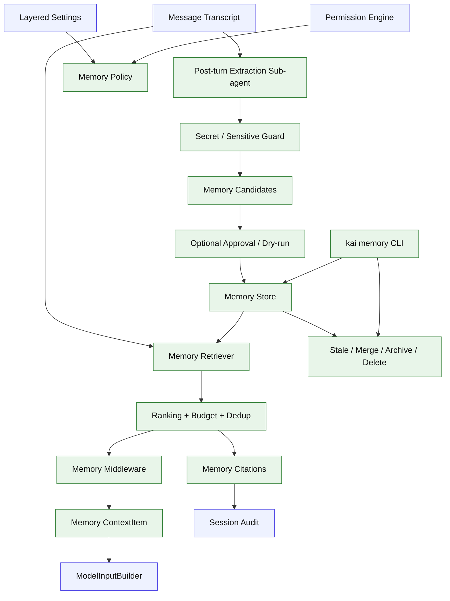

# Stage 13: Memory System

## 1. 本阶段目标

把 Stage 10 的 Memory v0 升级为完整的长期记忆系统：typed/scoped memory、可解释检索、post-turn extraction sub-agent、memory citations、stale/merge/delete lifecycle、secret guard 和调试命令。Memory retrieval 的输出不是散落在 prompt 里的文本块，而是带 scope/type/source/score/citation metadata 的 `ContextItem(kind="memory")`，交给 Stage 06 ModelInputBuilder 统一预算、排序、裁剪和 debug。

核心原则是：memory 不是 transcript、不是 context、也不是 skill。Transcript 记录“发生过什么”，context 是“本轮需要带给模型什么”，skill 是“可加载的能力包”，memory 只保存“未来仍有价值、不能稳定从仓库或 transcript 重新推导、用户可检查和删除的事实/偏好/决策”。

闭环可调试性声明：本阶段完成后，可运行第 7 节中的 Demo commands 验证 manual memory、retrieval ranking、post-turn extraction dry-run、secret guard、citations、lifecycle 和 memory ContextItem injection。

## 2. 前置依赖

| 依赖 | 用途 |
| --- | --- |
| Stage 04 | transcript store、message/part provenance、session replay |
| Stage 06 | ContextItem、ModelInputBuilder、ContextBudget、compaction summary、prompt debug |
| Stage 10 | Memory v0 store、manual CLI、memory middleware |
| Stage 11 | post-turn extraction sub-agent |
| Stage 12 | permission engine、settings scope、audit、remembered approvals |
| `bun:sqlite` | memory records、citations、events 本地持久化 |

## 3. 主流方案提炼

### 3.1 OpenCode / Claude Code / Codex 对比

| 维度 | OpenCode | Claude Code | Codex | Kai 选择 |
| --- | --- | --- | --- | --- |
| 核心形态 | instruction/context/compaction 强，memory 更偏上下文组织 | scoped memory + relevant prefetch + post-turn extraction | protocolized memory tool + citations + consolidation | 分层 memory store + retrieval middleware + extraction sub-agent |
| 权威事实 | session messages、instructions、summary | transcript + memory dir/files | rollout/protocol items + compacted history | transcript-first，memory 只引用 transcript/source |
| 写入策略 | 用户/项目指令为主 | 结束后 forked agent 提取候选，可写 memory dir | 通过 memory tool 和 thread memory mode 控制 | manual first，auto extraction 默认 dry-run/可配置 |
| 检索策略 | instruction loader、nearby instruction、compaction summary | relevant memory prefetch、dedupe | memory summary/citations | bounded top-k + score explanation + citation tracking |
| 安全边界 | context budget、instructions 去重 | memory path safety、secret guard、类型分类 | memory pollution/citation usage | secret guard + sensitive scope gating + source provenance |
| 生命周期 | 依赖文件/summary 更新 | memory scan、类型、dedupe | consolidation、citation trace | active/stale/archived、merge/delete、lastUsedAt、TTL |

### 3.2 好的 memory 设计共识

| 共识 | 说明 |
| --- | --- |
| 分层 scope | 至少区分 session、project local、project、user；团队/云同步可后置 |
| 类型化记录 | preference、feedback、decision、project、reference、fact 分开，便于检索和生命周期处理 |
| 来源可追踪 | 每条 memory 记录 source session/message/tool/file、confidence、createdAt、updatedAt |
| 保守写入 | 默认不把普通对话、临时任务、中间推理和可从代码重新推导的事实写成长期 memory |
| 检索有预算 | 注入模型前做 top-k、token budget、去重和解释，不能把 memory 当全文搜索结果塞进 prompt |
| 引用可审计 | 被注入并影响回答的 memory 要记录 citation，便于用户追踪“为什么模型记得这个” |
| 生命周期完整 | 支持 stale、merge、archive、delete、refresh；错误记忆必须能被清理 |
| 隐私优先 | API key、token、个人隐私、客户数据、未批准的项目私密信息不进入长期 memory |

## 4. 源码引用（必读清单）

| 来源 | 参考点 |
| --- | --- |
| `$OPENCODE_REPO/packages/opencode/src/session/instruction.ts` | instruction/context discovery、dedupe、nearby instruction 思路 |
| `$OPENCODE_REPO/packages/opencode/src/session/compaction.ts` | summary anchoring、recent tail、context budget |
| `$CLAUDE_CODE_REPO/src/query.ts` | relevant memory prefetch consume 与去重 |
| `$CLAUDE_CODE_REPO/src/services/extractMemories/extractMemories.ts` | post-turn forked extraction agent、受限工具、跳过重复写入 |
| `$CLAUDE_CODE_REPO/src/memdir/memoryTypes.ts` | user/feedback/project/reference 类型分类 |
| `$CLAUDE_CODE_REPO/src/memdir/memoryScan.ts` | memory manifest、排序、数量上限 |
| `$CLAUDE_CODE_REPO/src/memdir/paths.ts` | memory path resolution、enable gate、安全校验 |
| `$CODEX_REPO/codex-rs/core/src/session/mod.rs` | memory tool developer instructions 注入 |
| `$CODEX_REPO/codex-rs/core/src/client.rs` | memory summarization/consolidation endpoint |
| `$CODEX_REPO/codex-rs/core/src/stream_events_utils.rs` | memory citation parsing、usage trace、external context pollution guard |

## 5. 本阶段架构图（mermaid）



## 6. 详细设计

### 6.1 Scope 与存储

| Scope | 默认存储 | 用途 | 写入策略 |
| --- | --- | --- | --- |
| `session` | transcript/session DB | 当前会话临时偏好、短期任务约束 | 自动可写，随 session 生命周期 |
| `projectLocal` | 项目本机 `.kai` state | 本机私有项目偏好、路径、审批后的习惯 | 自动候选默认落这里，用户可提升 |
| `project` | 项目 `.kai` 可提交资产或 project-keyed DB | 团队共享项目决策、约定、架构事实 | 需要显式批准，避免提交隐私 |
| `user` | `~/.kai-code-agent` user memory DB | 用户全局偏好、工作习惯、常用约束 | 需要用户批准或显式 CLI 写入 |
| `team` | deferred | 未来团队/云同步 | v0.1 不实现 |

### 6.2 Memory 类型

| Type | 保存内容 | 不应保存 |
| --- | --- | --- |
| `preference` | 用户稳定偏好，例如回答风格、默认工具选择 | 单次对话口味、临时情绪 |
| `feedback` | 用户对 agent 行为的纠正，例如“以后先跑测试再总结” | 模型自我反思、未确认的推断 |
| `decision` | 已批准的设计/API/流程选择 | 仍在讨论中的候选方案 |
| `project` | 项目长期约定、目录职责、开发流程 | 可从 README/源码稳定推导的事实 |
| `reference` | 外部系统、文档、链接、账号无关配置 | token、cookie、客户敏感信息 |
| `fact` | 跨任务可复用的事实 | 过期率高的环境状态、构建输出、日志片段 |

### 6.3 模块清单

| 文件路径 | 职责 | 预计行数 | 主要导出 |
|---|---|---:|---|
| `src/memory/types.ts` | scope/type/status/schema | ~90 | `MemoryRecord`, `MemoryCandidate` |
| `src/memory/store.ts` | SQLite schema、CRUD、events | ~150 | `MemoryStore` |
| `src/memory/retrieval.ts` | scoring、top-k、budget、explain | ~130 | `retrieveRelevantMemories` |
| `src/memory/middleware.ts` | `beforeModel` 产出 memory ContextItem | ~100 | `memoryMiddleware` |
| `src/memory/extractor.ts` | post-turn extraction sub-agent orchestration | ~160 | `extractMemoryCandidates` |
| `src/memory/dedupe.ts` | 近似重复、scope/type merge 建议 | ~100 | `dedupeMemories` |
| `src/memory/lifecycle.ts` | stale、archive、delete、refresh、merge | ~130 | `MemoryLifecycle` |
| `src/memory/citations.ts` | 注入/使用记录、session audit | ~90 | `recordMemoryCitation` |
| `src/memory/secret-guard.ts` | secret/sensitive/path 检测 | ~80 | `MemorySecretGuard` |
| `src/cli/memory.ts` | add/list/search/explain/delete/archive/extract | ~120 | `memoryCommand` |
| `src/config/memory-settings.ts` | memory policy settings 与 scope gate | ~50 | `MemorySettings` |

### 6.4 关键接口

```ts
export type MemoryScope = "session" | "projectLocal" | "project" | "user";
export type MemoryType = "preference" | "feedback" | "decision" | "project" | "reference" | "fact";
export type MemoryStatus = "active" | "stale" | "archived";

export interface MemoryRecord {
  id: string;
  scope: MemoryScope;
  type: MemoryType;
  status: MemoryStatus;
  text: string;
  tags: string[];
  source: {
    sessionId?: string;
    messageId?: string;
    toolCallId?: string;
    filePath?: string;
    kind: "manual" | "extracted" | "imported";
  };
  confidence: number;
  createdAt: string;
  updatedAt: string;
  lastUsedAt?: string;
  expiresAt?: string;
}

export interface MemoryCandidate {
  type: MemoryType;
  suggestedScope: MemoryScope;
  text: string;
  reason: string;
  confidence: number;
  sourceMessageIds: string[];
  risk: "low" | "medium" | "high";
}

export interface MemoryCitation {
  memoryId: string;
  sessionId: string;
  messageId?: string;
  injectedAt: string;
  reason: string;
  score: number;
}

export interface MemoryContextItemMetadata {
  memoryId: string;
  scope: MemoryScope;
  type: MemoryType;
  score: number;
  citationId: string;
  sourceSummary: string;
}
```

### 6.5 检索与注入策略

检索得分采用简单、可解释、可替换的组合：

```text
score =
  keywordMatch * 0.35 +
  scopeBoost * 0.20 +
  typeBoost * 0.15 +
  recency * 0.10 +
  citationUsefulness * 0.10 +
  confidence * 0.10 -
  stalePenalty -
  duplicationPenalty
```

注入规则：

| 规则 | 说明 |
| --- | --- |
| top-k 有上限 | 默认最多 8 条，且占用固定 prompt budget |
| scope 顺序 | 当前 session/projectLocal/project 优先，user 其次；project shared 只注入 active |
| format 稳定 | memory ContextItem 使用编号、type、scope、source 摘要，不混进 system prompt 散文 |
| explain 可见 | `kai memory explain "<query>"` 展示每条命中的分数构成 |
| citation 记录 | 产出并注入模型的 memory ContextItem 记录 citation；模型最终是否显式使用可在 debug/audit 中查看 |
| 不替代 context | 仓库事实优先来自 instruction/read_file/search；memory 只补充长期偏好和历史决策 |
| 受 Stage 06 预算 | memory retrieval 只能输出 bounded ContextItem，不能绕过 ModelInputBuilder 直接拼 prompt |

### 6.6 Post-turn extraction

1. turn 结束后，读取本轮 transcript、tool summary、用户显式反馈、approved plan 和最终结果。
2. 如果本轮已经由用户显式调用 `kai memory add` 或 agent 写入 memory，跳过重复自动提取。
3. 启动 Stage 11 sub-agent，使用受限 profile：read transcript、read existing memory、只读 search、不得修改业务文件。
4. extraction agent 只产出 `MemoryCandidate[]`，不直接写 store。
5. `MemorySecretGuard` 拦截 token/API key/cookie/private key、疑似客户数据、个人敏感信息和高风险路径。
6. `dedupeMemories` 合并重复候选，给出 update/merge/archive 建议。
7. 根据 settings policy 决定：dry-run、自动写入 `projectLocal` 低风险候选、或通过 HITL approval 让用户确认。
8. 写入 store 后记录 memory event 和来源。

### 6.7 生命周期

| 动作 | 触发方式 | 行为 |
| --- | --- | --- |
| `stale` | TTL 到期、项目文件变化、用户反馈冲突 | 不默认注入，但保留可查 |
| `refresh` | 被新证据确认 | 更新 text/source/updatedAt/confidence |
| `merge` | dedupe 发现重复或用户执行 | 合并 tags/source/citations，保留 alias |
| `archive` | 用户认为暂时无用 | 不注入，不删除 |
| `delete` | 用户明确删除或 secret guard 发现敏感信息 | 删除 record，并记录 tombstone event |
| `promote` | 用户批准 | `projectLocal -> project` 或 `projectLocal -> user` |

## 7. 实施步骤（Step-by-step）

1. 扩展 Memory v0 schema：scope/type/status/source/confidence/tags/lastUsedAt/expiresAt。
2. 增加 memory events 和 citation 表。
3. 实现 retrieval scoring、budget、dedupe 和 `kai memory explain`。
4. 改造 memory middleware：只产出 active top-k ContextItem，写入 citation。
5. 实现 `MemorySecretGuard`，覆盖常见 secret、token、private key、cookie、`.env` 值和高风险路径。
6. 实现 post-turn extraction sub-agent 的 dry-run。
7. 增加 settings：`memory.enabled`、`memory.autoExtract`、`memory.defaultScope`、`memory.requireApprovalForScopes`。
8. 接入 HITL approval：高风险候选或 user/project scope 写入需要用户确认。
9. 实现 lifecycle CLI：list/search/explain/delete/archive/merge/refresh/extract。
10. 增加 citations/debug export：可以从 session 看到哪些 memory 被注入。

Demo commands:

```bash
bun run kai memory add preference --scope user "Prefer concise final answers"
bun run kai memory search "final answer"
bun run kai memory explain "fix tests before summary"
bun run kai memory extract --session <session-id> --dry-run
bun run kai memory archive <memory-id>
bun run kai memory citations <session-id>
bun test -- stage-13
```

## 8. 验收标准

| 验收项 | 标准 |
| --- | --- |
| typed scope | memory 支持 scope/type/status/source/confidence，并能 CLI 查看 |
| retrieval ranking | 同一 query 下 top-k 顺序稳定，`explain` 能展示分数原因 |
| prompt budget | 注入 memory ContextItem 不超过固定 budget，stale/archived 默认不注入 |
| citations | 每次注入 memory ContextItem 都记录 citation，session export 可查 |
| extraction dry-run | post-turn extraction 只产出候选，不直接写长期 memory |
| extraction approval | 写入 user/project scope 需要 settings 允许或 HITL approval |
| secret guard | API key/token/private key/cookie/`.env` 值不会进入 memory store |
| dedupe/merge | 重复候选不会生成多条长期 memory，可合并来源 |
| lifecycle | stale/archive/delete/refresh/promote 有 CLI 和测试覆盖 |
| no derivable facts | 可从当前仓库文件稳定推导的事实默认不作为长期 memory |
| context injection | memory system 只通过 Stage 06 ContextItem/ModelInputBuilder 注入，不直接拼 provider messages |
| 代码预算 | 累计核心代码约 9220 行 |

## 9. 已知限制 & 下一阶段衔接

Stage 13 不做云同步、团队 memory server、向量数据库或跨设备实时共享。检索先用可解释的关键词/recency/scope/type 评分，后续如果需要再替换为 embedding hybrid retrieval。下一阶段做发布级 polish：doctor/debug/examples、Bun binary release，以及 Bash background/status 的完整日常体验；真实使用后再到 Stage 15 调 memory ContextItem 的 ranking/budget 和冲突处理。
