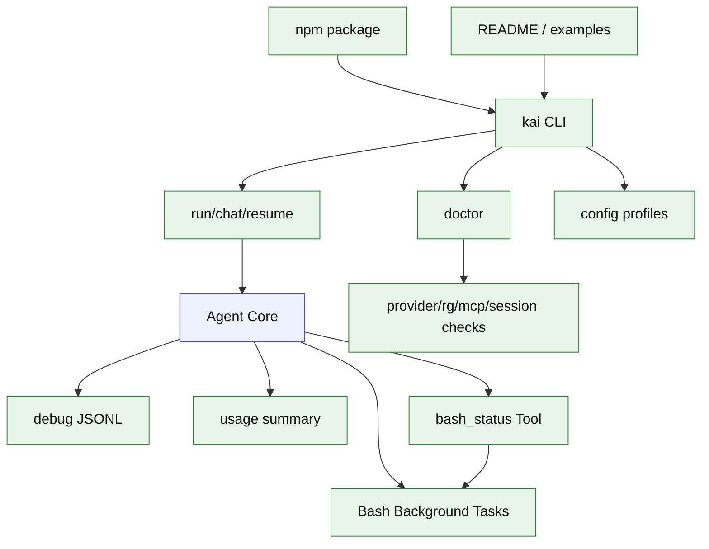

# Stage 13: Polish

## 1. 本阶段目标

把 Kai 从阶段性原型整理成日常可用 CLI：完善 config/profile、doctor 诊断、debug 日志、错误文案、示例项目、发布脚本和用户文档。对 `bash` 工具，Stage 13 承接 Claude Bash 的目标形态，补齐 `run_in_background`、`bash_tasks` 任务表、`bash_status` 只读工具、读取后台输出和大输出持久化。

闭环可调试性声明：本阶段完成后，可运行第 7 节中的 Demo commands 验证 CLI、测试和核心场景。

## 2. 前置依赖

| 依赖 | 用途 |
| --- | --- |
| Stage 01-12 | 完整核心能力 |
| npm packaging | 本地安装与发布 |
| debug logger | 事件追踪 |
| docs generator | README 和 examples |

## 3. 三家方案对比

### 3.1 CLI 体验对比

| 维度 | OpenCode | Claude Code | Codex | 我们的选择 | 理由 |
| --- | --- | --- | --- | --- | --- |
| 命令 | 产品级命令集 | 交互丰富 | CLI/app 协议 | `run/chat/resume/doctor`；参考 §4 源码引用 | 个人项目优先小代码量、可调试、阶段闭环。 |
| 输出 | TUI/状态丰富 | Bash progress 与后台提示多 | protocol events | 简洁文本 + debug，bash 支持后台任务摘要；参考 §4 源码引用 | 个人项目优先小代码量、可调试、阶段闭环。 |
| 配置 | provider/tool/permission | settings/hooks/agents | config profiles | `kai.config.json`；参考 §4 源码引用 | 个人项目优先小代码量、可调试、阶段闭环。 |

### 3.2 可观测性对比

| 维度 | OpenCode | Claude Code | Codex | 我们的选择 | 理由 |
| --- | --- | --- | --- | --- | --- |
| 工具输出 | truncate + file hint | large output 持久化 | output cap | JSONL + truncated summary + bash persisted output；参考 §4 源码引用 | 个人项目优先小代码量、可调试、阶段闭环。 |
| session | SQL 查询 | transcript | state db | `kai sessions export`；参考 §4 源码引用 | 个人项目优先小代码量、可调试、阶段闭环。 |
| bash task 查询 | foreground/background task registry | background task + persisted output | session item status | Stage 13 增加 `bash_tasks` 表和 `bash_status` 工具；参考 §4 源码引用 | 适度增加行数，换取后台任务可查询性。 |
| doctor | 多平台能力 | 环境提示 | debug sandbox | provider/rg/mcp/config checks；参考 §4 源码引用 | 个人项目优先小代码量、可调试、阶段闭环。 |

### 3.3 发布范围对比

| 维度 | OpenCode | Claude Code | Codex | 我们的选择 | 理由 |
| --- | --- | --- | --- | --- | --- |
| 目标用户 | 通用用户 | 产品用户 | Codex 用户 | 个人与小团队；参考 §4 源码引用 | 个人项目优先小代码量、可调试、阶段闭环。 |
| 安装 | 产品分发 | 产品分发 | npm/binary | npm package；参考 §4 源码引用 | 个人项目优先小代码量、可调试、阶段闭环。 |
| 文档 | 完整网站 | 产品文档 | repo docs | README + roadmap；参考 §4 源码引用 | 个人项目优先小代码量、可调试、阶段闭环。 |

## 4. 源码引用（必读清单）

| 来源 | 行号 | 参考点 |
| --- | --- | --- |
| `$OPENCODE_REPO/packages/opencode/src/tool/truncate.ts` | L16-L142 | 输出截断与完整输出提示 |
| `$OPENCODE_REPO/packages/opencode/src/session/processor.ts` | L499-L558 | usage 和 snapshot 记录 |
| `$OPENCODE_REPO/packages/opencode/src/provider/provider.ts` | L92-L190 | provider SDK map 与 custom provider |
| `$CLAUDE_CODE_REPO/src/tools/BashTool/BashTool.tsx` | L725-L753 | 大输出持久化思路 |
| `$CLAUDE_CODE_REPO/src/tools/BashTool/BashTool.tsx` | L1027-L1142 | 长命令 progress loop |
| `$CLAUDE_CODE_REPO/src/tools/BashTool/BashTool.tsx` | L985-L1000 | 显式 `run_in_background` 返回后台任务 id |
| `$CODEX_REPO/codex-rs/core/src/session/mcp.rs` | L68-L159 | elicitation 作为后续高级交互参考 |

## 5. 本阶段架构图（mermaid）



## 6. 详细设计

### 6.1 模块清单

| 文件路径 | 职责 | 预计行数 | 主要导出 |
|---|---|---:|---|
| `src/config/index.ts` | config/profile load | ~60 | `KaiConfig` |
| `src/cli/doctor.ts` | 环境诊断 | ~70 | `runDoctor` |
| `src/cli/tasks.ts` | `kai tasks list/read`，读取 bash 后台任务和持久化输出 | ~80 | `tasksCommand` |
| `src/bash/taskStore.ts` | `bash_tasks` 表访问、状态更新、查询 | ~170 | `BashTaskStore` |
| `src/bash/outputStore.ts` | 大输出写入、preview、persistedOutputPath 管理 | ~120 | `BashOutputStore` |
| `src/tools/bashStatus.ts` | 模型可调用的只读 `bash_status` 工具 | ~100 | `bashStatusTool` |
| `src/tools/bash.ts` | 增强 `run_in_background`、backgroundTaskId、persisted output | ~270 | `bashTool` |
| `src/debug/events.ts` | JSONL debug logger，记录 bash task lifecycle | ~70 | `UiEvent` |
| `src/ui/messages.ts` | 错误/状态文案 | ~30 | `Message` |
| `src/cli/package.ts` | version、help、examples | ~30 | `packageInfo` |

### 6.2 关键接口

```ts
export interface KaiConfig {
  provider: string;
  permission: "readOnly" | "workspaceWrite" | "dangerFullAccess";
  bash?: { defaultTimeoutMs?: number; enableBackgroundTasks?: boolean };
  mcp?: Record<string, McpServerConfig>;
  profiles?: Record<string, Partial<KaiConfig>>;
}

export interface BashTaskRecord {
  id: string;
  command: string;
  cwd: string;
  status: "running" | "exited" | "failed" | "canceled";
  outputPreview: string;
  exitCode?: number | null;
  persistedOutputPath?: string;
  persistedOutputSize?: number;
}

export interface BashStatusInput {
  taskId: string;
  tailBytes?: number;
}

export interface BashStatusResult {
  task: BashTaskRecord;
  tailPreview: string;
}
```

### 6.3 关键算法 / 数据流

1. config loader 按 default、project、env、CLI args 合并。
2. doctor 顺序检查 Node、rg、provider key、sqlite、MCP config。
3. debug logger 记录 turn、provider、tool、bash task、permission、compaction 事件。
4. `bash` 后台任务写入 `bash_tasks`；`parts.metadata_json.bash` 继续保留 transcript 摘要。
5. `bash_status` 只读工具按 taskId 查询状态、exitCode、outputPreview 和 persistedOutputPath。
6. `kai tasks list` 展示后台 bash task；`kai tasks read <id>` 打印 outputPreview 或提示用 `read_file` 读取 persistedOutputPath。
7. CLI help 给出最短可运行示例。
8. package 脚本产出可本地安装的 npm 包。

## 7. 实施步骤（Step-by-step）

1. 增加 `kai init` 生成配置模板。
2. 增加 `kai doctor`。
3. 统一错误文案和 help。
4. 增加 debug JSONL 开关。
5. 增加 `bash_tasks` 表和 `BashTaskStore`。
6. 增加 `bash_status` 只读工具；完整输出仍复用 `read_file` 读取 persisted output path。
7. 增加 `kai tasks list/read`，后台输出读取优先走 CLI。
8. 写 examples：读文件、修 bug、跑测试、bash 后台任务、MCP echo、子 Agent。
9. 准备 npm package metadata。

Demo commands:

```bash
pnpm kai init
pnpm kai doctor
pnpm kai run --profile local "fix failing test"
pnpm kai tasks list
pnpm kai tasks read <task-id>
pnpm test -- stage-13
```

## 8. 验收标准

| 验收项 | 标准 |
| --- | --- |
| init | 能生成可编辑配置 |
| doctor | 能发现缺失 rg/provider key/MCP command |
| debug | 开启后产出 JSONL 事件 |
| bash background | `run_in_background` 返回 task id，后续可读取后台输出 |
| bash status | 模型可通过 `bash_status` 查询 task 状态和输出摘要 |
| task output | `kai tasks read <task-id>` 能显示后台输出摘要或 persisted output 路径 |
| docs | README 包含 5 个可运行示例 |
| package | `pnpm pack` 成功 |
| 代码预算 | 累计核心代码约 6400 行 |

## 9. 已知限制 & 下一阶段衔接

Stage 13 完成的是个人 CLI v0.1。后续可扩展 IDE 集成、并行子 Agent、MCP resources UI、真实 sandbox、云同步和更精细的 provider 兼容层。
