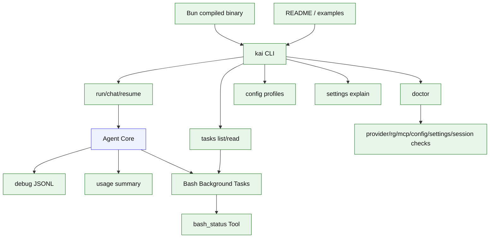

# Stage 14: Polish + Diagnostics + Bun Binary Release

## 1. 本阶段目标

把 Kai 从阶段性原型整理成日常可用 CLI：完善 config/profile/settings、doctor 诊断、debug JSONL、错误文案、示例项目、用户文档和 Bun binary release。对 `bash` 工具，Stage 14 承接 Claude Bash 的目标形态，补齐 `run_in_background`、`bash_tasks` 任务表、`bash_status` 只读工具、后台输出读取和大输出持久化。

闭环可调试性声明：本阶段完成后，可运行第 7 节中的 Demo commands 验证 doctor、debug、Bash background/status、任务输出读取和 `bun build --compile`。

## 2. 前置依赖

| 依赖 | 用途 |
| --- | --- |
| Stage 01-13 | 完整核心能力 |
| Bun build | 本地 binary release |
| debug logger | 事件追踪 |
| docs generator | README 和 examples |
| `bash_tasks` | 后台任务状态 |

## 3. 三家方案对比

### 3.1 CLI 体验对比

| 维度 | OpenCode | Claude Code | Codex | 我们的选择 | 理由 |
| --- | --- | --- | --- | --- | --- |
| 命令 | 产品级命令集 | 交互丰富 | CLI/app 协议 | `run/chat/resume/doctor/tasks` | 个人 CLI 日常使用所需 |
| 输出 | TUI/状态丰富 | Bash progress 与后台提示多 | protocol events | Ink TUI + plain/debug；thinking 只在 debug/folded 视图可见 | 兼顾产品感和脚本化，避免 reasoning 裸输出 |
| 配置 | provider/tool/permission/settings | settings/hooks/agents | config profiles | user config YAML + layered settings JSON | API key 安全放用户级，运行设置可按项目合并 |

### 3.2 可观测性对比

| 维度 | OpenCode | Claude Code | Codex | 我们的选择 | 理由 |
| --- | --- | --- | --- | --- | --- |
| 工具输出 | truncate + file hint | large output 持久化 | output cap | truncated summary + persisted output path | 模型看摘要，用户可读完整输出 |
| session | SQL 查询 | transcript | state db | `kai sessions export` | 可复盘 |
| thinking debug | message part 可查询 | reasoning 不做普通正文 | protocol/debug item | debug JSONL 或折叠视图查看 thinking | 默认用户界面保持干净 |
| bash task 查询 | foreground/background task registry | background task + persisted output | session item status | `bash_tasks` + `bash_status` + `kai tasks` | 后台任务可查询 |
| doctor | 多平台能力 | 环境提示 | debug sandbox | provider/rg/mcp/config/session checks | 降低排错成本 |
| settings explain | settings inspect | settings/debug | config inspect | `kai settings explain` | 看清 user/project/local 每层来源和最终 effective settings |

### 3.3 发布范围对比

| 维度 | OpenCode | Claude Code | Codex | 我们的选择 | 理由 |
| --- | --- | --- | --- | --- | --- |
| 目标用户 | 通用用户 | 产品用户 | Codex 用户 | 个人与小团队 | 范围可控 |
| 安装 | 产品分发 | 产品分发 | npm/binary | Bun compiled binary，后续可附 npm wrapper | Bun-first 路线闭环 |
| 文档 | 完整网站 | 产品文档 | repo docs | README + roadmap + examples | 够用、易维护 |

## 4. 源码引用（必读清单）

| 来源 | 行号 | 参考点 |
| --- | --- | --- |
| `$OPENCODE_REPO/packages/opencode/src/tool/truncate.ts` | L16-L142 | 输出截断与完整输出提示 |
| `$OPENCODE_REPO/packages/opencode/src/session/processor.ts` | L499-L558 | usage 和 snapshot 记录 |
| `$OPENCODE_REPO/packages/opencode/src/provider/provider.ts` | L92-L190 | provider SDK map 与 custom provider |
| `$CLAUDE_CODE_REPO/src/tools/BashTool/BashTool.tsx` | L725-L753 | 大输出持久化思路 |
| `$CLAUDE_CODE_REPO/src/tools/BashTool/BashTool.tsx` | L1027-L1142 | 长命令 progress loop |
| `$CLAUDE_CODE_REPO/src/tools/BashTool/BashTool.tsx` | L985-L1000 | 显式 `run_in_background` 返回后台任务 id |
| `$CODEX_REPO/codex-rs/core/src/session/mcp.rs` | L68-L159 | elicitation 作为高级交互参考 |

## 5. 本阶段架构图（mermaid）



## 6. 详细设计

### 6.1 模块清单

| 文件路径 | 职责 | 预计行数 | 主要导出 |
|---|---|---:|---|
| `src/config/index.ts` | config/profile load | ~80 | `KaiConfig` |
| `src/config/settings-cli.ts` | `kai settings explain`，展示 settings 来源和合并结果 | ~80 | `settingsCommand` |
| `src/cli/doctor.ts` | 环境诊断 | ~90 | `runDoctor` |
| `src/cli/tasks.ts` | `kai tasks list/read`，读取 bash 后台任务和持久化输出 | ~90 | `tasksCommand` |
| `src/coding/tools/bash/task-store.ts` | `bash_tasks` 表访问、状态更新、查询 | ~180 | `BashTaskStore` |
| `src/coding/tools/bash/output-store.ts` | 大输出写入、preview、persistedOutputPath 管理 | ~130 | `BashOutputStore` |
| `src/coding/tools/bash-status.ts` | 模型可调用的只读 `bash_status` 工具 | ~100 | `bashStatusTool` |
| `src/coding/tools/bash.ts` | 增强 `run_in_background`、backgroundTaskId、persisted output | ~280 | `bashTool` |
| `src/agent/tool-result-formatter.ts` | 发布级格式策略、统一截断文案和完整输出提示 | ~80 | `formatToolResultForModel` |
| `src/config/debug-events.ts` | JSONL debug logger，记录 lifecycle | ~80 | `DebugEventWriter` |
| `src/ui/messages.ts` | 错误/状态文案 | ~40 | `MessageCatalog` |
| `src/cli/build-info.ts` | version、help、examples、binary metadata | ~40 | `buildInfo` |

### 6.2 关键接口

```ts
export interface KaiConfig {
  provider: string;
  permission: "readOnly" | "workspaceWrite" | "dangerFullAccess";
  bash?: { defaultTimeoutMs?: number; enableBackgroundTasks?: boolean };
  mcp?: Record<string, McpServerConfig>;
  profiles?: Record<string, Partial<KaiConfig>>;
}

export interface EffectiveSettingsReport {
  layers: Array<{ name: "user" | "project" | "projectLocal"; path: string; exists: boolean }>;
  effective: KaiSettings;
  notes: string[];
}

export interface BashTaskRecord {
  id: string;
  command: string;
  cwd: string;
  status: "running" | "exited" | "failed" | "canceled";
  outputPreview: string;
  exitCode?: number | null;
  persistedOutputPath?: string;
  persistedOutputSize?: number;
}

export interface BashStatusInput {
  taskId: string;
  tailBytes?: number;
}

export interface BashStatusResult {
  task: BashTaskRecord;
  tailPreview: string;
}
```

## 7. 实施步骤（Step-by-step）

1. 增加 `kai init` 生成配置模板。
2. 增加 `kai doctor`。
3. 增加 `kai settings explain`，展示 user/project/projectLocal 路径、是否存在、合并结果和 gitignore 提示。
4. 统一错误文案和 help。
5. 增加 debug JSONL 开关。
6. 增加 `bash_tasks` 表和 `BashTaskStore`。
7. 增加 `bash_status` 只读工具；完整输出仍复用 `read_file` 读取 persisted output path。
8. 收敛所有工具的 model-visible formatting policy，统一大输出截断文案和 persisted output 提示。
9. 增加 `kai tasks list/read`，后台输出读取优先走 CLI。
10. 写 examples：读文件、修 bug、跑测试、plan mode、bash 后台任务、MCP echo、子 Agent。
11. 准备 Bun binary release：`bun build --compile --outfile dist/kai src/cli/main.ts`。
12. 更新 README、OpenSpec 使用建议和 troubleshooting。

Demo commands:

```bash
bun run kai init
bun run kai doctor
bun run kai settings explain
bun run kai run --profile local "fix failing test"
bun run kai tasks list
bun run kai tasks read <task-id>
bun build --compile --outfile dist/kai src/cli/main.ts
bun test -- stage-14
```

## 8. 验收标准

| 验收项 | 标准 |
| --- | --- |
| init | 能生成可编辑配置 |
| doctor | 能发现缺失 rg/provider key/MCP command/settings local gitignore |
| settings explain | 能展示三层 settings 来源、合并后的 effective settings 和 local 文件忽略状态 |
| debug | 开启后产出 JSONL 事件 |
| thinking debug | 默认 UI/plain 不显示 thinking；debug export 可按配置包含 thinking 摘要或折叠内容 |
| bash background | `run_in_background` 返回 task id，后续可读取后台输出 |
| bash status | 模型可通过 `bash_status` 查询 task 状态和输出摘要 |
| task output | `kai tasks read <task-id>` 能显示后台输出摘要或 persisted output 路径 |
| formatter polish | 所有内置工具的大输出和错误都有统一模型可见格式 |
| docs | README 包含可运行示例 |
| binary | `bun build --compile` 成功产出本地可执行文件 |
| 代码预算 | 累计核心代码约 10410 行 |

## 9. 已知限制 & 下一阶段衔接

Stage 14 完成的是个人 CLI v0.1 的可用形态。下一阶段先不扩功能，而是基于真实使用 trace 优化 context 质量：context eval/replay、prompt debug diff、ranking/budget tuning、真实 tokenizer 校准和 prompt cache stability。再往后可扩展 IDE 集成、并行子 Agent、MCP resources UI、真实 OS sandbox、云同步和更细的 provider 兼容层。
